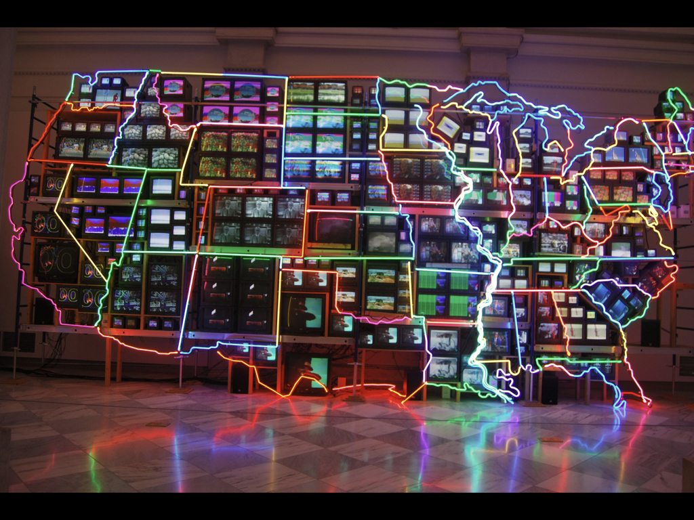
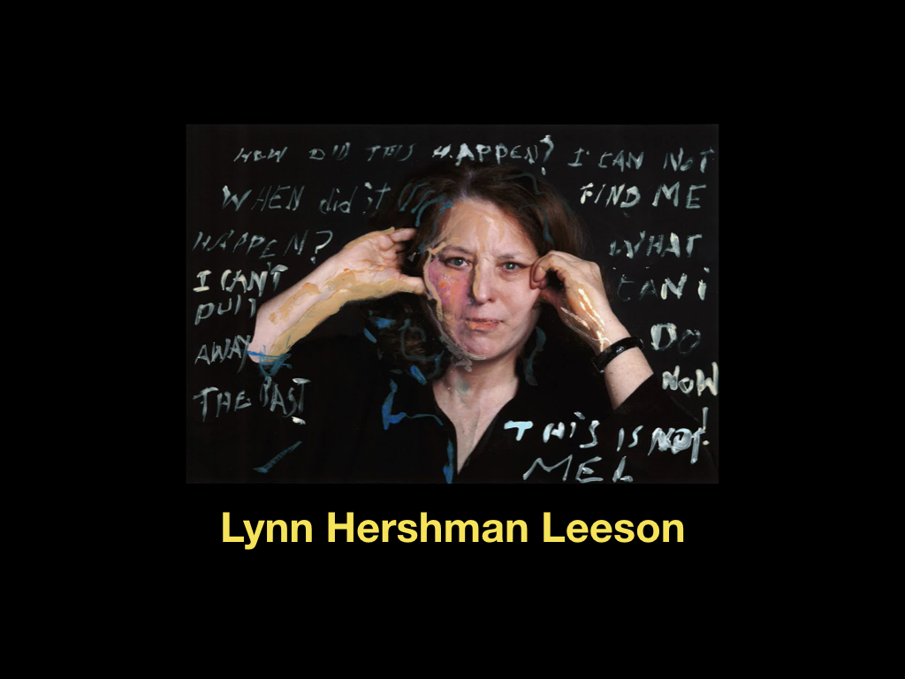
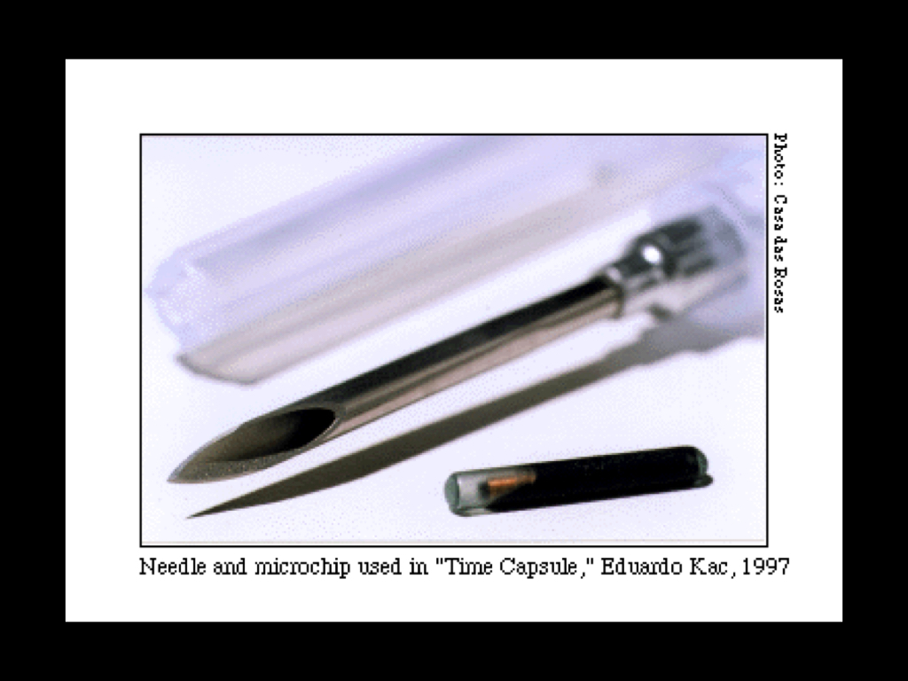

# **INTRO TO NEW MEDIA ART**

### **++[SJSU Art Spring 2019](https://carriehott.github.io/SJSU-Art74-Sp2019/)++**

[<Back to Lectures](https://carriehott.github.io/SJSU-Art74-Sp2019/lectures)

#### >Introductory lecture on New Media Art
#### ->Corresponding Readings:

* [Chapter 1: Digital Technologies as a Tool from _Digital Art_ by Christine Paul](https://carriehott.github.io/SJSU-Art74-Sp2019/readings/DigitalArt_ChristinePaul_Ch1.pdf)

* [Art in the Age of Digital Distribution by Mark Tribe](https://carriehott.github.io/SJSU-Art74-Sp2019/readings/Tribe_NewMediaArt.pdf) (from [New Media Art](https://books.google.com/books/about/New_Media_Art.html?id=8IaZQgAACAAJ))
 

**New Media Art** is an umbrella term for artwork produced using new media. It includes a diverse set of categories such digital art, computer graphics, computer animation, virtual art, Internet art, interactive art technologies, but may also pertain to such fields as computer robotics or art as biotechnology.

New media art is characterized by spanning practices ranging from conceptual and virtual art to performances and installations. Very often, new media art acts like a platform for communication and interaction rather than a closed, inactive artwork.

* New media art can be any form of artistic production that is created in a medium that does not belong to traditional modes of artistic expression.
 
 
* **Discipline strictly tied to developments in technology, and to the availability of that technology to the artist.**
 
 

### > New Media Art Pre-History- What came before in Art History to pave the way for the art being made today?
 

Hannah Höch, 
Image: _Cut with the Kitchen Knife Dada through the Beer-Belly of the Weimar Republic_, 1919, collage of pasted papers



New Media Art builds on the ground laid in art history through the **[Dada Movement](https://en.wikipedia.org/wiki/Dada)** and the **[Pop Art Movement](https://en.wikipedia.org/wiki/Pop_art)**.
These art movements that grew out of responses to changes in political or cultural realities (World War I, mass proliferation of printed and televised media, mass commercialization and consumerism). **Like these movements,
New Media Art grew out of a response to the information technology revolution and the digitization of cultural forms.**
 
 

Andy Warhol, _Empire_, Silent Film, 1964-- [link to video excerpt here](https://www.youtube.com/watch?v=VMCeDBn1Zu0)

**[Andy Warhol's Empire](https://en.wikipedia.org/wiki/Empire_(1964_film))** is a 1964 black-and-white silent film
, and an example of the avant garde film that paved the way for New Media Art.
 Empire, when projected according to Warhol's specifications, consists of eight hours and five minutes of slow motion footage of an unchanging view of the Empire State Building. It was controversial at the time, and was created by Warhol to "to see time go by", a contrast to the idea that film is meant for entertainment.
 
 

Yoko Ono, _Grapefruit_, 1964-- **[link to wikipedia](https://en.wikipedia.org/wiki/Grapefruit_(book))**

The conceptual art movement of the 1970s paved the way for New Media Art.
**[Conceptual art](https://en.wikipedia.org/wiki/Conceptual_art)**, like New Media art, does not have one medium- but rather project materials and mediums are determined by the artists’ idea.  Grapefruit is an artist's book written by Yoko Ono, originally published in 1964. It has become famous as an early example of conceptual art, containing a series of "event scores" that replace the physical work of art, with instructions that an individual may, or may not, wish to enact. The art can belong to the person who enacts the instructions, making it more accessible and ephemeral.
 
 

## > New Media Artists Past and present
 

[Name June Paik](https://en.wikipedia.org/wiki/Nam_June_Paik) was a Korean American artist. He worked with a variety of media and is considered to be the founder of video art/new media art. He was one of the first artists — possibly the first — to use a portable video recorder.
 

 
Video art is often said to have begun when Nam June Paik used his new **[Sony Portapak](https://en.wikipedia.org/wiki/Portapak)** to shoot footage of Pope Paul VI's procession through New York City in the autumn of 1965. Later that same day, across town in a Greenwich Village cafe, Paik played the tapes and it is said that this was when video art was born.
 
 

Nam June Paik's _Untitled_, 1993, Player piano, fifteen televisions, two cameras, two laser disc players, one electric light, light bulb, wires, laser disc player and lamp.


Nam June Paik experimented with a lot of different electronic media, including televisions.

Nam June Paik's, _Zen for TV_, works he made throughout the 1960s-1990s,   

In Paik's TVs, The TV cathode-ray tubes have been compressed and manipulated with magnets so that their screens display thin lines. The idea is to "demystify" the television by collapsing the television image and all its potential information into a single line.

Nam June Paik's _TV Clock_, (1963/1989), a row of 24 color televisions that collectively evoke a clock face or sundial; their cathode-ray tubes have been compressed so that their screens display thin lines that tilt in various directions.

Within his lifetime, Nam June Paik witnessed the birth/use of the following technologies: the atomic bomb, home televisions, spaceships, photocopiers, communications satellites, VCRs and DVDs, personal computers, cell phones, video chat/conferencing, the internet, smartphones, and, finally, personal-platform sites like MySpace, Facebook, and YouTube.  Paik was part of a generation that was born into households without TVs and died with smartphones.

Nam June Paik, _Bakelite Robot_, 2002 

Paik has a whole series of robots and **his interest in television as an object ensues from his desire to humanize technology by applying it to aesthetic purposes.**

Nam June Paik, _Electronic Superhighway: Continental U.S., Alaska, Hawaii_, 1995, Fifty-one channel video installation, custom electronics, neon lighting, steel and wood

Nam June Paik is credited with an early usage (1974) of the term "electronic super highway" in application to telecommunications.

 Paik augmented the flashing images "seen as though from a passing car" with audio clips from The Wizard of Oz, Oklahoma, and other screen gems, suggesting that our picture of America has always been influenced by film and television. 
 
 

[Cory Arcangel](http://www.coryarcangel.com/) is an American post conceptual artist. He makes work in many different media, including drawing, music, video, performance art, and video game modifications.

Cory Arcangel, **[Super Mario Clouds](http://www.coryarcangel.com/things-i-made/2002-001-super-mario-clouds)**, 2002

---[Link to Video Here](https://www.youtube.com/watch?v=fCmAD0TwGcQ)---

**_Super Mario Clouds_**, 2002


**His work explores the relationship between digital technology and pop culture.** Arcangel's best known works are his Nintendo game cartridge hacks and reworkings of obsolete computer systems of the 1970s and 80s. One example is Super Mario Clouds (2002), a modified version of the Super Mario Bros. video game for Nintendo's NES game console in which all of the game's graphics have been removed, leaving only a blue background with white clouds scrolling slowly from right to left.

**_Tetris Screwed_**, 2002

 
 
From Cory Arcangel: “It takes about 8 hours for the blocks to fall in one complete game. At the same time, it is still possible to move them left and right, it just takes minutes for them to drop one pixel down on the screen. It’s totally maddening!”
 
 

  Cory Arcangel, _Photoshop CS Series_

Arcangel's Photoshop CS series are large c-print gradient digital paintings created solely in Photoshop, and build on histories of abstract expressionism or color field painting.
 
 

[Lynn Hershman Leeson](http://www.lynnhershman.com/) currently lives in the Bay Area.  Her work focuses on the relationship between people and technology. Common themes in her work: identity in a time of consumerism, privacy in an era of surveillance, interfacing of humans and machines, and the relationship between real and virtual worlds.

**“I’ve always been interested in the edge of reality, And it seems to me that once you could imagine something, it could be true. So where does reality end and fiction begin?”** -Lynn Hershman Leeson

[Roberta Breitmore Project](http://www.lynnhershman.com/project/roberta-breitmore/)- From 1974 until 1978, Leeson ‘developed’ a fictional persona and alter ego of "Roberta Breitmore." The Breitmore persona was very fully developed: she had her own mannerisms, handwriting, clothing, wig, makeup, apartment, psychiatrist, credit cards, acquaintances, life story, and adventures. Hershman Leeson categorizes this project variously as as a "private performance," a "time-based sculptural" work, and a "virtual or simulated persona”.
 
 

‘Robertas’ during the opening of ‘Lynne Hershman Leeson: Civic Radar’ at Yerba Buena Center for the Arts in San Francisco in 2017 

Roberta Breitmore was 'born', according to Hershman Leeson, when she arrived in San Francisco with $1800 on a Greyhound bus and checked in to the Dante Hotel. What remains now are the artefacts of any life: documentation and personal effects. These were shown in the exhibition, Lynne Hershman Leeson: Civic Radar’ at Yerba Buena Center for the Arts in San Francisco in 2017, along with actors dressed as 'Robertas'.
 
 

Lynn Hershman Leeson, ‘Agent Ruby’, 1998-2002, 2013

**[Agency Ruby's e-dream portal](http://agentruby.sfmoma.org/)**

Agent Ruby is an artificial intelligence web character—has conversed with online users, which has shaped her memory, knowledge, and moods. The piece reflects the artist’s long-standing interest in the interaction of fictional and virtual characters with real people and situations. Ruby chats with users, remember users questions, ultimately be able to recognize their voice and have moods and emotions. Her mood may also be affected directly by web traffic.
Presented at SFMOMA in 2013 as an interactive piece, along with Agent Ruby transcripts and ephemera.
 
 

[Olafur Eliasson](http://www.olafureliasson.net/) 
is an Icelandic-Danish artist known for sculptures and large-scale installation art employing elemental materials such as light, water, and air temperature. 


Olafur Eliasson, _The Weather Project_, 2003

The Weather project was an installation in a large museum. Eliasson used humidifiers to create a fine mist in the air via a mixture of sugar and water, as well as a circular disc made up of hundreds of monochromatic lamps which radiated yellow light. The ceiling of the hall was covered with a huge mirror, in which visitors could see themselves as tiny black shadows against a mass of orange light (symbolization the sun). Many visitors responded to this exhibition by lying on their backs and waving their hands and legs.
 
 

Olafur Eliasson, _Room for One Colour_, 1998
.
In Room For One Colour (1998), a corridor lit by yellow monofrequency tubes, the participants find themselves in a room filled with light that affects the perception of all other colors.
 
 

[Ryoji Ikeda](http://www.ryojiikeda.com/) is a Japanese sound and installation artist who lives and works in Paris. His work covers music, mathematics, science and art, with sound, light, and data as materials.
 
 

Ryoji Ikeda, _Dataplex / Datamatics_, album, 2005

Ikeda has a fascination with the mathematical language of music. Through his sound work, he explores the limits of human perception that are brought into relation with data and the limits of the machines. For example, this album contains information that not all CD players can read.

-->**[Link to Ryoji Ikeda Test Pattern in Times Square in New York](https://www.youtube.com/watch?v=JfcN9Qhfir4)**

Ryoji Ikeda,_Test Pattern_, 2011

Test Pattern is a piece for audio-visual devices and the human senses. The project was displayed on screen billboards in Times Square, and included a sound component.
 Along with the accompanying sound piece it transformed a public space that has similar notions of sensory overload, whilst stripping it of color and some of its corporate agenda.
  
  

 
[Eduardo Kac](http://www.ekac.org/) is best known for his works featuring genetically altered organisms in ways that frequently had conceptual or symbolic import. He called these endeavors “bio art” or “transgenic art.
 
 

Eduardo Kac, _Time Capsule_, 1997

In this piece Kac injected a microchip normally used to track pets into his leg and then he registered himself in the tracking company’s database. It spanned a local event-installation, a site-specific work in which the site itself is both my body and a remote database, and it was simulcast on TV and the Web.

Eduardo Kac, _GFP Bunny_, 2000 (green fluorescent protein bunny)

Again mixing conceptual and performance art, Kac centred the project on a rabbit engineered to express the green fluorescent protein (GFP) from the jellyfish Aequoria victoria.
 
 

[Laurie Anderson](http://www.laurieanderson.com/) is an American avant-garde artist, composer, musician and film director whose work spans performance art, pop music, and multimedia projects.
 
 

Laurie Anderson, Tape-Bow Violin, created in 1977

Anderson has invented several experimental musical instruments that she has used in her recordings and performances. In 1977, she created a tape-bow violin that uses recorded magnetic tape in place of the traditional horsehair in the bow, and a magnetic tape head in the bridge. She also invented voice filters to deepen her voice to a masculine register for performances.
 
 

Laurie Anderson, _Habeas Corpus_, 2015, Telepresence project that took place in the Park Avenue Armory in New York

Laurie Anderson worked with Mohammed el Gharani, a Chadian man who was captured in Pakistan by the U.S. government and, in 2002, became one of the youngest inmates at Guantánamo, the US prison camp in Cuba. El Gharani entered the  prison at 14 years-old and spent the next seven years of his life there.
 

Now free, he was telecast from a studio in West Africa—where he now lives—into the Armory’s Drill Hall at four times his true scale. Thousands of high-res images were streamed live through the internet and projected onto an enlarged model of his body, seated in a chair to resemble that of the Lincoln Memorial.

Aside from el Gharani’s voice, all that can be heard in the Drill Hall is the orchestral drone of an immersive guitar feedback work created by Anderson’s late husband, Lou Reed, fused with the sounds of surveillance audio and wind.
 
 

[Christian Marclay](https://en.wikipedia.org/wiki/Christian_Marclay) is a Swiss American artist. His work explores connections between sound, noise, photography, video, and film.

Christian Marclay, _2282 Records_, 1987-2009

Marclay has long explored the rituals around making and collecting music, and used this imagery in installations and photographs. Marclay is also known for his video work, collaging excerpts from film and television to create new work.

**Telephones 1995 (42 min)**--> [link to video excerpt here](https://www.youtube.com/watch?v=2MMfgRg53SU)

In Telephones, Marclay uses the building blocks of dialing, greeting, conversing, farewells and hang-ups to play with the notion of cinematic continuity by splicing newer and older films into his own narrative.

**The Clock, 24 hours, 2010**--> [link to excerpt here](https://www.youtube.com/watch?v=xp4EUryS6ac)

The Clock is a looped 24-hour video montage of scenes from film and television that feature clocks or timepieces.
The artwork itself functions as a clock: its presentation is synchronized with the real time, resulting in the time shown in a scene being the actual time. Marclay assembled a team to find footage, which he edited together over the course of three years. 

**A Note on Copyright:** When he started to make The Clock, Marclay expected that copyright would not be a substantial obstacle. He did not get copyright clearances for any of the films used. He stated that although his use was illegal, "most would consider it fair use.” Because of the film's copyright status, museums have offered it as part of their general admission instead of charging for separate tickets.
 
 

[Pamela Z](http://www.pamelaz.com/) is an American composer, performer, and media artist who is best known for her solo works for voice with electronic processing.

Pamela Z, _Fount_, 2012-->**[link to video here](https://vimeo.com/45290902)**

_Fount_ is a media installation work involving video projected on two perpendicular planes with audio projected through speakers or a sound dome. When there is no viewer the piece is silent and the image is blurred. The the presence of a viewer viewer brings it into focus and makes the sound audible. The viewer sees and hears water being poured into a vessel, which eventually fills and then dissolves into an image of ocean. It is a short, time-based work that unfolds over an approximately 1 minute cycle.

-->**[Link to Pamela Z performance excerpts](https://www.youtube.com/watch?v=FxUyYEsqW20)**
 
Pamela Z combines various vocal sounds including operatic bel canto, experimental extended techniques and spoken word, with samples and sounds generated by manipulating found objects. Z’s musical aesthetic is one of sonic accretion, and she typically processes her voice in real time through a software program called MAX MSPon a MacBook Pro as a means of layering, looping, and altering her live vocal sound.
