# **INTRO TO VIDEO ART**

### **++[SJSU Art 74 Spring 2019](https://carriehott.github.io/SJSU-Art74-Sp2019/)++**

[<Back to Lectures](https://carriehott.github.io/SJSU-Art74-Sp2019/lectures)

## Intro to Video Art
 

### From film to video:
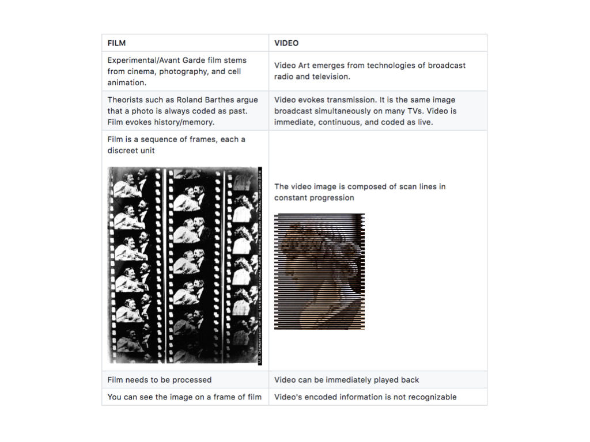
 

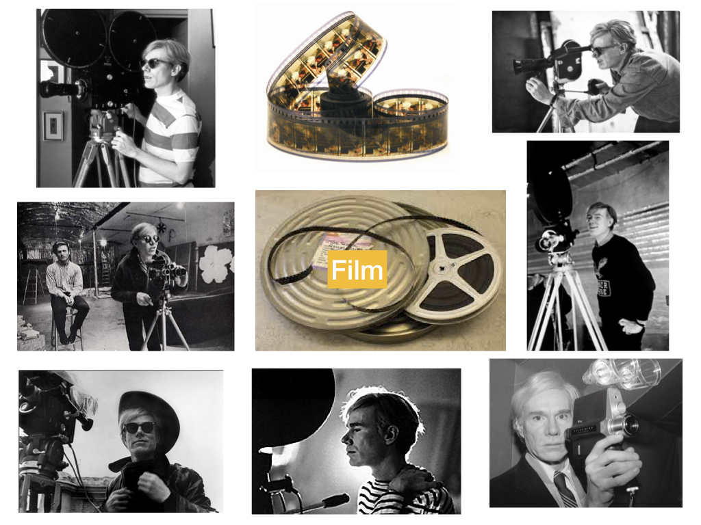
 

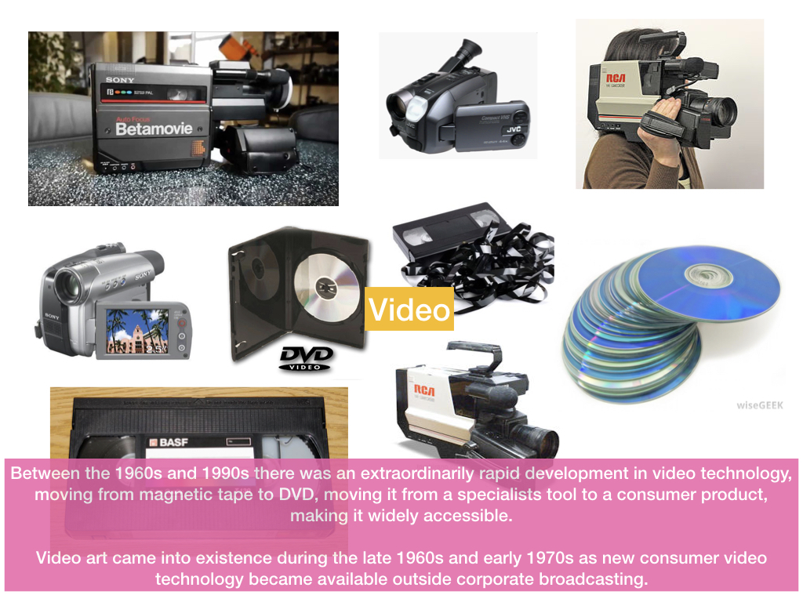
 

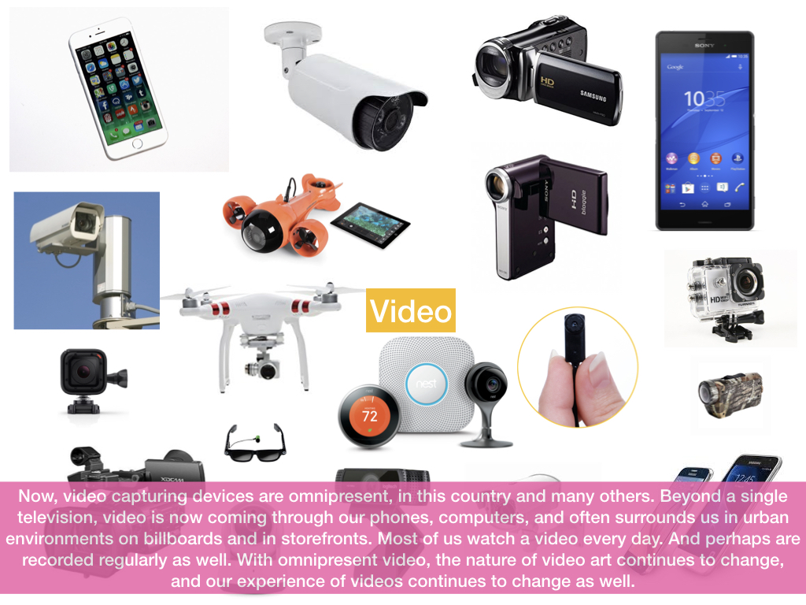
 

## Contemporary Video Art
#### Examples of video with non-original audio

[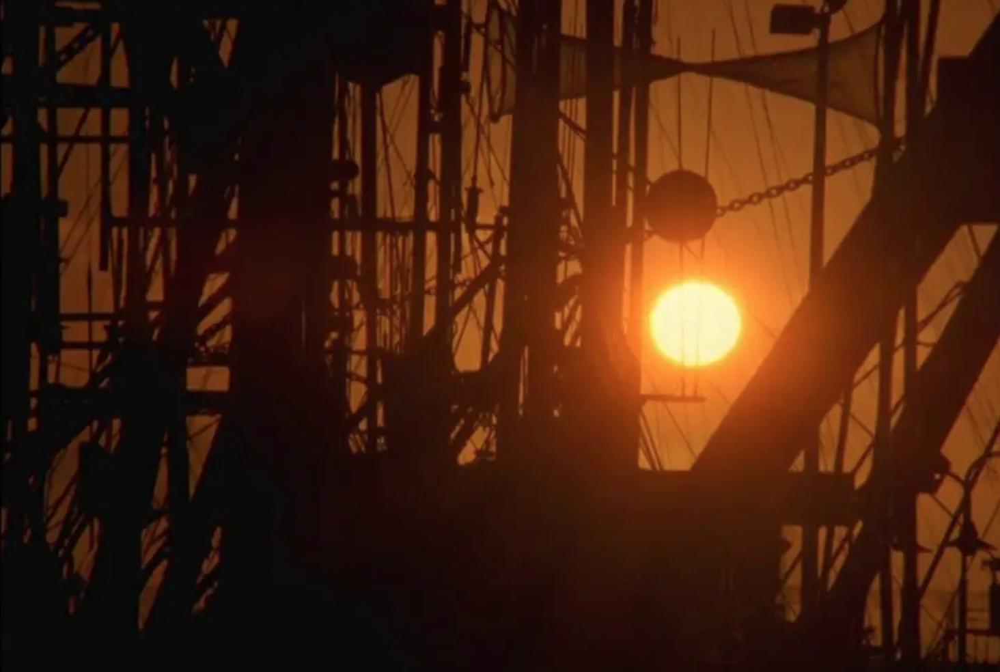](https://vimeo.com/85962209)
**Paul Clipson, _Light Year_, 2013**
 

[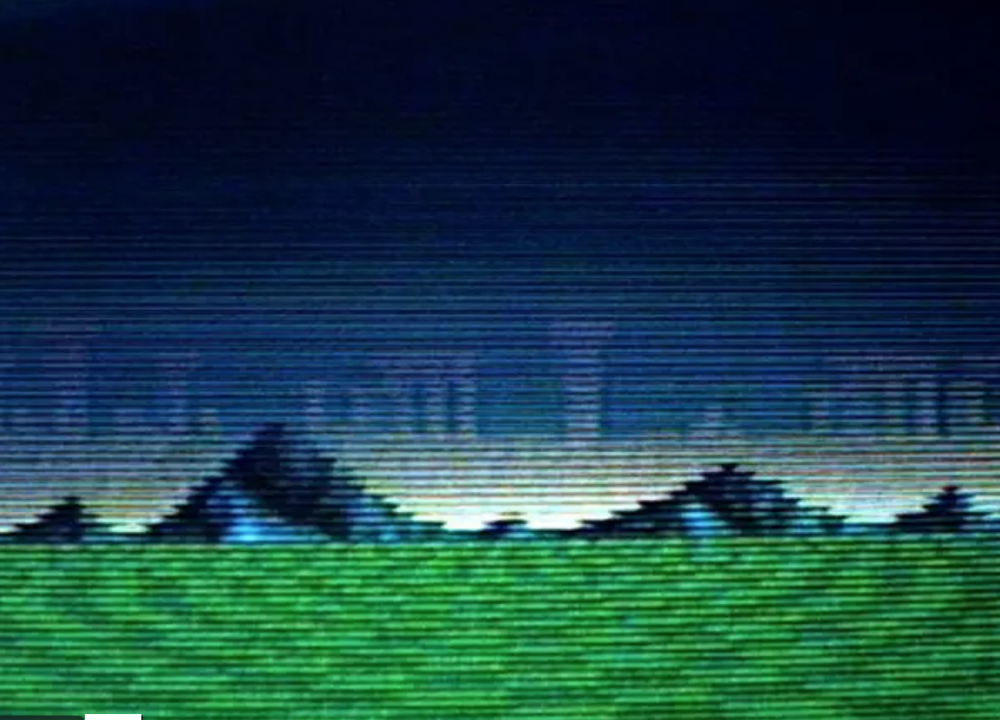](https://vimeo.com/8739633)
**Michael Robinson, _And We All Shine On_, 2010**
 

[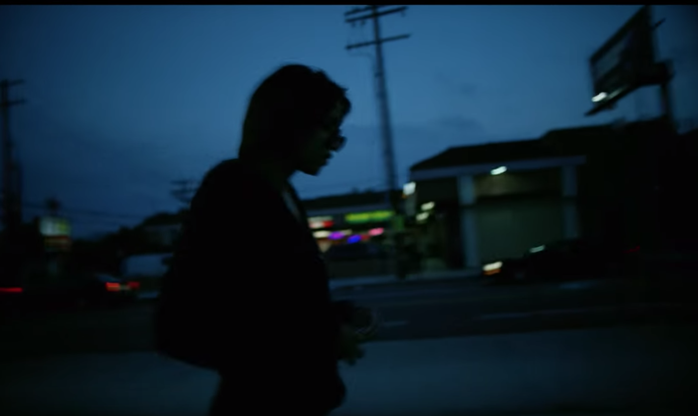](https://www.youtube.com/watch?v=3EqAJEgf4vA)
**Martine Syms and Kahlil Joseph, _Memory Palace_, 2015**
 

#### A few key themes in contemporary video art

#### Performance

**Martine Syms and Kahlil Joseph, _Memory Palace_, 2015**

#### Commentary on the role of technology in
our private and public lives

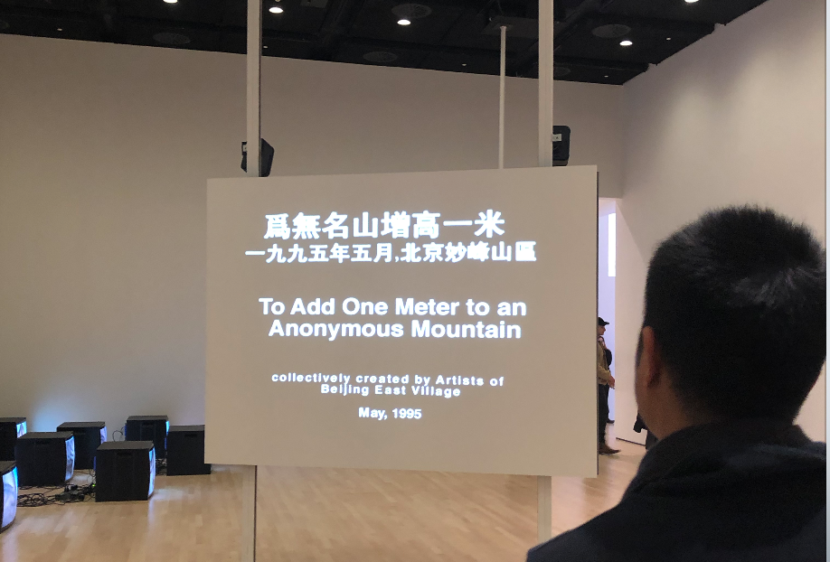
**Zhang Huang, _To Add One Meter to an Anonymous Mountain_, 1995**

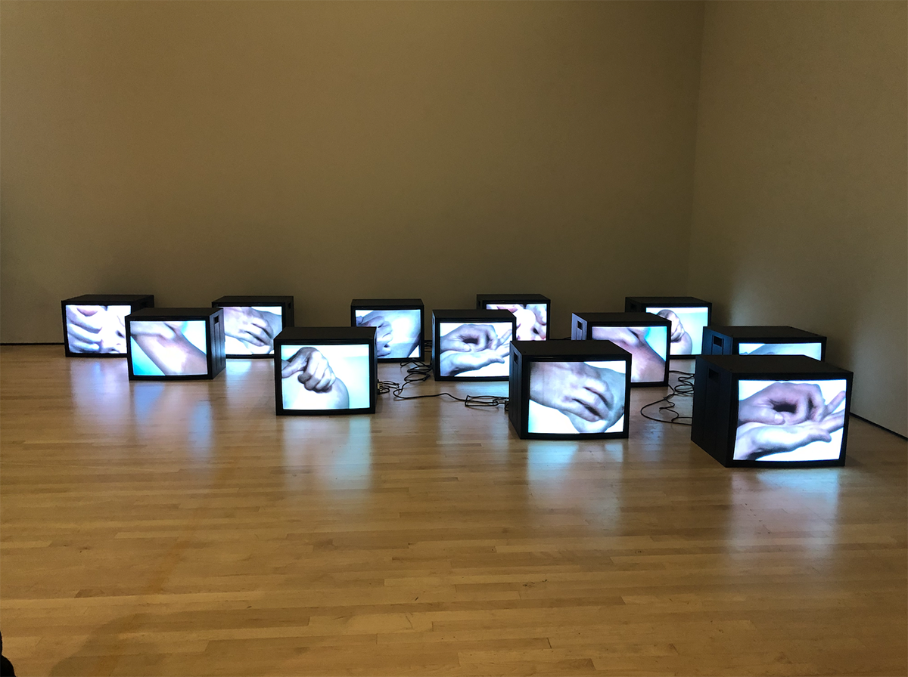
**Zhang Peili, _Uncertain Pleasure II_, 1996**

[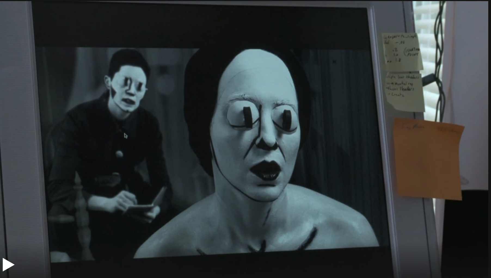](https://art21.org/artist/mary-reid-kelley/?gclid=Cj0KCQiAtvPjBRDPARIsAJfZz0pQqpKRJOAdh2zMBEUEmCZna6QJ-n4tIc99KXq02O1P3M1U07JgdhIaAgukEALw_wcB)
**Mary Reid Kelly, _You Make Me Iliad_, 2012**

#### Commentary on conventional narrative and/or advertising

[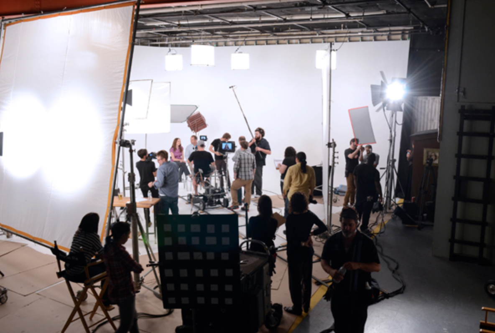](http://jonnherschend.com/projects/more-real-coming-soon/)
**Jonn Herschend, _More Real?_, 2012**

#### As a component within a gallery installation

[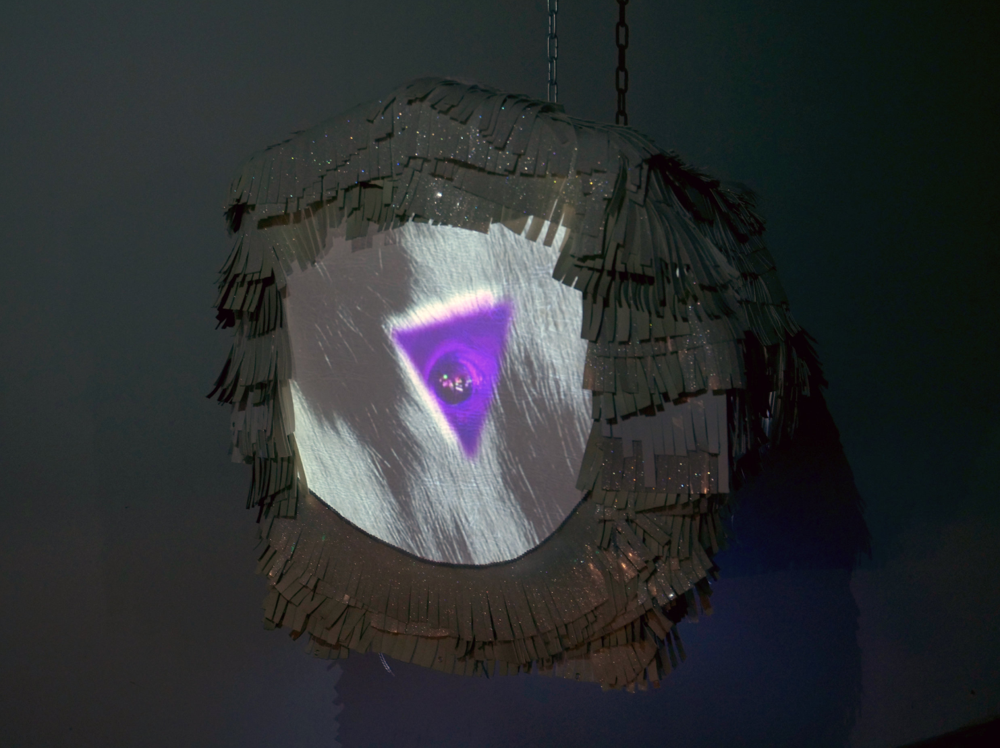](http://krhoades.com/2018/12/30/baby)
**Kate Rhoades, _Baby_, Video Sculpture, 2018**

---

## links
* [Video Data Bank](https://www.vdb.org/)
* [Electronic Arts Intermix](https://www.eai.org/)
* [Independent Media Arts Preservation: Archiving the Arts](http://www.imappreserve.org/archivingarts/)
* [Experimental Television Center](http://www.experimentaltvcenter.org/)
* [Smithsonian Show: Watch This! Revelations in Media Art](http://americanart.si.edu/exhibitions/online/watch_this/)
