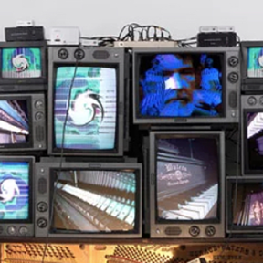
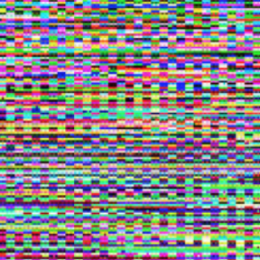
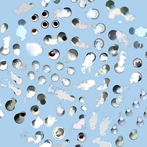
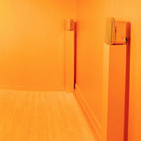
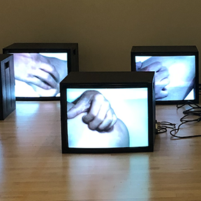
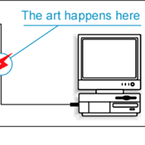
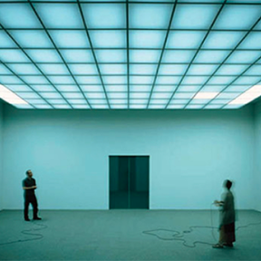

# **INTRO TO DIGITAL MEDIA ART**

|  Art 74 Spring 2019  | Course Information  | Course Content | Course Resources |
| -------------------------- |
| **Instructor:** Carrie Hott   **Office Location:** Art 311   **Office Hours:** Mondays 1:30-3pm, or by appt   **Email:** carolyn.hott@sjsu.edu   | [Description](https://carriehott.github.io/SJSU-Art74-Sp2019/#course-description)    [Schedule](https://carriehott.github.io/SJSU-Art74-Sp2019/schedule)   [Assignments](https://carriehott.github.io/SJSU-Art74-Sp2019/assignments)   [Expectations](https://carriehott.github.io/SJSU-Art74-Sp2019/#course-expectations)  [Grading](https://carriehott.github.io/SJSU-Art74-Sp2019/grading) | [Critiques](https://carriehott.github.io/SJSU-Art74-Sp2019/critiques)  [Lectures](https://carriehott.github.io/SJSU-Art74-Sp2019/lectures)  [Readings](https://carriehott.github.io/SJSU-Art74-Sp2019/readings)   [Tutorials](https://carriehott.github.io/SJSU-Art74-Sp2019/tutorials)| [Equipment](https://carriehott.github.io/SJSU-Art74-Sp2019/setup)  [Software](https://carriehott.github.io/SJSU-Art74-Sp2019/programs)   [Resources](https://carriehott.github.io/SJSU-Art74-Sp2019/resources)  |

# Lectures
Lectures are updated after in-class lectures are given. This page is not a substitute for what is presented in class.
 
 

| |  **[New Media Artist Presentations- Section 1](https://carriehott.github.io/SJSU-Art74-Sp2019/sec-one/artist-presentations/)**   **[New Media Artist Presentations- Section 4](https://carriehott.github.io/SJSU-Art74-Sp2019/sec-four/artist-presentations/)**|
| ------------------------------------------------------- |
|  |**[Intro to New Media Art](https://carriehott.github.io/SJSU-Art74-Sp2019/lectures/Intro_NewMediaArt/)** |
| |**[Glitch Art](https://carriehott.github.io/SJSU-Art74-Sp2019/lectures/glitch/)**|
|  |**[Composite Art](https://carriehott.github.io/SJSU-Art74-Sp2019/lectures/Composite/)** |
| | **[Sound Art](https://carriehott.github.io/SJSU-Art74-Sp2019/lectures/Sound_Art/)**|
|| **[Video Art](https://carriehott.github.io/SJSU-Art74-Sp2019/lectures/Intro_VideoArt/)** |
| |[**The Internet**](https://carriehott.github.io/SJSU-Art74-Sp2019/lectures/Intro_HTML_CSS/)   [**Net Art**](https://carriehott.github.io/SJSU-Art74-Sp2019/lectures/Net_Art/)|
||[**Code as Art**](https://carriehott.github.io/SJSU-Art74-Sp2019/lectures/Interactive_Art/)|
