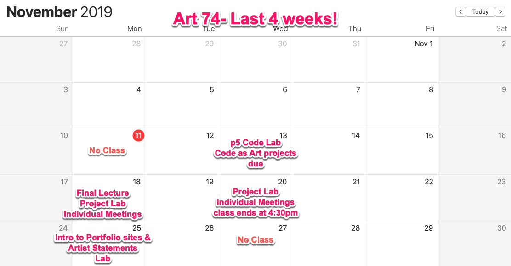
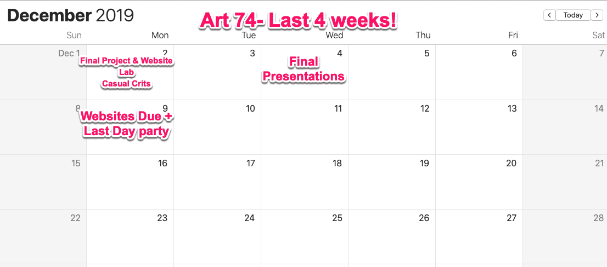

# **INTRODUCTION TO DIGITAL MEDIA ART**

|  Art 74 FALL 2019  | Course Information  | Course Content | Course Resources |
| -------------------------- |
| **Instructor:** Carrie Hott   **Office Location:** Art 311   **Office Hours:** Mondays 11:00am-12:00pm, or by appt   **Email:** carolyn.hott@sjsu.edu   | [Description](https://carriehott.github.io/sjsu-art74/#course-description)    [Schedule](https://carriehott.github.io/sjsu-art74/schedule)   [Assignments](https://carriehott.github.io/sjsu-art74/assignments)   [Expectations](https://carriehott.github.io/sjsu-art74/#course-expectations)  [Grading](https://carriehott.github.io/sjsu-art74/grading) | [Gallery](https://carriehott.github.io/sjsu-art74/critiques)  [Lectures](https://carriehott.github.io/sjsu-art74/lectures)  [Readings](https://carriehott.github.io/sjsu-art74/readings)   [Tutorials](https://carriehott.github.io/sjsu-art74/tutorials)| [Software](https://carriehott.github.io/sjsu-art74/programs)   [Resources](https://carriehott.github.io/sjsu-art74/resources)  |

# Course Schedule

_Note: This schedule is subject to change. You will be notified of any changes in a timely manner. Check Canvas and this website regularly for updates._

**Week** | **Date** | **Topics, Readings, Assignments** | **Deadlines**
------------ | ------------ | ------------- | -------------
1 | Wed 8/21 | Course Introductions and Syllabus Overview   Computer Setup + Intro to Digital Media Art reading |
2 | Mon 8/26 | Lecture: Intro to New Media Art  Computer setup and preparation   Team presentations | Digital Media Art Reading response
2 | Wed 8/28 |Image formats, resolution, software interface and main tools Lecture: Glitches in New Media Art  Intro to Glitch Art | Computer Preparation
3 | Mon 9/2 | LABOR DAY: NO CLASS | 
3 | Wed 9/4 | Lecture: Raster and Vector files  Intro to digital image editing with Photoshop & Illustrator   In-Class Exercise: Raster & Vector | Glitch Art project
4 | Mon 9/9 | Lecture: Composites in New Media Art Intro to Composite Art project Lab: Raster & Vector exercise| 
4 | Wed 9/11 | Composite Art continued   Demo/Lab: Editing with Photoshop (cont)   |
5 | Mon 9/16 | Composite Presentations   Intro to Sound Art Assignment: New Media Artist Presentations | Composite Art project
5 | Wed 9/18 |Lecture: Sound and Video Art   Demo: Collecting Sounds & Video Intro to Video Art project |
6 | Mon 9/23| Intro to Premiere Pro   Audio/Video Art lab |
6 | Wed 9/25| NO CLASS- Field Trip to Yerba Buena Center for the Arts in San Francisco |
7 | Mon 9/30 | Audio/Video Art Finalizing Lab   Watch Audio/Video projects | Audio/Video Art projects
7 | Wed 10/2| Intro to the Internet and Net Art   Intro to HTML  In-Class exercise: HTML  Assignment: HTML/CSS reading | HTML exercise
8 | Mon 10/7 | HTML cont'd   Net Art concept development exercise  Intro to GitHub & Setup Lab | Response to reading + GitHub account
8 | Wed 10/9 | Intro to CSS Intro to Net Art projects  In-Class Exercise: CSS    | CSS Exercise
9 | Mon 10/14 | New Media Artist presentations | New Media Artist presentations
9 | Wed 10/16  | New Media Artist presentations |
10 | Mon 10/21 | Net Art project lab | Net Art project progress
10 | Wed 10/23 | Net Art project lab | Net Art project progress
11 | Mon 10/28 | Net Art project finalizing lab   Net Art presentations | Net Art project
11 | Wed 10/30 | Intro to Code Art   Intro to p5 & Algorithms | Algorithm exercise
12 | Mon 11/4 | p5 cont'd  Intro to Code as Art porject  | 
12 | Wed 11/6 | p5 Lab   Intro to Final projects |
13 | Mon 11/11  | VETERANS DAY- NO CLASS | 
13 | Wed 11/13 | Review p5 projects   Intro to WYSIWYG sites | Code as Art project
14 | Mon 11/18 | Portfolio Lab   Final Project Lab  | Final Project Proposals
14 | Wed 11/20 | Final Project Lab | Final Project progress
15 | Mon 11/25 | Final Project + Portfolio Lab | Final Project progress
15 | Wed 11/27 | THANKSGIVING- NO CLASS |
16 | Mon 12/2 | Final Critique | Final Project
16 | Wed 12/4 | Final Critique | Final Project
17 | Wed 12/9 | Review of Portfolio Websites | Portfolio websites
FINAL | | | Online Portfolio + Artist Statement
