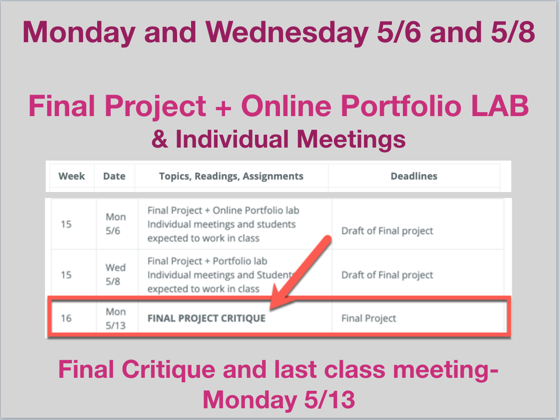
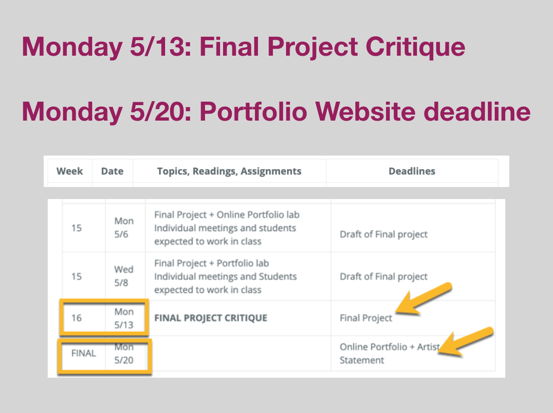

# **INTRO TO DIGITAL MEDIA ART**

|  Art 74 Spring 2019  | Course Information  | Course Content | Course Resources |
| -------------------------- |
| **Instructor:** Carrie Hott   **Office Location:** Art 311   **Office Hours:** Mondays 1:30-3pm, or by appt   **Email:** carolyn.hott@sjsu.edu   | [Description](https://carriehott.github.io/SJSU-Art74-Sp2019/#course-description)    [Schedule](https://carriehott.github.io/SJSU-Art74-Sp2019/schedule)   [Assignments](https://carriehott.github.io/SJSU-Art74-Sp2019/assignments)   [Expectations](https://carriehott.github.io/SJSU-Art74-Sp2019/#course-expectations)  [Grading](https://carriehott.github.io/SJSU-Art74-Sp2019/grading) | [Critiques](https://carriehott.github.io/SJSU-Art74-Sp2019/critiques)  [Lectures](https://carriehott.github.io/SJSU-Art74-Sp2019/lectures)  [Readings](https://carriehott.github.io/SJSU-Art74-Sp2019/readings)   [Tutorials](https://carriehott.github.io/SJSU-Art74-Sp2019/tutorials)| [Equipment](https://carriehott.github.io/SJSU-Art74-Sp2019/setup)  [Software](https://carriehott.github.io/SJSU-Art74-Sp2019/programs)   [Resources](https://carriehott.github.io/SJSU-Art74-Sp2019/resources)  |

# Course Schedule
_Note: This schedule is subject to change. You will be notified of any changes in a timely manner. Check Canvas and this website regularly for updates._

**Week** | **Date** | **Topics, Readings, Assignments** | **Deadlines**
------------ | ------------ | ------------- | -------------
1 | Mon 1/28 | Course Introductions and Syllabus Overview   Computer Setup + Intro to Digital Media Art reading |
1 | Wed 1/30 | Lecture: Intro to New Media Art  Computer setup and preparation  Team presentations |
2 | Mon 2/4 |Team Presentations continued Computer Setup Review Image formats, resolution, software interface and main tools | Computer Preparation & Digital Media Art Reading response
2 | Wed 2/6 | Intro to digital image editing with Photoshop & Illustrator   Lecture: Glitches in New Media Art  Intro to Glitch Art project  Demo & Lab: Audacity + Photoshop |
3 | Mon 2/11 | Lecture: Composites in New Media Art Intro to Composite Art project Demo/Lab: Editing with Photoshop | Glitch Art project
3 | Wed 2/13 | Composite Art continued   Demo/Lab: Editing with Photoshop (cont)  Exquisite Corpse group projects |
4 | Mon 2/18 | **COMPOSITE ART CRITIQUE** | Composite Art project
4 | Wed 2/20 |Lecture: Sound and Video Art   Demo: Collecting Sounds Importing Audio into Audacity |
5 | Mon 2/25| Audacity and Audition continued    Lecture: Sound and Video Art |
5 | Wed 2/27 | Intro to editing Video with Premiere   Demo & Lab: Collect video footage |
6 | Mon 3/4 | Editing with Premiere continued   Audio/Video Art Lab | Audio/Video Art progress
6 | Wed 3/6 | **AUDIO/VIDEO ART CRITIQUE** | Audio/Video Art projects
7 | Mon 3/11 | Intro to the Internet and the Web   Team Presentations - Let’s Make the Internet   Net Art concept development exercise  Intro to GitHub & Setup Lab | Response to reading + GitHub account
7 | Wed 3/13 | Lecture: Net Art Examples  Intro to HTML/CSS cont'd  Intro to GitHub & Setup Lab  Net Art group exercise  | Net Art group & GitHub URL
8 | Mon 3/18 | Intro to HTML/CSS continued  Individual meetings on Net Art projects | Net Art progress
8 | Wed 3/20 | Net Art lab  HTML/CSS continued   Intro to Portfolio Websites + Artist Statements|
9 | Mon 3/25 | **NET ART PROJECT REVIEW** Online Portfolio Setup  | Net Art project
9 | Wed 3/27 | **NO CLASS**- Website work day| Online Portfolio (website) + Artist Statement draft
10 | Mon 4/1 | **SPRING BREAK- NO CLASS** |
10 | Wed 4/3 | **SPRING BREAK- NO CLASS** |
11 | Mon 4/8 | Intro to New Media Presentations + Final Projects   Portfolio Websites + Artist Statements | Portfolio website URL
11 | Wed 4/10 | Portfolio Websites + Artist Statements cont'd   Intro to Coding Concepts |
12 | Mon 4/15 | Writing Interactivity - Code as Art I   Intro to Coding Concepts| p5 team exercise 1
12 | Wed 4/17 | Writing Interactivity - Code as Art II   Intro to p5 & basic shapes   Intro to Code as Art team Projects | p5 tutorial homework- variables
13 | Mon 4/22 | Writing Interactivity - Code as Art III - adding images and interactivity   p5 Code as Art Lab  | Final Project Proposals
13 | Wed 4/24 | Writing Interactivity - Code as Art IV  Code as Art project lab Portfolio and Final project lab | Code as Art project progress
14 | Mon 4/29 | **CODE as ART PROJECT REVIEW** | Code as Art project
14 | Wed 5/1 | **NEW MEDIA ARTIST PRESENTATIONS**  5 minutes each | New Media Artist Presentations
15 | Mon 5/6 | Final Project + Online Portfolio lab Individual meetings and students expected to work in class |  Draft of Final project
15 | Wed 5/8 | Final Project + Portfolio lab Individual meetings and Students expected to work in class | Draft of Final project
16 | Mon 5/13| **FINAL PROJECT CRITIQUE** | Final Project
FINAL | Mon 5/20 | | Online Portfolio + Artist Statement

