# **6PM SECTION 4 EMOJI PROPOSALS**

### **++[SJSU Art Spring 2019](https://carriehott.github.io/SJSU-Art74-Sp2019/)++**

[<Back to HOME PAGE](https://carriehott.github.io/SJSU-Art74-Sp2019/)

#### >EMOJIS

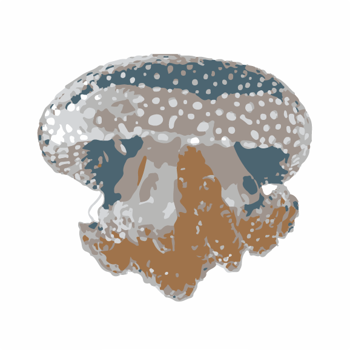 
**Artist:** Alex Alonzo 
**Description:** There isn't a Jellyfish emoji and I think there needs to be.
 

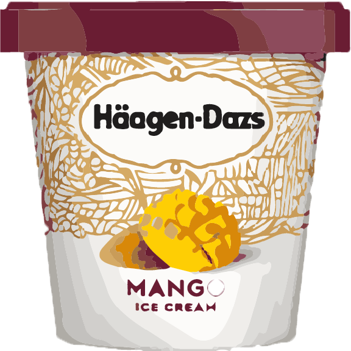 
**Artist:** Mandy Chan 
**Description:** This emoji should be added, because it it my favorite ice cream from Haagen dazs.
 

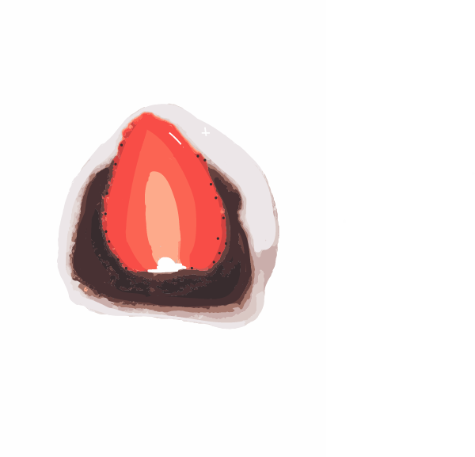 
**Artist:** Sabrina Chan 
**Description:** Strawberry daifuku is very tasty and is an iconic Japanese dessert.
Delete comment: Strawberry daifuku is very tasty and is an iconic Japanese dessert.

 

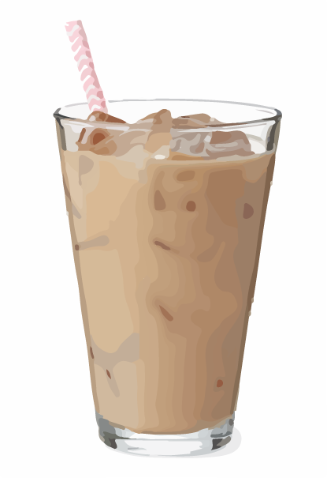 
**Artist:** Annie Coleman 
**Description:** I think it's crucial that we make an ice coffee emoji because there is already a hot coffee one. It would also be important to note that ice coffee is way better than hot coffee.

 

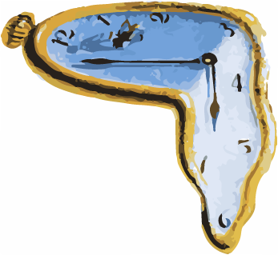 
**Artist:** Diego Esparza 
**Description:** This should be added as an emoji because it jokingly expresses the feeling of having no time, or the lack of using logic or reason.
 

 
**Artist:** Bri Felix 
**Description:** This is my couch potato emoji, because everyone is entitled to be lazy!!!
 

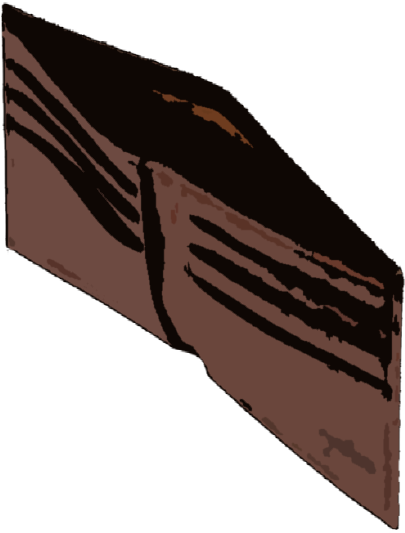 
**Artist:** Yingshi Feng 
**Description:** Empty wallet means no money.
 

 
**Artist:** David Koster 
**Description:** I believe my emoji is important because Bubble Milk Tea, Pearl Milk Tea, or Boba (or one of its other various names) has been extremely popular over the years. Though the drink originated in Taiwan over 30 years ago, it is very popular in various Asian countries and has had a boom in America over the past few years. I think it's important to have because it's commonplace in so many people's lives, but they cannot represent the item when texting or using emojis.
 

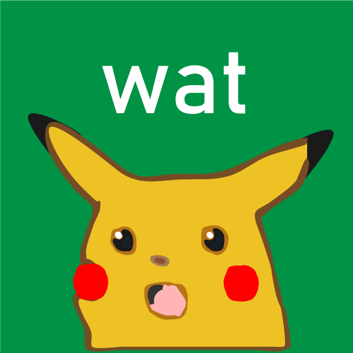 
**Artist:** Ray Lam 
**Description:** This emoji should be added because Pikachu is a precious creature and must be shared with all.
 

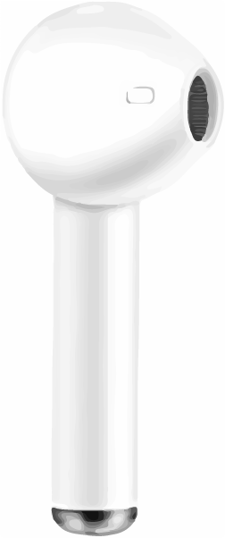 
**Artist:** Xin Li 
**Description:** AirPods is Apple's product and is now very popular.
 

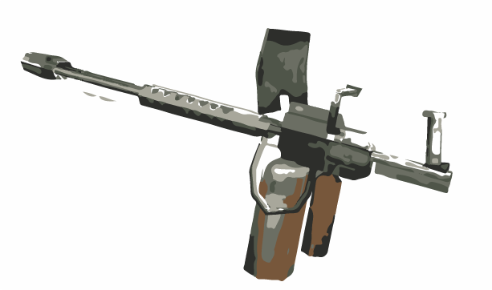 
**Artist:** Ruben Martinez-Aguilar 
**Description:** When the whole group chat is roasting you, a few simple flames do not suffice. That's when you pull out the flame thrower. Other uses may include global warming when followed by Earth emoji, wild fires when followed by tree emojis, and Burning Man when followed by the camping emoji.

 

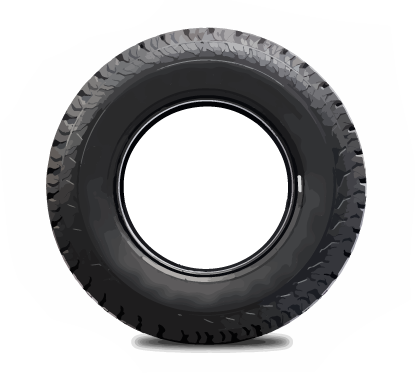 
**Artist:** Jiho Park 
**Description:** This emoji should be added because there is no tire emoji. How else must one discuss getting flat tires or getting their tires changed without the help of a perfectly vectorized tire?
 

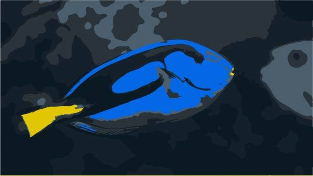 
**Artist:** Vanessa Rivera 
**Description:**
 

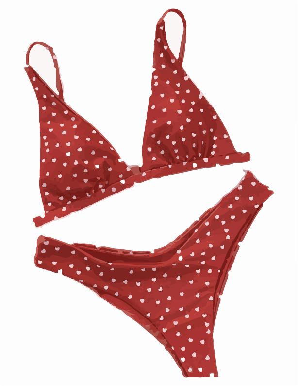 
**Artist:** Krystal Ruiz 
**Description:** The current bikini emoji needs to have a more timeless design and color palette.
 

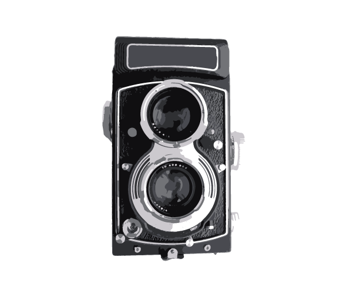 
**Artist:** Noah Sesmas 
**Description:** I made this emoji because all of a sudden everyone wants to shoot from "vintage" cameras and there isn't this emoji already. I shoot with a TLR (twin reflex lens) camera and wish I could actually have this emoji.

 

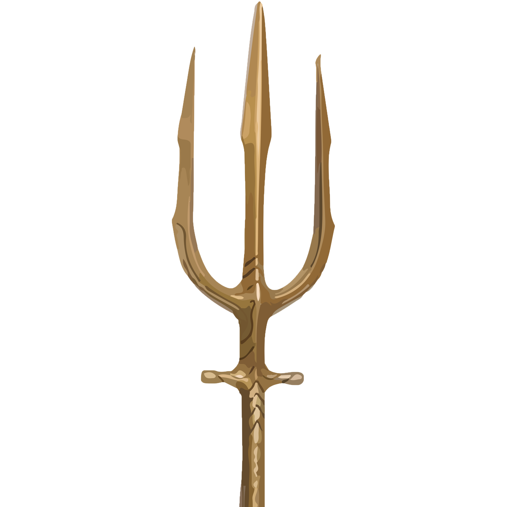 
**Artist:** Weikun Shen 
**Description:** Darkness and Trident. This idea comes from watching the Aquaman movie.
 

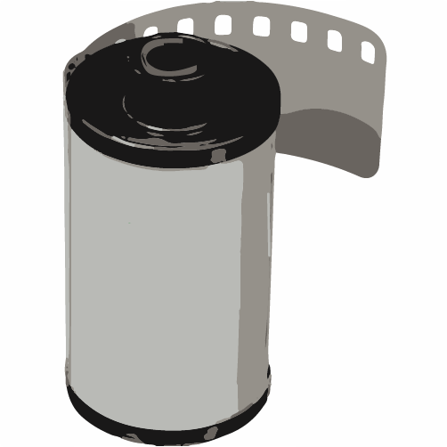 
**Artist:** Carla Torres 
**Description:** This Emoji should be added because analog photography has become relevant again in mainstream culture.
 

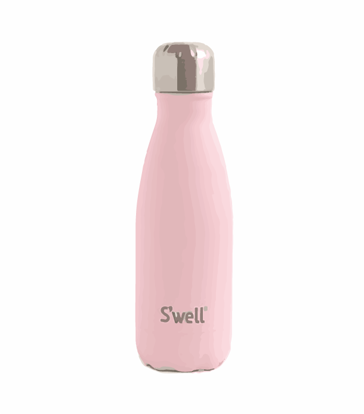 
**Artist:** Mary Tran 
**Description:** Using reusable water bottles is a healthier choice than the plastic one-time bottles and it's another way to create and maintain our green and substantial earth.
 

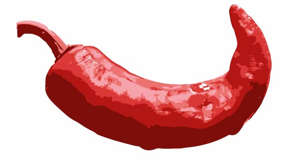 
**Artist:** Thomas Vuong 
**Description:** Pepper signifies "hotness"
 

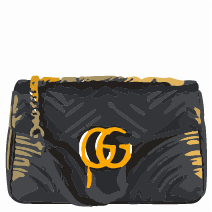 
**Artist:** Effy Wang 
**Description:** I like this bag.
 

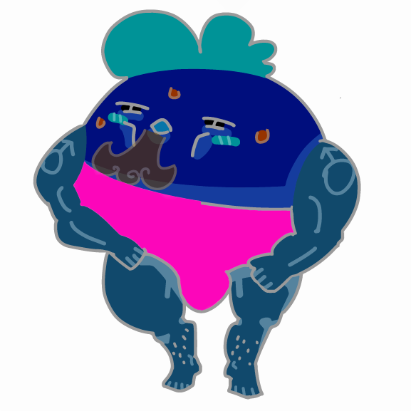 
**Artist:** Guoxun Wu 
**Description:** Arrogance.
 

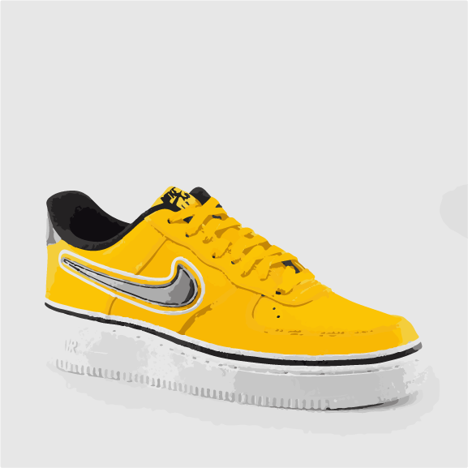 
**Artist:** Jiaming Wu 
**Description:**
 

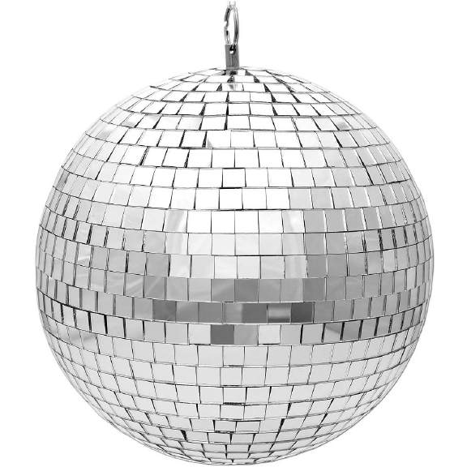 
**Artist:** Wilber Zheng 
**Description:** The reason why this the disco ball should be an emoji is that it signifies disco and parties and because of this it would be used constantly.
 
