# **ART 74 SECTION 4 - FINAL PROJECTS**

### **++[SJSU Art 74 Spring 2019](https://carriehott.github.io/SJSU-Art74-Sp2019/)++**

[<Back to Home Page](https://carriehott.github.io/SJSU-Art74-Sp2019)

# FINAL PROJECTS

# **--> COMPOSITE & GLITCH work**
# **Annie Coleman** 

 
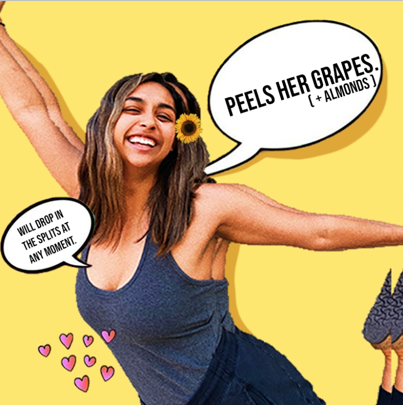
 
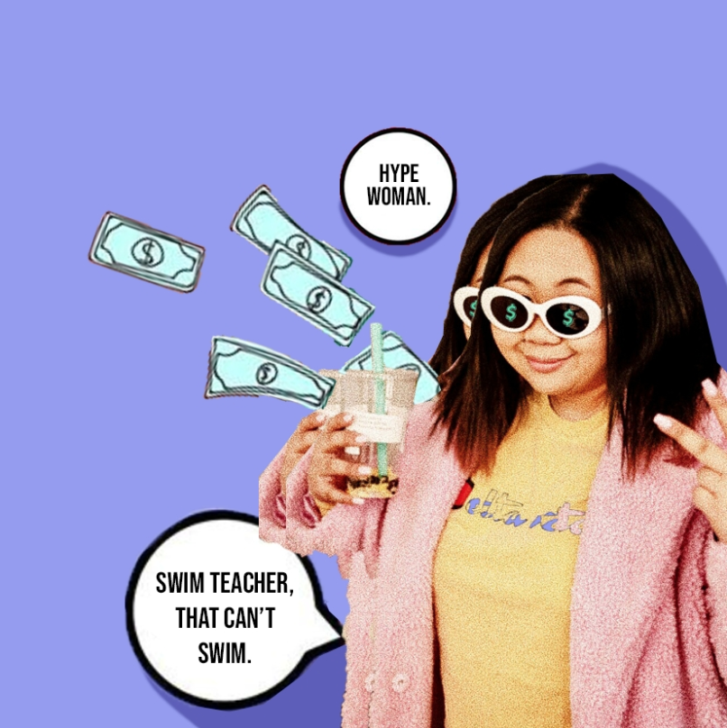
 
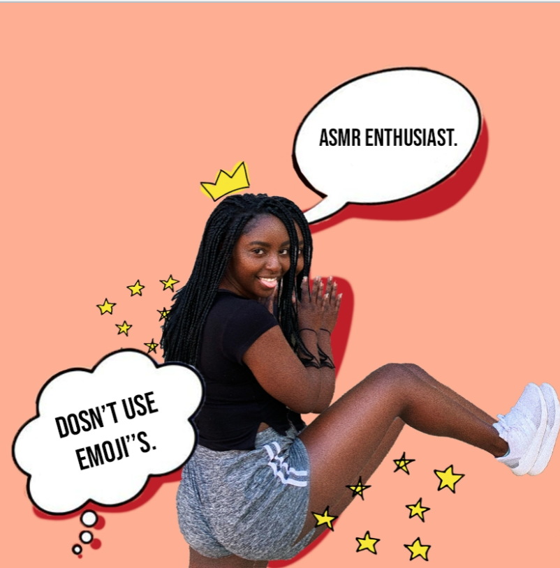

**friends** 
For my project I decided to do collages of my three friends. Each college is a representation of who they are and little weird things they do, sort of like their bio. I chose to use this medium because I enjoyed the collaging aspect of it.

# **Sabrina Chan**
 
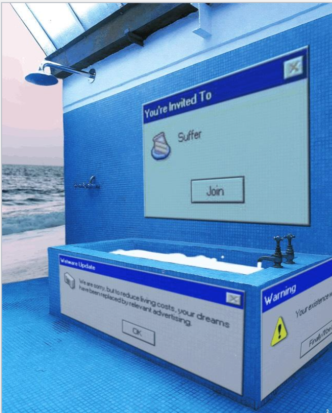
 
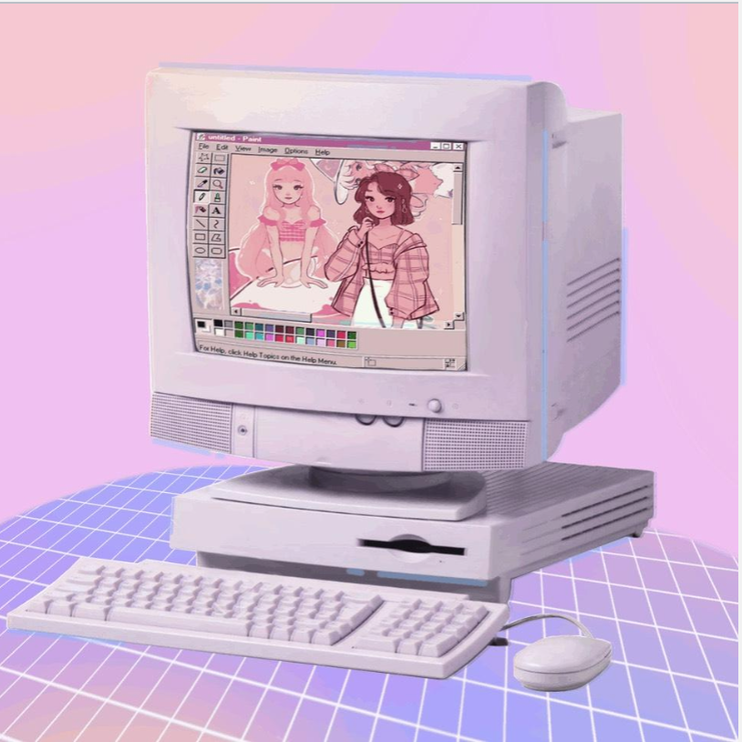
 
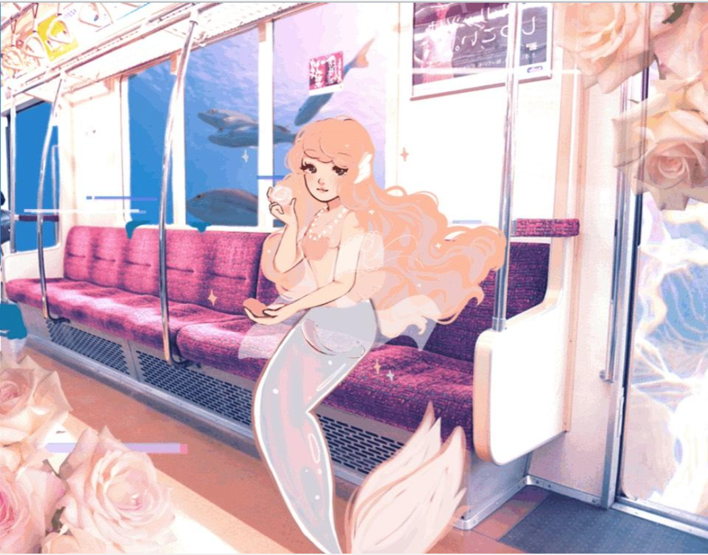

# **Diego Esparza**
 
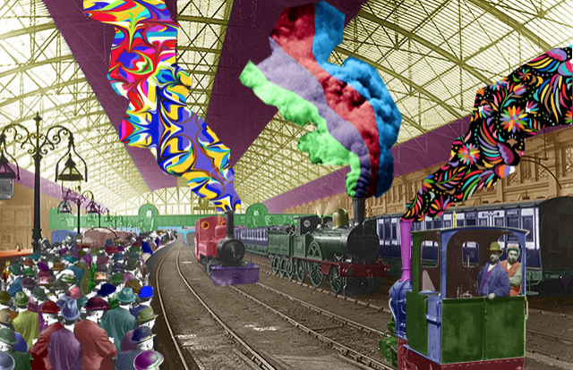
 
**Pepperland Station** 
I Remember when I had first watch the Beatle's film, Yellow Submarine, I couldn't help myself to be amazed about the art style. It was so vibrant with many different colors, and it didn't matter which color matched or was to vibrant, and all hand drawn not looking for detail. Now I know that is most common form of pop art who I had previously hated until i had understood it's concept. I made this piece because I had always loved steam locomotives with visible pistons and the connection rods and plus I wanted to add color when it was only monochrome. All of this was originally black and white so I added different colors to each different article of clothing, also there was no smoke so I added that mixed in with some wild patterns.
 
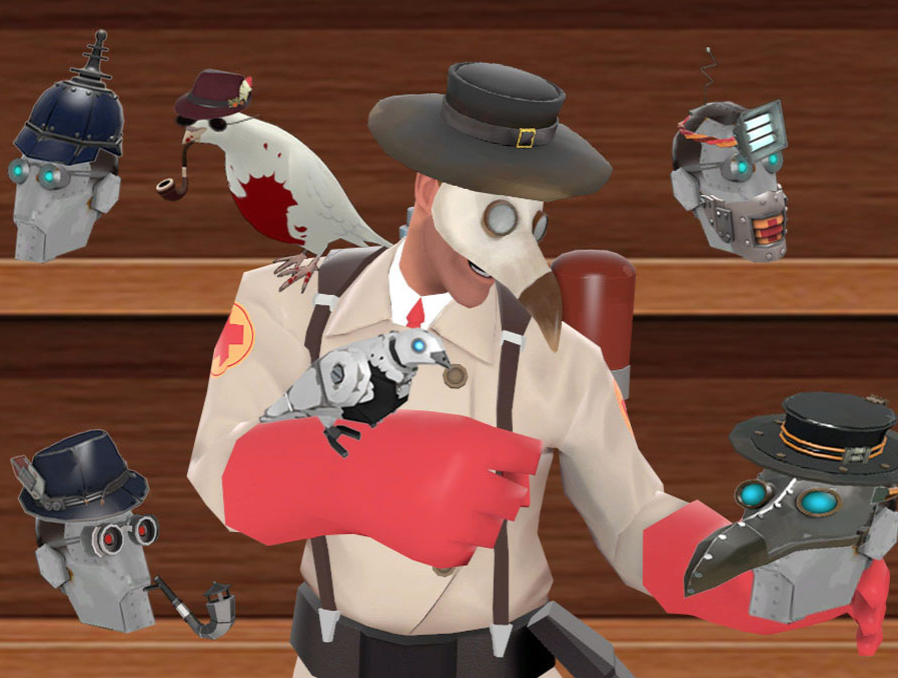
 
**Boogaloo Update** 
I have always loved playing the FPS game, Team Fortress 2 (TF2); not because of it's quality of gaming but for all the crazy story and personality of every character in the game. there's 9 classes you can play but for every class, they have there own story behind them as a an insane personality. Any, a while back they had an update where the developers to add cosmetic items that the gaming community had made. Now most people have said that TF2 is a "hat-simulator" because there are in-game cosmetics that you can collect and can add to your player with some having a rare particle effect on them which is why there is has been an in-game economy of players trading for hats. Beside that, the update was called the "Robotic Boogaloo update" where the TF2 community had made several robotically theme cosmetics of pre-existing cosmetics. The reason behind the robot theme was because without giving to much detail with the lore.in the game, you can play a tour mission where you go on to destroy robot alter-egos of the classes, and for a short while people made robotic hats and the developers saw this and added them to the game. So I made this to sort and capture the mindset of every player that was playing during the update, of want to get every single cosmetic for there class.
 
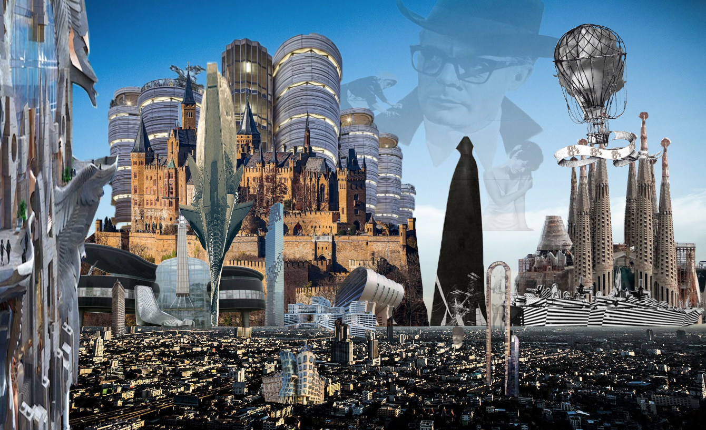
**La vita alta** 
In the Looney Toon's cartoon "Bugs Bunny Rides again" made in 1948, we are introduced to Yosemite Sam for the first time. There's a scene the Yosemite Sam says to Bugs up close, "This town ain't big enough for the two of us", and Bugs is to say, "it ain't?" then immediately runs out of the saloon with some wooden boards and a hammer, he's off screen for about 5 seconds with the sounds of hammering, sawing and drilling, comes back and says to Sam "is it big enough now?", it then cuts to the small western town but now having skyscrapers in the background. I though that was hilarious growing up, and I had like that of things not making sense to prove a point. It also reminded me of the works of Federico Fellini, manly his comedy/drama "8 1/2" so I mixed the types of building around to see what looking interesting. Though while I was making this, I started to thing of how it would be inevitable that in the future that with growing population and overcrowding in cities, large housing structures will become about the size of skyscrapers, this may not be true but it sure does seem like a high possibility. but to add, a skyscraper, they can't be the same, thats boring, they have to be different with a new structure and design for each one. And to add to Fellini's works, I added a picture of Marcello Mastroianni to the sky with his tie showing the launch tower from the film 8 1/2.

# **Raymond Lam**
 
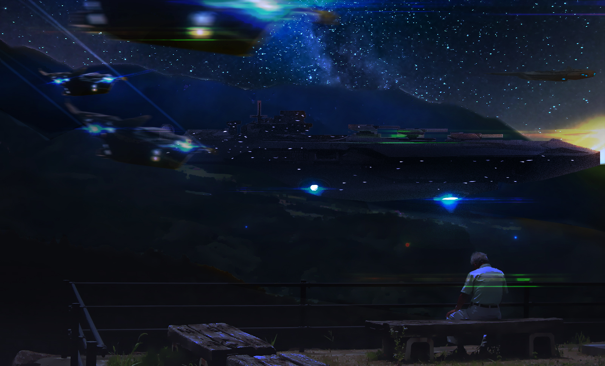
 
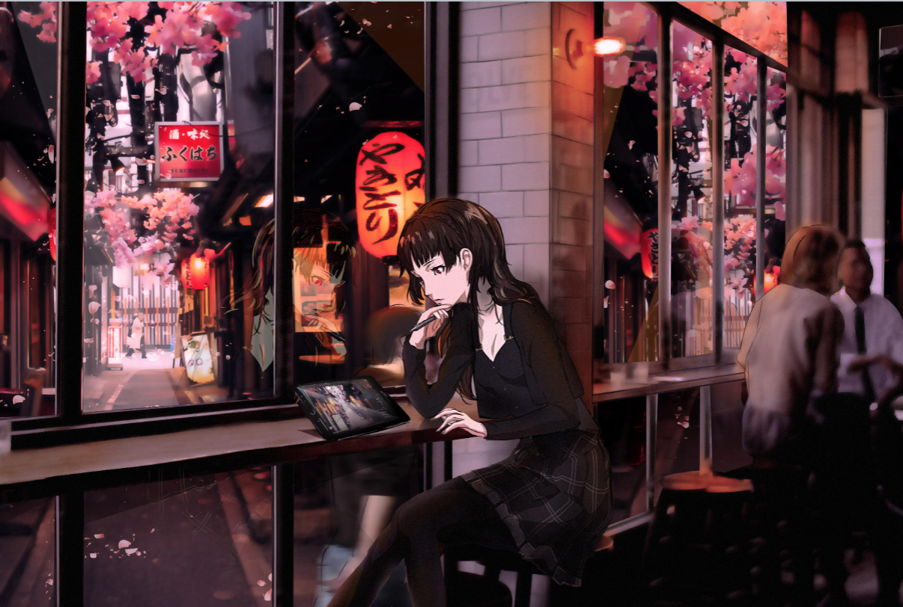
 
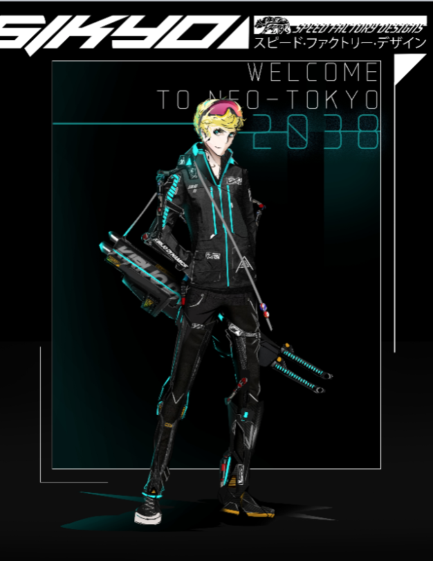

The reason I chose composite art is because I've always been fascinated with visual storytelling. This time I tried a technique known as "photobashing" which is using different real life photos and compositing them together. This was the first time I've tried doing this and it was really fun learning all the different hidden features of photoshop. I wanted to play with realism/fake withe Sikyo and Cafe Scene, and scale with Space Ship.

# **Noah Sesmas**
 
 

 

 

 
The title of this body of work is "Untitled 1, 2, 3" and they are gifs with incorporated glitches. This work creates disruption in the movement and repetition of light. The work is meant to create distortion in commonly known arcade games which gives the viewers a skewed view of the subjects.

# **Carla Torres**
 
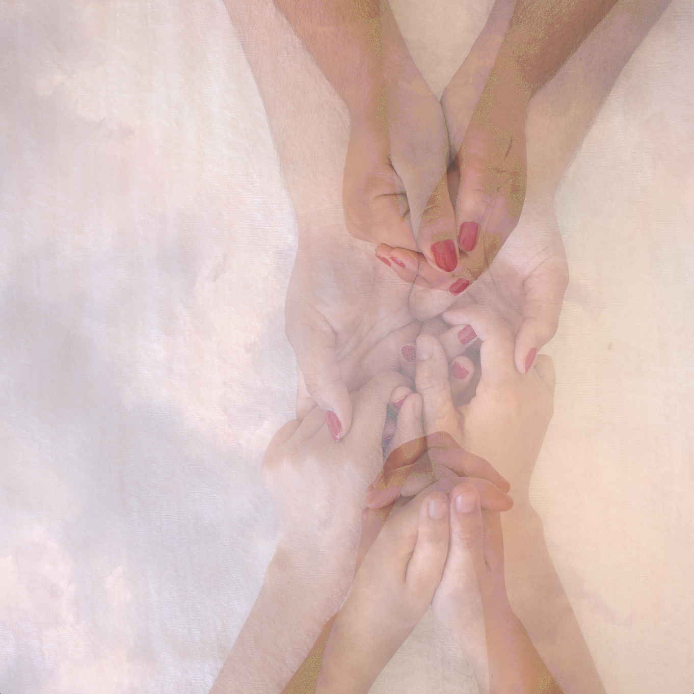
 
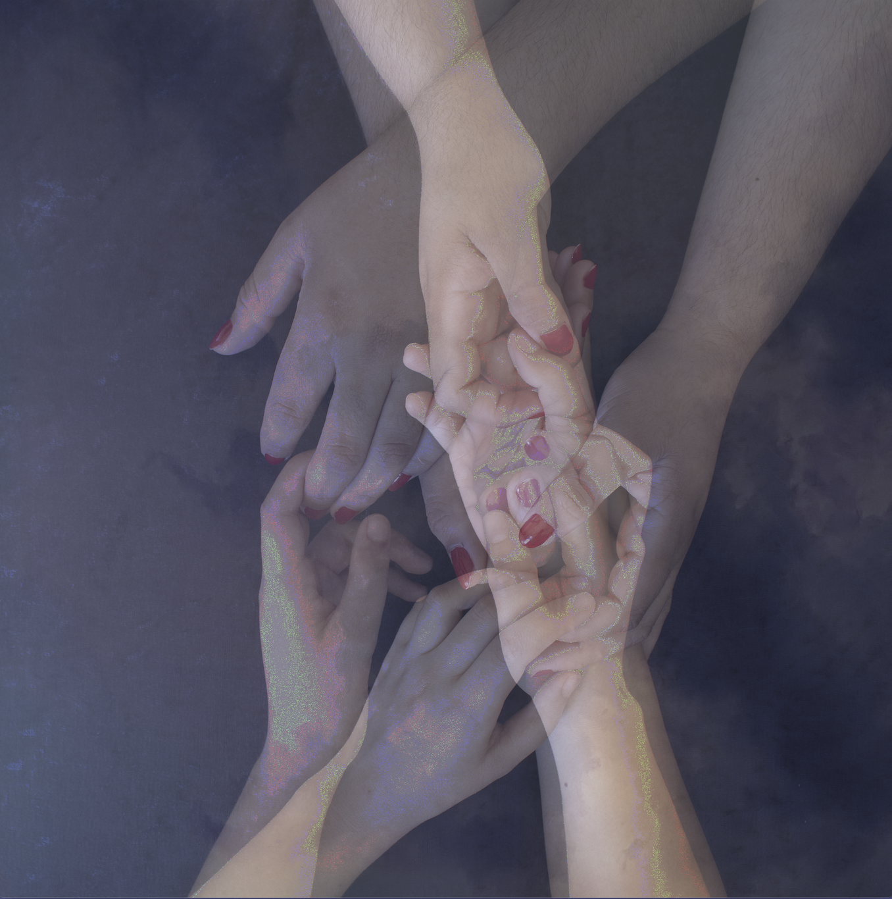
 
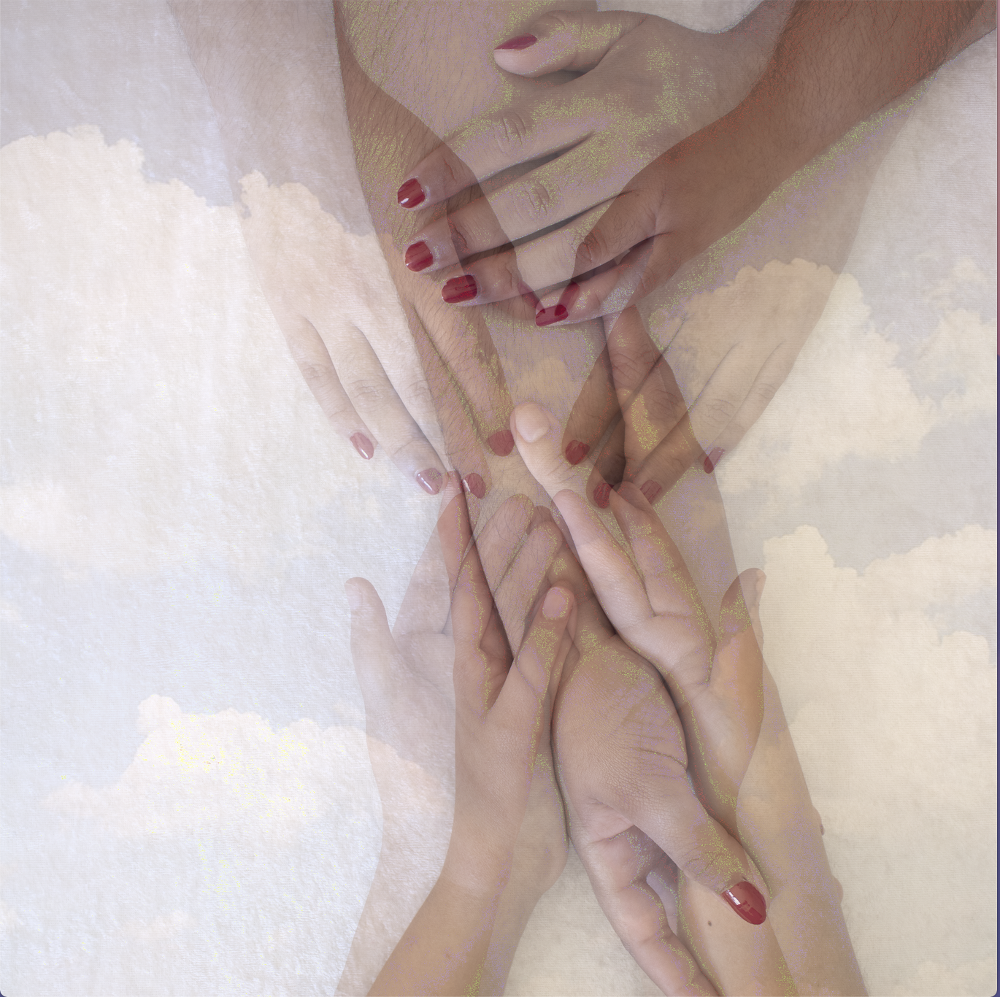

The title of my series is, "At the Table". The mediums I utilized were scans of 120mm film that were digitalized and manipulated and glitched. The concept for this series was an exploration of relationships. I wanted to focus on the ways affection can be expressed between two people and how that reads when it is multiple images. I wanted to emphasize on the concept of affection being transmitted and what it can look like. The glitching of the images was done to add a visual representation of energy being transmitted between two people.

# **Ruben Martinez-Aguilar**
 
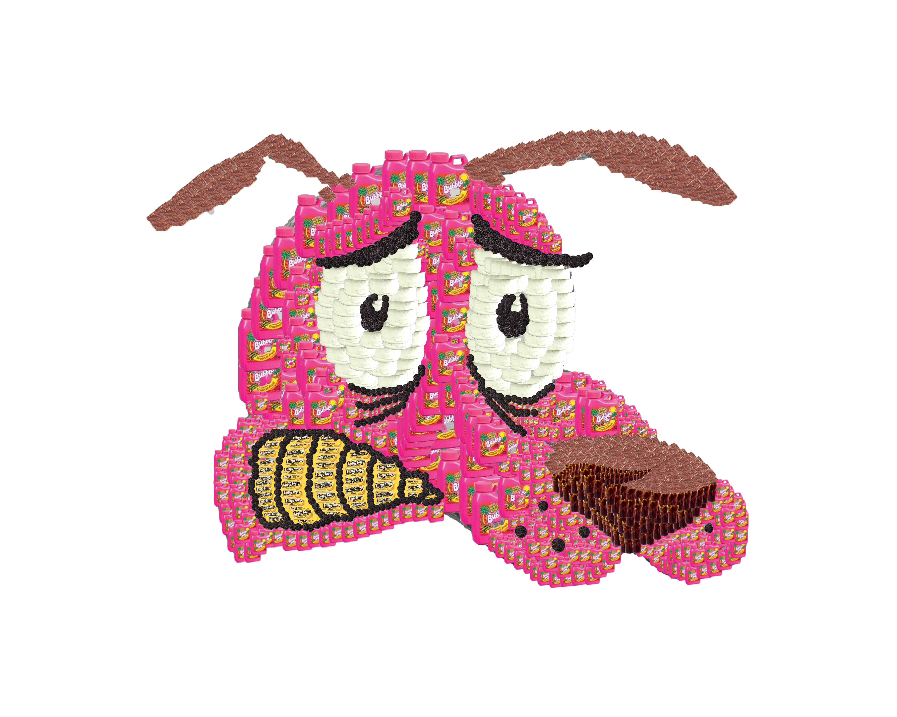
 
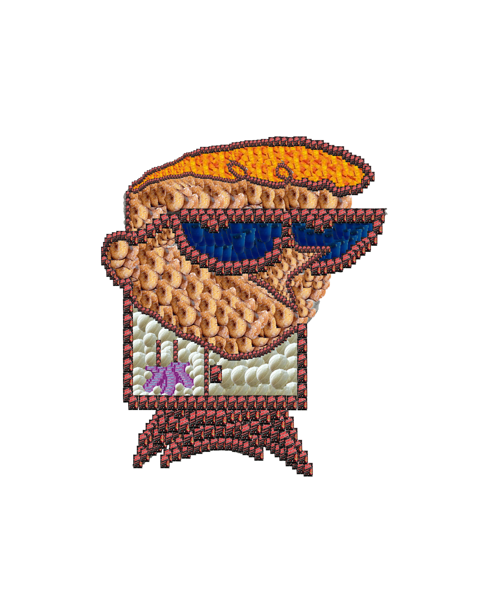
 
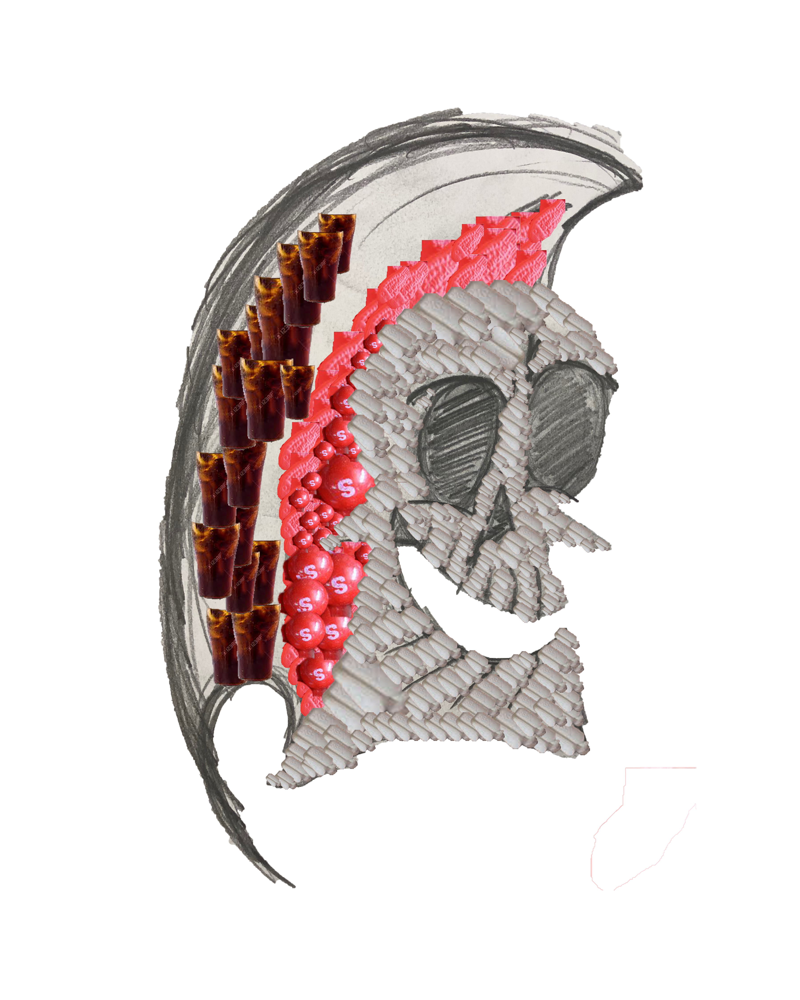

# **--> AUDIO/VIDEO work**

# **Alex Alonzo** 

<iframe src="https://player.vimeo.com/video/335804635" width="640" height="360" frameborder="0" allow="autoplay; fullscreen" allowfullscreen></iframe>

**Banal is Good** 
Originally this started out as a storyboard, but with the video and sound element, it’s now more of a short film. The concept behind the storyboard is photographically interpreted song lyrics; I listened to the song ‘Black is Good’ by Young Rival and picked out lyrics that I found compelling. I then imagined the lyrics as scenes and did my best to make those a reality. The end result came out to be the story of a working man coming home for the night.

# **David Koster** 

<iframe src="https://player.vimeo.com/video/335789433" width="640" height="360" frameborder="0" allow="autoplay; fullscreen" allowfullscreen></iframe>

**Drowning** 
For this piece, I wanted to dive into the mind of mental illness; depression specifically. When you're depressed, you have various negative thoughts and feelings that make you feel like you're drowning. No matter where you go, you are faced with the one thing that can literally drown you: water. I used the constant presence of water to help represent how suffocating it can feel to have so much water around you to the point where you drown. In order to achieve this, I had visual representations of water in everyday life as well as audio cues that were detached from the videos themselves. I chose to distort audio and create a dual video/audio art so that the piece can be experienced either visually or audibly.

# **Jiaming Yu**
 
[link to video](https://drive.google.com/file/d/1AMSBF0-yX_IWv7mCmAUQRcN0Y3WMgeu1/view?usp=sharing)
<iframe src="https://drive.google.com/file/d/1AMSBF0-yX_IWv7mCmAUQRcN0Y3WMgeu1/view?usp=sharing" width="500" height="400" target="_blank"></iframe>

Sicko Mode in the building? The reason why I choose this medium is because Travis Scott as a most famous artist nowadays, he likes to use a lot visual and graphic effects as obviously. I'm kinda his amazing idolater if I do say so myself. Enjoying his performance is one thing that I cannot forgettable this year. Some of my past design, I found that I was trending his sense.

# **Jiho Park**
 
[link to video](https://drive.google.com/file/d/1d7ve55K_WEHtozQZ_8iahuTlcwniLs-r/view?usp=sharing)
<iframe src="https://drive.google.com/file/d/1d7ve55K_WEHtozQZ_8iahuTlcwniLs-r/view?usp=sharing" width="500" height="400" target="_blank"></iframe>

 **It's Not Okay** 
 The title of the piece is "it's not okay" because many people apologize without meaning it everyday.Often people find it easier to apologize rather than to either listen to what someone has to say or follow through with them.Using Video and words I wanted to create a video that were only words because i wanted the conversation to be easily relatable to anybody, not someone specific.Also the focus on the letters and language means that the words that are being displayed have a lot of emphasis.

# **Mary Tran**
 
<iframe src="https://player.vimeo.com/video/335788615" width="640" height="360" frameborder="0" allow="autoplay; fullscreen" allowfullscreen></iframe>

**Hypnagogia** 
Hypnagogia is a project describing a dream-like stage that occurs in the transition between wakefulness and sleep. It reflects what I've been experiencing for a while, a feeling of falling and floating neither in my dream nor reality. The whole concept for this project is to explore what our brains are capable of doing. In hypnagogia, both alpha and theta brain waves are present. Typically these brain waves present separately, during waking or sleeping states, respectively, their coexistence during hypnagogia accounts for the bizarre imagery and auditory experience. Due to this fact, a video would be the best way to demonstrate this experience as it has the ability to include all visual and auditory content.

# **--> NET & CODE ART work**

## **Effy Wang**
 

**<a href="https://junhanwang.github.io/EFFYWANG/index.html" target="_blank">**Click for Full Website**</a>**

<iframe src="https://junhanwang.github.io/EFFYWANG/index.html" width="500" height="400" target="_blank"></iframe>

**The Glitch Gallery** 
I glitched masterpiece paintings to combined the digital art and old-school art. And I made a gif to embed on the main page. I chose the coding website because I want to give an online gallery feel to it, so the viewers can check out every paintings information on their own pace.

# **Mandy Chan**
 
**<a href="https://manyungchan.github.io/Finalproject/" target="_blank">**Click for Full Website**</a>**

<iframe src="https://manyungchan.github.io/Finalproject/" width="500" height="400"></iframe>

**Bay Area's Milk Tea Guide**
I made this website for people who visit the bay area and want suggestion on milk tea places. I provided my top five places that I like to go and gave a recommended drink for each milk tea place. I chose net art because I fee like I can connect with more people when I put these information online. I do not know why is my "happy lemon" page does not work, but it works on my server in atom....

# **Yingshi Feng**
 
**<a href="https://yingshifeng.github.io/yingshifeng/" target="_blank">**Click for Full Website**</a>**

<iframe src="https://yingshifeng.github.io/yingshifeng/" width="500" height="400"></iframe>

**Ocean** 
In the project, I combine the P5js, composite art, and HTML together. The idea is talked about waste in the ocean, how it affects ocean life. And trying to address this issue by using web space.

# **Xin Li** 
 
**<a href="https://xinyuekl.github.io/xinyueli/" target="_blank">**Click for Full Website**</a>**

<iframe src="https://xinyuekl.github.io/xinyueli/" width="500" height="400"></iframe>
 
Hello everyone, my name is Li Xinyue. The concept I will introduce is called "the story in lines and shapes."
concept:
Lines are the basis for many figurative things. Whether it is a strong artistic work or simple daily necessities.
I will show my thoughts by painting, editing videos, etc. There may be some glitch photos at the beginning.
I really like the work of Mark Napier, Mark tribe, Anne marie schleiner. Their works contain a lot of line elements.
Lines play an important role in their work.
I also would like to express my emotion through various versions of combinations with lines and shapes.

# **Vanessa Rivera** 
 
**<a href="https://vanessar098.github.io/FinalProj/" target="_blank">**Click for Full Website**</a>**

<iframe src="https://vanessar098.github.io/FinalProj/" width="500" height="400"></iframe>
 
For my piece, I really wanted to explore and dwell more into the realm of Coding as Art (with a bit of Net Art) since it's something new to me. I've had past programming experience, however, none of which was applied to art. So, I wanted to see if I could challenge myself a bit into actually taking that experience and transferring it into a coded art piece. The title of my piece is called "I Can't Help It" and I wanted to explore the concept of anxiety and in general, mental instability. In previous art classes, I had a project revolved around anxiety, however I portrayed that through video art. This time, I wanted to see if I could get that same anxious reaction from my audience, but through interactive code using HTML, CSS, and JS. What could I code that would create a feeling of anxiousness and portray what it feels to struggle with anxiety or a mental illness?

# **Guoxun Wu**
 
**<a href="https://wuguoxun.github.io/art74/" target="_blank">**Click for Full Website**</a>**

<iframe src="https://wuguoxun.github.io/art74/" width="500" height="400"></iframe>

**Stress Release** 
In this project I combine the p5js and web page development together. The idea in this project is let people release the stress. This time I push it farther and create four web pages, it includes the main page which gives viewer different select options and enters the way they like to release the stress.

# **Weikun Shen**
 

# **Krystal Ruiz**
 

# **Bri Felix**
 
