# **3PM SECTION 1 EMOJI PROPOSALS**

### **++[SJSU Art Spring 2019](https://carriehott.github.io/SJSU-Art74-Sp2019/)++**

[<Back to HOME PAGE](https://carriehott.github.io/SJSU-Art74-Sp2019/)

#### >EMOJIS

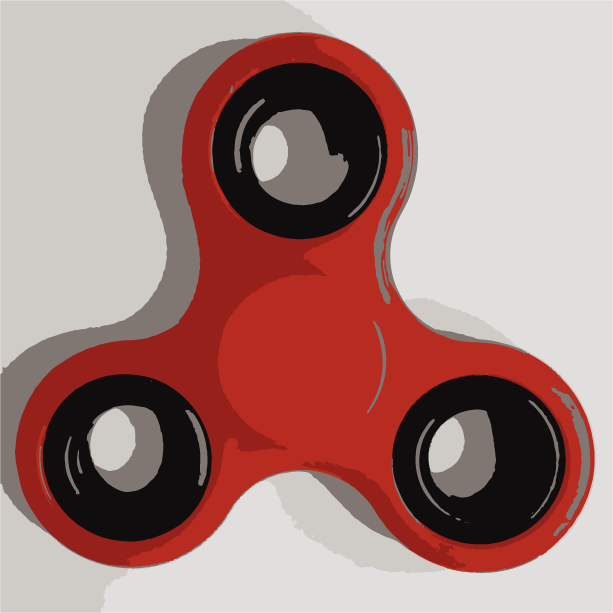 
**Artist:** Christian Canturia 
**Description:** The fidget spinner gained its popularity late 2017 and has become a very iconic product for this generation.
 

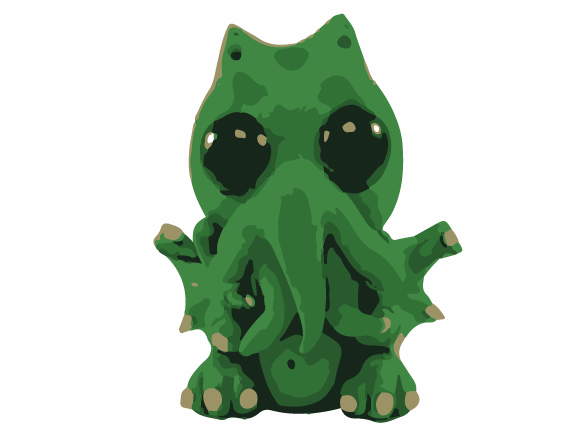 
**Artist:** Derek Fung 
**Description:** We need this emoji because there's a lack of more dramatic versions of the thinking emoji. Cthulhu is baffling, we need a baffled emoji.
 

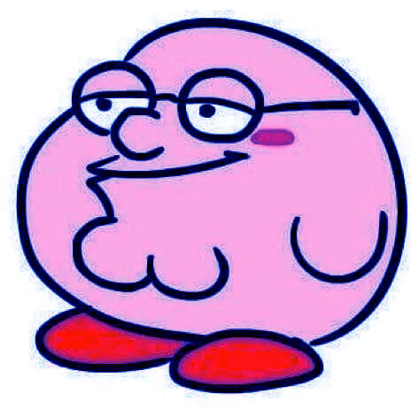 
**Artist:** Chris Garcia 
**Description:** I believe that "TheDestroyer™" should be an emoji is because of how you can use it for anything, answer any question with a "The Destroyer™) emoji no matter the context.

 

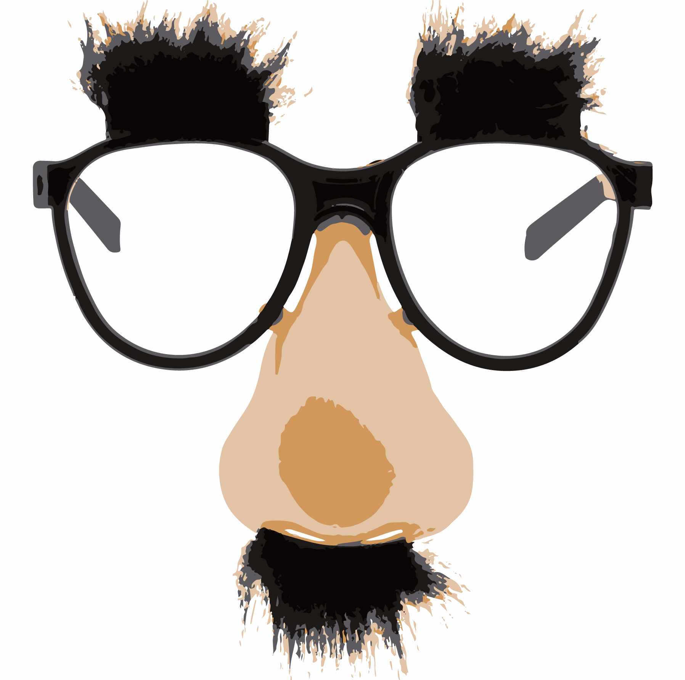 
**Artist:** Shannon Gonzalez 
**Description:** For the new emoji, I chose the fake disguise glasses in order to have an emoji that will have a mysterious but goofy emotion, as if someone wants to go under cover in a joking manner.

 

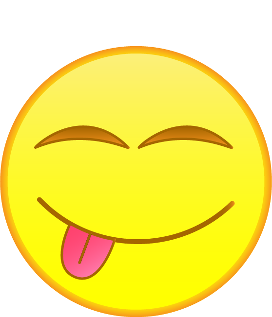 
**Artist:** Lilly Arstad Helmersen 
**Description:** Because there is no friendly hearted emoji that shows its tongue, you have the one with one open eye but it is more flirty.
 

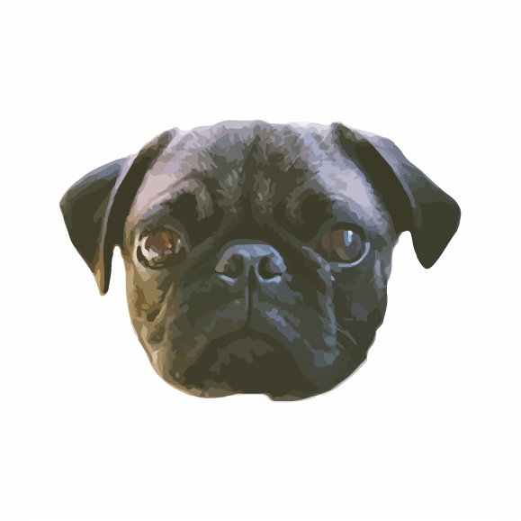 
**Artist:** Shadaye Hernandez 
**Description:** Pugs are planning a global takeover of cuteness. So, I am proposing a pug emoji because I am pretty sure that the average person mentions the word "pug" at least ten times on a normal day......
The pug emoji should be placed in between the red heart and the purple heart because one look and they steal your heart <333333
 

 
**Artist:** Mohamed Husain 
**Description:** This emoji should be added in so people don't have to type up Good Morning every time they feel the need to send someone a Good Morning text.
 

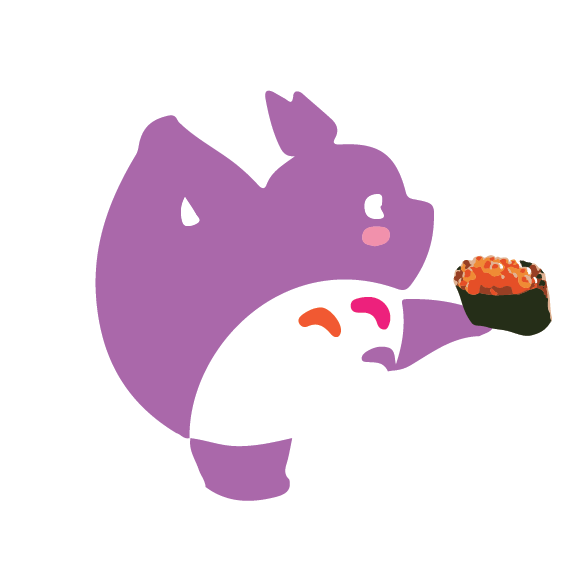 
**Artist:** Lydia Lim 
**Description:** Totoro is doing yoga to lose weight- that looks very cute and funny.
 

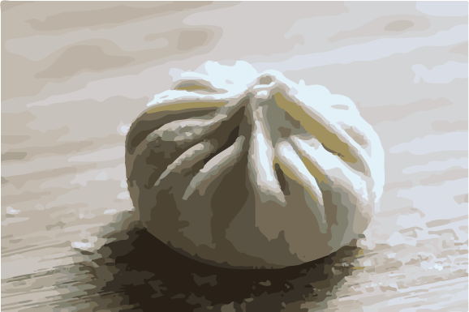 
**Artist:** Yanrong Li 
**Description:** My favorite food xiaolongbao (Also, for one who loves it). I couldn't find it in emoji, so I decide to make this.
 

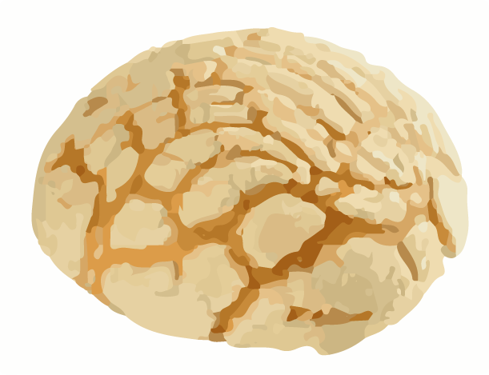 
**Artist:** Francisco Mendoza 
**Description:** I want a Pan Dulce emoji because there is currently none.

 

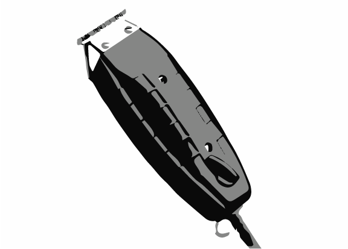 
**Artist:** Hector Mendoza 
**Description:** This emoji should be added because even though there are already hair cut emojis, they all use outdated hair cutting tools like the scissors. The hair trimmer is the tool that most hair stylists use nowadays and even though the scissors haven't become obsolete, the hair trimmer is what comes to mind when most people think of a haircut.

 

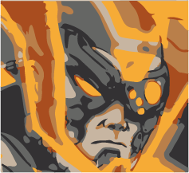 
**Artist:** Eric Moua 
**Description:** This emoji shows off an underrated skin in League of Legends.
 

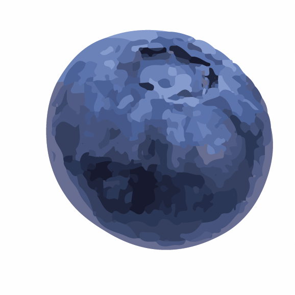 
**Artist:** Monica Muñoz 
**Description:** 'The Blueberry' is a key emoji that is missing from the vast library of emojis that we have because it is such a common fruit that we see and eat often! (It's also my favorite fruit.)
 

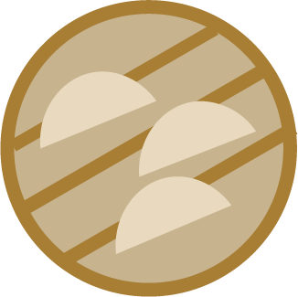 
**Artist:** Michelle Quan 
**Description:** This is a simple image of dumpling dim sum which is a type of Chinese cuisine. Dim sum is usually eaten in a restaurant with family on the weekends and is seen as a way to spend time with loved ones.
 

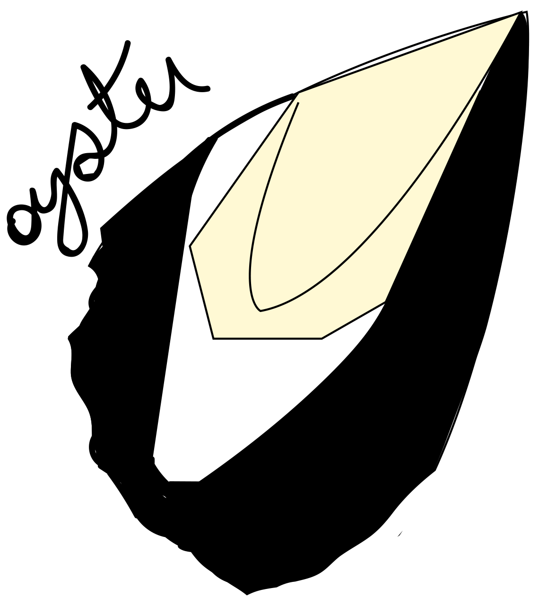 
**Artist:** Isabel Rios-Juarez 
**Description:** who doesn't love oysters! yum!

 

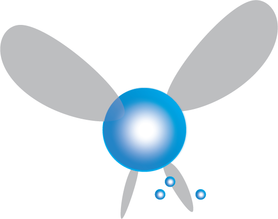 
**Artist:** Josh Santiago 
**Description:** The fairy reticle emoji! For when you're targeting something specific and need people to "LISTEN!" yum!

 

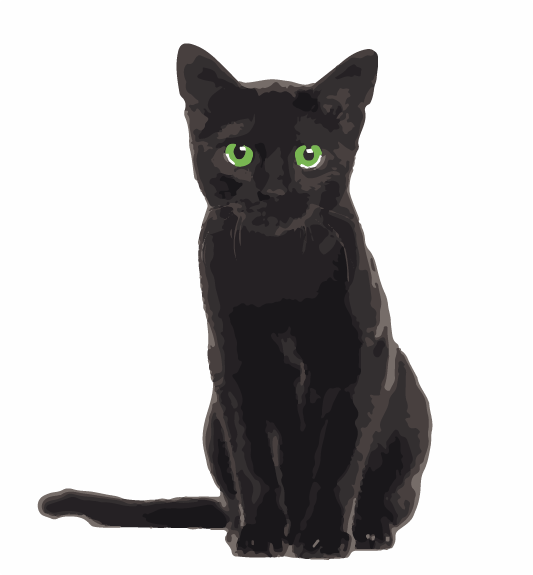 
**Artist:** Patti Silva 
**Description:** There are multiple skin colors for people emojis, there should also be multiple colors for animals that come in a variety of colors. A good place to start would be with a black cat, since there is currently only orange cat emojis, and black cats are a common and loved type of cat.
 

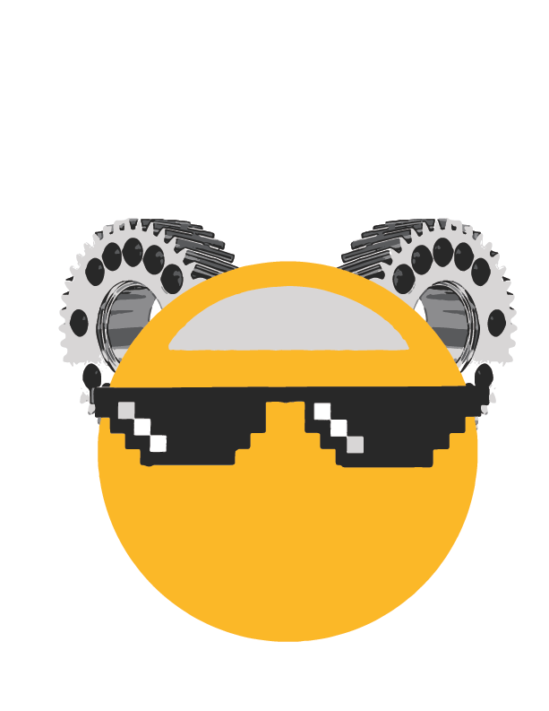 
**Artist:** Kaicong Tang 
**Description:** The world we live in is surrounded by engineer and technologies, so that's what my emoji represents.
 

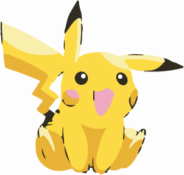 
**Artist:** Khoa Tran 
**Description:** This emoji should be added because Pikachu is adorable and I feel like it would be used a lot since Pikachu is in Wow face
 

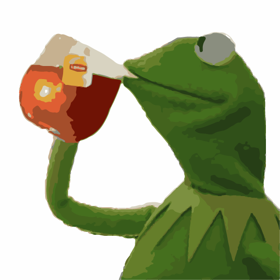 
**Artist:** Seraiah West 
**Description:** This emoji should be added because there be some good tea that need sippin on.
 

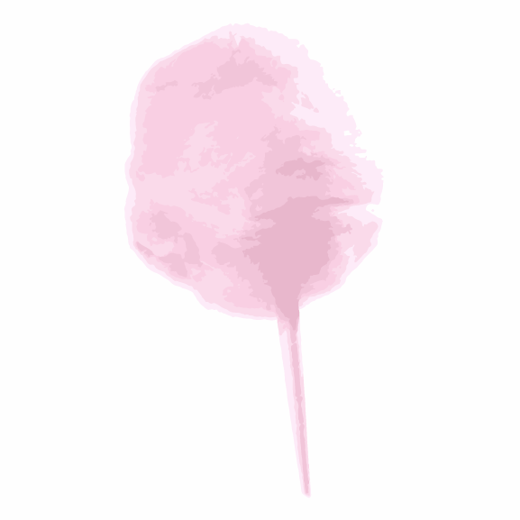 
**Artist:** Sophia Yuan 
**Description:** This emoji should be added because cotton candy often represents having fun with friends in the summer at carnivals and other events.
 
