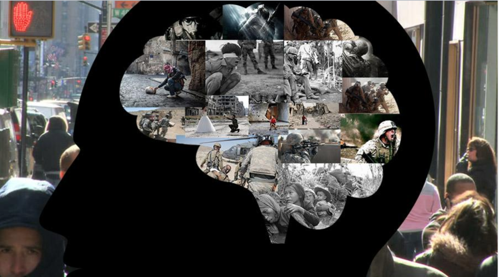
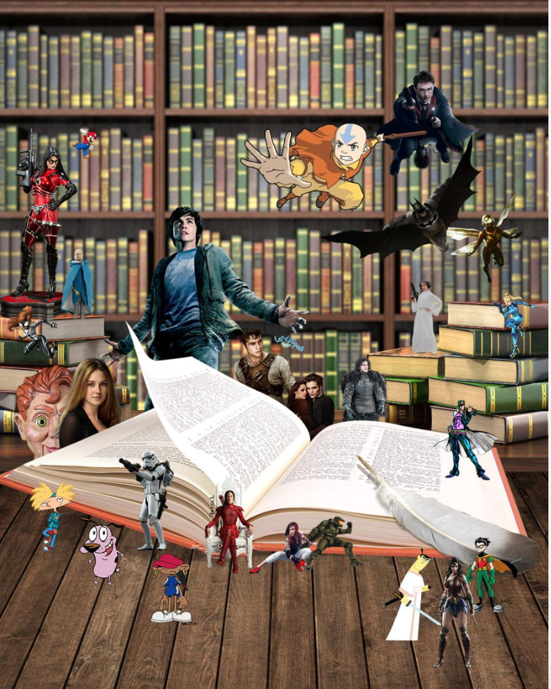
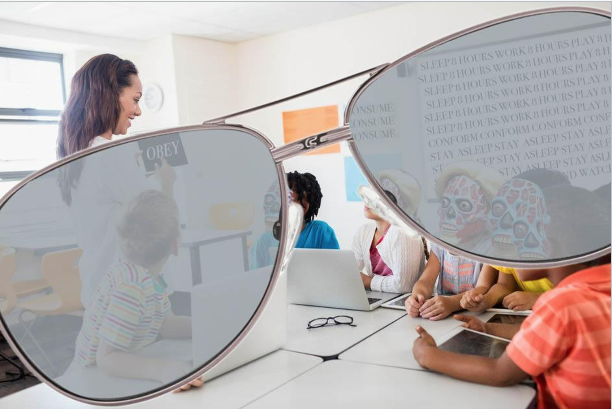
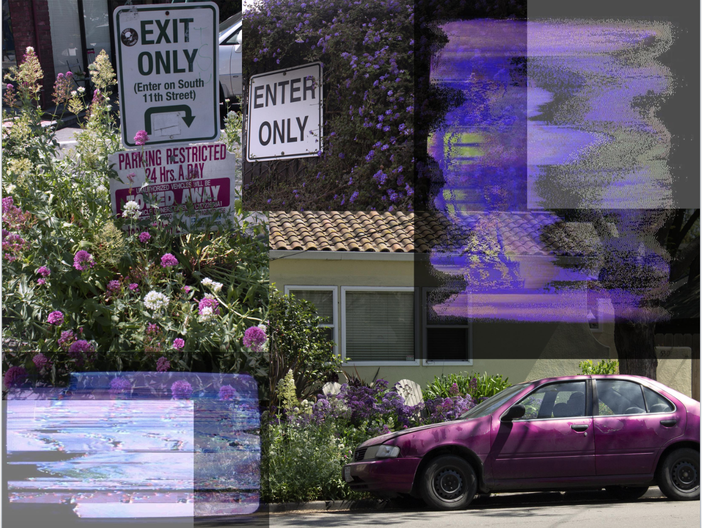
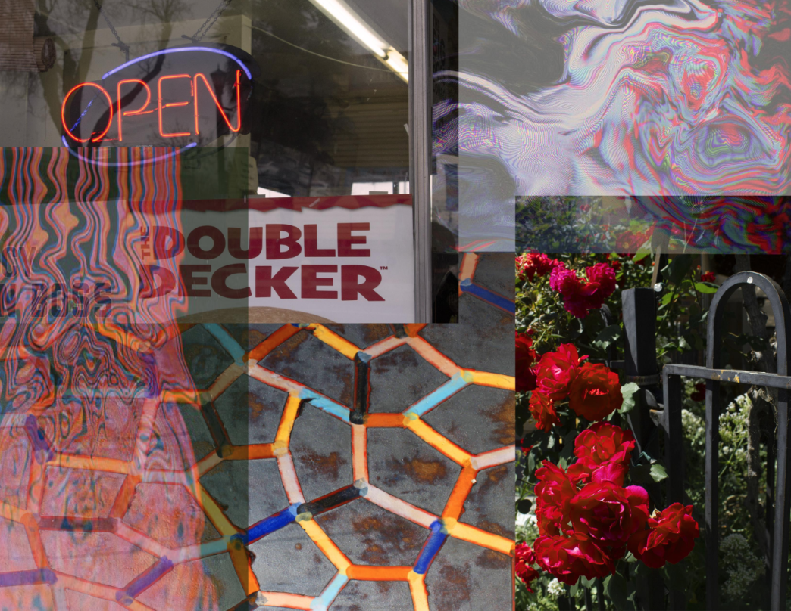
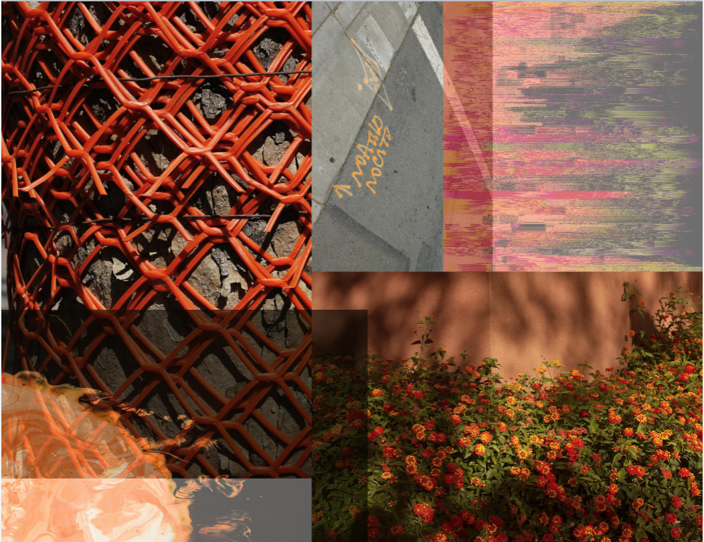
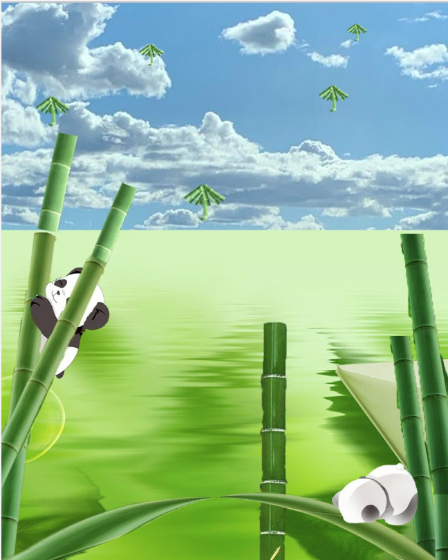
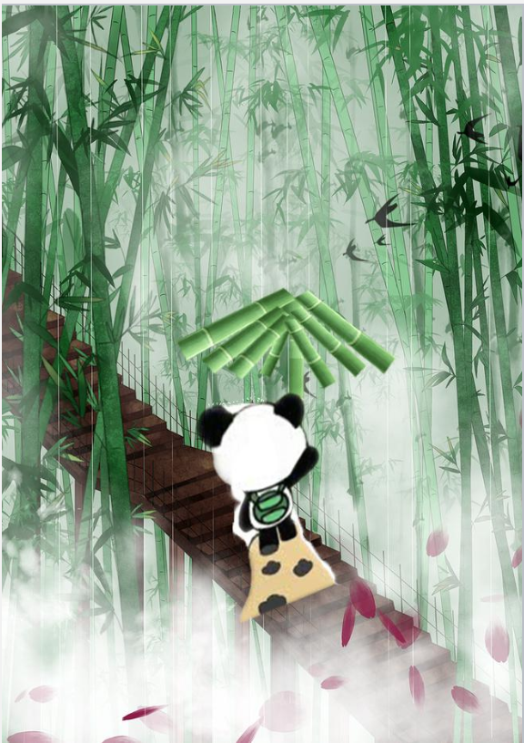
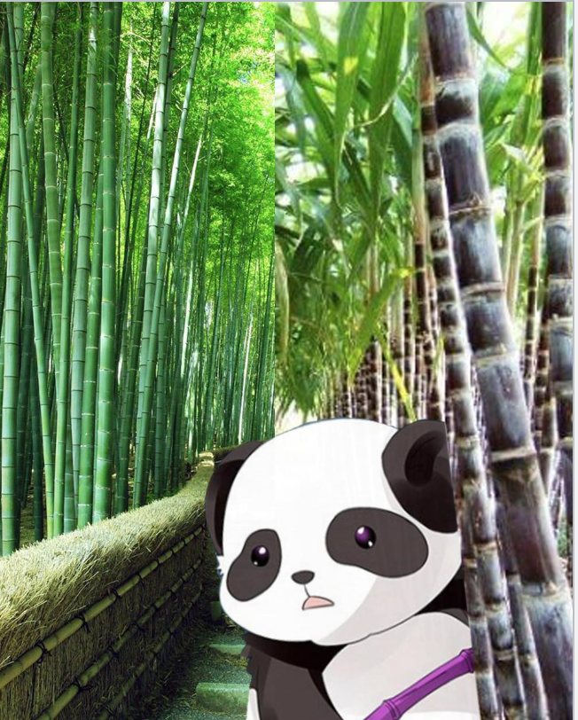

# **ART 74 SECTION 1 - FINAL PROJECTS**

### **++[SJSU Art 74 Spring 2019](https://carriehott.github.io/SJSU-Art74-Sp2019/)++**

[<Back to Home Page](https://carriehott.github.io/SJSU-Art74-Sp2019)

# FINAL PROJECTS

# **--> COMPOSITE & GLITCH work**

# **Chris Garcia**
 

 

 

When creating these pics, I really enjoyed making these pieces of work. It felt like I was making whole new worlds or something. Including the HowAreYou picture because it shows what might be under the surface of someone that had experienced horrible trauma either in combat to life. Mainly in combat hence why there are so many pictures of war in there.

# **Patty Silva**
 

 

 

**Colored Reality** 
This series is titled "Colored Reality" and is a composite and glitch art piece composed of my own photography and images found online. In this project I mainly wanted to explore the concept of color and colors that stand out to me in the world around me, aka my "reality". While working on this project I thought it would be interesting to include some digital and/or glitched images since technology and screens take up a large part of my life, even though digital life is often not considered to be "reality". I thought that composite art would be the best way to capture what I wanted to, since I wanted this piece to focus on still moments for the eyes to just absorb colors.

# **Yanrong Li**
 
 

 

 

**Fantasy Panda** 
I refer to the last Composite Art, a surreal theme. I have added the elements I like to the three pictures, Chinese style - bamboo, panda. The panda in the picture is anthropomorphic. The pictures are like wallpaper.

# **--> AUDIO/VIDEO work**

# **Monica Mun̄oz**
 

<iframe src="https://player.vimeo.com/video/335774819" width="640" height="360" frameborder="0" allow="autoplay; fullscreen" allowfullscreen></iframe>

**Dear Home** 
I wanted to create an audio/video piece that dives deeper into the complexities of loss and grief and show the importance of a home. It is important to be in touch with vulnerability. I want to create work that starts this confrontation that is often hard to begin. This piece was created to stirs emotions within the viewer and evoke similar emotions that I have felt this year through its visuals and audio.

# **Joshua Santiago**
 
<iframe src="https://player.vimeo.com/video/335785673" width="640" height="360" frameborder="0" allow="autoplay; fullscreen" allowfullscreen></iframe>

Love. Free Will. Emotion. Failure.

**Fabricated Motion** 
Fabricated Motion is a digital media film that showcases the subtle intricacies of every day motion that we take for granted, and how difficult it is to replicate. It explore technology’s ability to replicate motion, while begging the question if it even should in the first place. This could only be done in a video, using video editing software, creating a sort of meta commentary on the medium itself. 

# **Khoa Tran**
<iframe src="https://player.vimeo.com/video/335949426" width="640" height="360" frameborder="0" allow="autoplay; fullscreen" allowfullscreen></iframe>
 
**San Jose Sharks** 
There really isn't much that I tried to do that was new other than implementing texts in the middle of the clips. I choose this type of medium simply because the sharks has had an impact on me and I wanted to document a scary game 7 of the playoffs. I went to San Pedro Square but I didn't make it on time for the Shark parade, so I recorded the next big thing and there you have it :))

# **--> NET & CODE ART work**

# **Shadaye Hernandez**
 
**<a href="https://shadayejane0120.github.io/deepbreathing/" target="_blank">**Click for Full Website**</a>**

<iframe src="https://shadayejane0120.github.io/deepbreathing/" width="500" height="400" target="_blank"></iframe>

**Deep Breathing**
The concept I am exploring with this project is bringing my mental processing of understanding complex cultural beliefs in my family and transforming my experience into visual existence. In the first video, I used a compilation of light installations captured from LIB and videos of me in various self-created masks. In the second video, I used old found video footage along with me recalling a conversation I had with my mother. The words I express act as a reminder of what she said and in what order it was said. The breath in between the words speaks to the mental process I have recently been experiencing.  

# **Christian Canturia**
 
**<a href="https://chriscanturia.github.io/skater/" target="_blank">**Click for Full Website**</a>**

<iframe src="https://chriscanturia.github.io/skater/" width="500" height="400" target="_blank"></iframe>

**Curiously Misguided Skater** 
This piece is a continuation of my video project titled Jaded. _Curiously Misguided Skater_ is an interactive website that takes the viewer on a skateboard ride through someone who is high on a substance. This is not the most accurate simulation since every person is different when they take drugs, but this is a visual representation of what the different stages of a high can be for someone who is under the influence. On the website, there are three skateboards. Each skateboard takes you on a different stage of being high. The first stage will show videos that are unsaturated, not full of life. The second stage is when you start feeling the substance and things start to become disoriented and much more saturated. The third stage is when the fun stops, and you start to get paranoid and the side effects start kicking in. I want the viewer to go on a ride with me and see visually what people who take drugs might experience. I chose to make a video/net art project on this subject because i felt that If I wanted the audience to take a ride through this trippy piece I made, It would be most effective if I created a video/net art piece about it. Family members and friends close to me who were addicted to drugs deeply influenced this work.

# **Sophia Yuan**
 

**<a href="https://sophia17yuan.github.io/computerpuzzle/login.html" target="_blank">**Click for Full Website**</a>**

<iframe src="https://sophia17yuan.github.io/computerpuzzle/login.html" width="500" height="400" target="_blank"></iframe>

**Computer Math Puzzle** 
This project is created for the purpose of showing how easy it is to have people take your information away with a click of a button. Because I have just started programming on UI/UX interface, I hoped to bring understanding of this puzzle to others who have simple knowledge of front-end programming like me. I chose this medium because technology has become part of our lives, and it is important to show not only the good aspects, but bad aspects as well.

# **Lily Alstad Helmersen**
 
**<a href="https://lillyhelmersen.github.io/final/final.html" target="_blank">**Click for Full Website**</a>**

<iframe src="https://lillyhelmersen.github.io/final/final.html" width="500" height="400" target="_blank"></iframe>

**After a while** 
I have used sound combined with the javascript library p5. In this project, I have tried to explore the effect of different kinds of laughter can have. To make the effect greater I added colors that gradually get darker. I wanted to provoke a feeling of uncertainty.

# **Mona Kaji**
 
**<a href="http://littlemonastar.com/74final/74.html" target="_blank">**Click for Full Website**</a>**

<iframe src="http://littlemonastar.com/74final/74.html" width="500" height="400" target="_blank"></iframe>

**Aha Experience!** 
I wanted to make a little game for final project. I thought making this game is gonna be a good review for using a technique I learned of photoshop, editing video, and also html/css. This game was popular in my country Japan almost 10 years ago and I don't know if it's really helping nerves of our brains activate, but I think it's fun anyway to find the difference.

# **Michelle Quan**
 
**<a href="https://murasaki21.github.io/oneyear/" target="_blank">**Click for Full Website**</a>**

<iframe src="https://murasaki21.github.io/oneyear/" width="500" height="400" target="_blank"></iframe>

 **One Year** 
For my final, I wanted to create something personal and blog-like. Initially, I wanted to cover events and stories through high school, but because high school is very broad and most of my stories are from senior year of high school, I decided to make each letter of my name "Michelle" a link to align to an event during my senior year. Before taking this class, because I had no experience in coding nor creating websites and because I want to make project blog-like, I decided to create a net art project.   

# **Shannon Gonzalez**
 
**<a href="https://shannongonzalez.github.io/finalproject/" target="_blank">**Click for Full Website**</a>**

<iframe src="https://shannongonzalez.github.io/finalproject/" width="500" height="400" target="_blank"></iframe>

**Social Judgment** 
For my final project I wanted to explore the concept of beauty standards and narcissism in today’s social media. I see many people agree that loving yourself is something positive and posting pictures or selfies to social media pages like Instagram or Facebook encourages loving yourself. However, there is a flip side to it and many people will turn on someone who is posting too many pictures of themselves, saying they just want the attention, or will say they wear too much make-up. If they don’t wear any make-up then people will say they’re ugly or look tired. It seems as if no one can win no matter what they do; not everyone can be pleased so you must love and be positive towards yourself. I chose glitch art and code art as my mediums to better convey the rigorous cycle of judgment happening on social media. I wanted to show both sides by adding positive comments to regular selfies with and without makeup for the good side of social media and put negative comments on glitched selfies to show the corrupted judgment of social media. As the mouse hovers around the four area of the canvas, it will show the various responses to different pictures.

# **Lydia Lim**
 
**<a href="https://sunhefan.github.io/netart/index.html" target="_blank">**Click for Full Website**</a>**

<iframe src="https://sunhefan.github.io/netart/index.html" width="500" height="400" target="_blank"></iframe>

**Natural Moment** 
I used Composite Art and Net Art for my project. The concept of my project is to create a pleasing natural environment where can reduce people' stress. I want people to be in nature to increase their pleasant feelings, so I made four different seasons with different viewing scenes of spring, summer, fall, and winter. The reason I chose Composite Art and Net Art are that many people like to spend their time on the internet. Also, Composite art can help me to create an idea that I want.

# **Kaicong Tang**
 
**<a href="https://kctang97.github.io/finalproject/" target="_blank">**Click for Full Website**</a>**

<iframe src="https://kctang97.github.io/finalproject/" width="500" height="400" target="_blank"></iframe>

**Message Board** 
This website is base on my first website from my childhood memories, in a simple form I redesigned and added a few features to the background. The reason I decided to display the words all over the background is that it's interesting to see the user's text get cover by the color. It kinds of represent that no matter what you feel, it will disappear in the next moment. In the textbox, the idea was inspired by Yoko Ono's art piece, an instruction or option for the user to follow.

# **Francisco Mendoza**
 

**<a href="https://editor.p5js.org/fcmendoza9/present/lQfRjObaX" target="_blank">**Click for Full Website**</a>**

<iframe src="https://editor.p5js.org/fcmendoza9/present/lQfRjObaX" width="500" height="400" target="_blank"></iframe>

**<a href="https://editor.p5js.org/fcmendoza9/present/nyUmW4AXf" target="_blank">**Click for Full Website**</a>**

<iframe src="https://editor.p5js.org/fcmendoza9/present/nyUmW4AXf" width="500" height="400" target="_blank"></iframe>

**<a href="https://editor.p5js.org/fcmendoza9/present/DjKtrlL3i" target="_blank">**Click for Full Website**</a>**

<iframe src="https://editor.p5js.org/fcmendoza9/present/DjKtrlL3i" width="500" height="400" target="_blank"></iframe>

# **Stephen Sum**
 
**<a href="https://xxtotalrandomxx.github.io/Stephen_Sum_final/" target="_blank">**Click for Full Website**</a>**

<iframe src="https://xxtotalrandomxx.github.io/Stephen_Sum_final/" width="500" height="400" target="_blank"></iframe>

# **Mohamed Husain**
 

**<a href="https://mahusain.github.io/stressedstudent/" target="_blank">**Click for Full Website**</a>**

<iframe src="https://mahusain.github.io/stressedstudent/" width="500" height="400" target="_blank"></iframe>

**Stressed Student** 
This is an accumulation of a lot of the passion and emotions I had throughout this semester. I wanted to create something that many other students could understand and relate to. I wanted to send a message through this site and I've spent quite a bit to make sure it came out right. This website represented the mindset I had while making this and ultimately, I feel like a lot of other students could understand this.

# **Hector Mendoza**
 

# **Eric Leej Xeeb Moua**
 

# **Derek Fung**
 

# **Henry Fisher**
 
