# **COMPUTER SETUP**

### **++[SJSU Art 74 Spring 2019 Home Page](https://carriehott.github.io/SJSU-Art74-Sp2019/)++**

[<Back to Tutorials](https://carriehott.github.io/SJSU-Art74-Sp2019/tutorials)

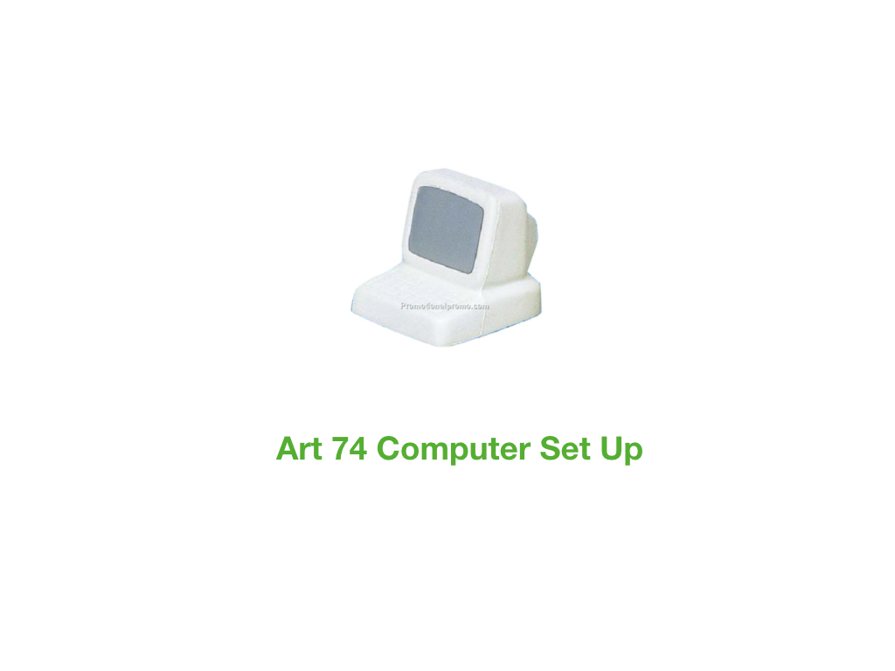
**Follow tips below for workflow and troubleshooting**

### **Software Needed for Art 74**
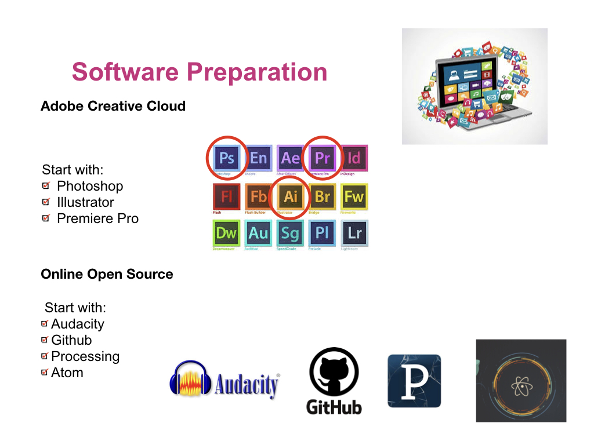

### **>Organizational Strategies<**
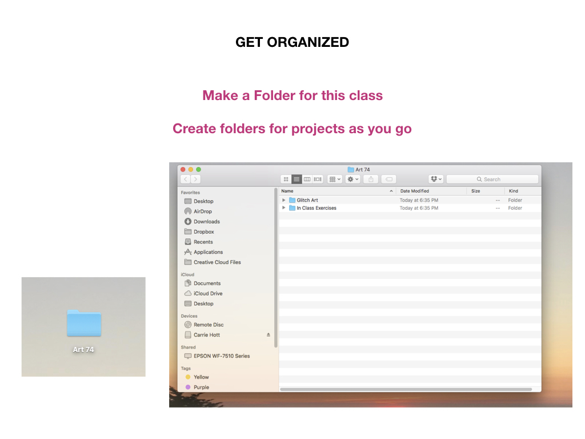

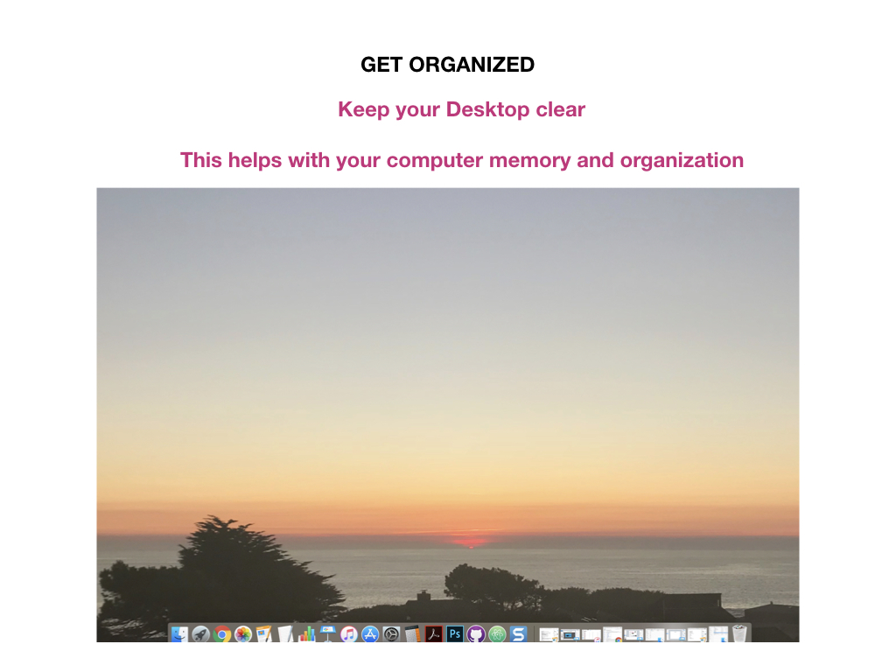

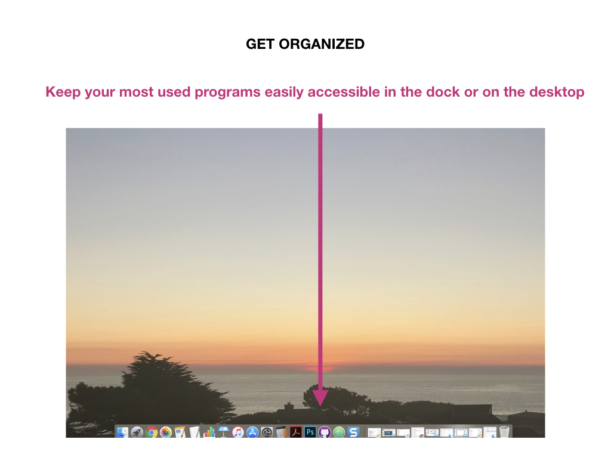

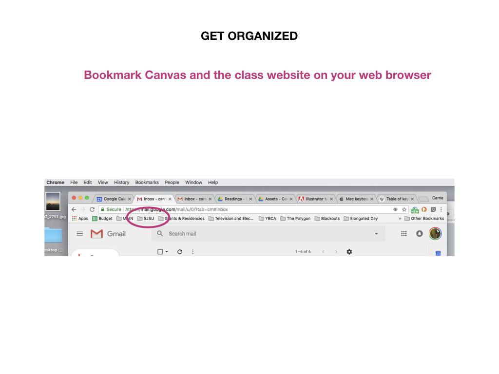
**Bookmarks will save you a lot of time. For tips on bookmarking in Google Chrome, [click here](https://support.google.com/chrome/answer/188842?co=GENIE.Platform%3DDesktop&hl=en).**

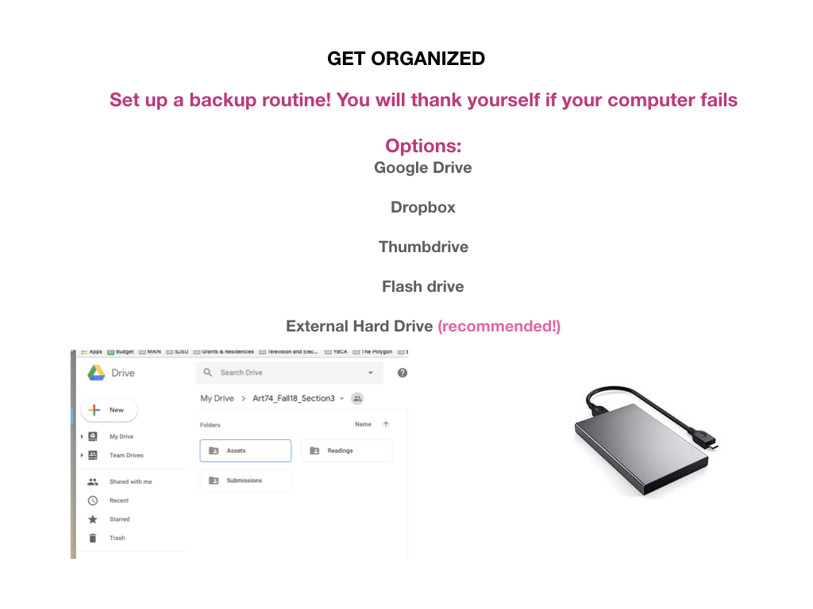
**Saving and backing up is crucial to working in digital media. You can use Google Drive, Dropbox, or another online 'cloud' backup. I recommend you use both a cloud backup and an external hard drive. Recommended brands are Lacie, Seagate, and G-Tech.**

### **>Key Commands<**
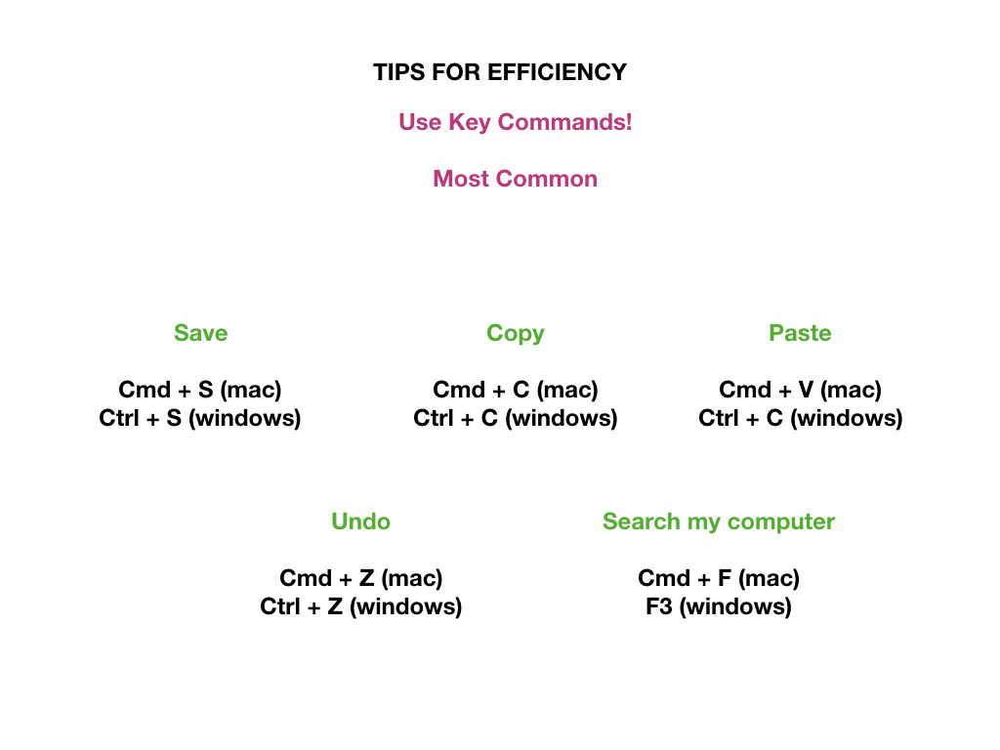
**Key commands will improve your workflow and save you time** 
More Mac keyboad shortcuts [Here](https://support.apple.com/en-us/HT201236)  
More PC keyboard shortcuts [Here](https://support.microsoft.com/en-us/help/12445/windows-keyboard-shortcuts) 
Full list of keyboard shortcuts [Here](https://en.wikipedia.org/wiki/Table_of_keyboard_shortcuts)  

### **>Screenshots<**
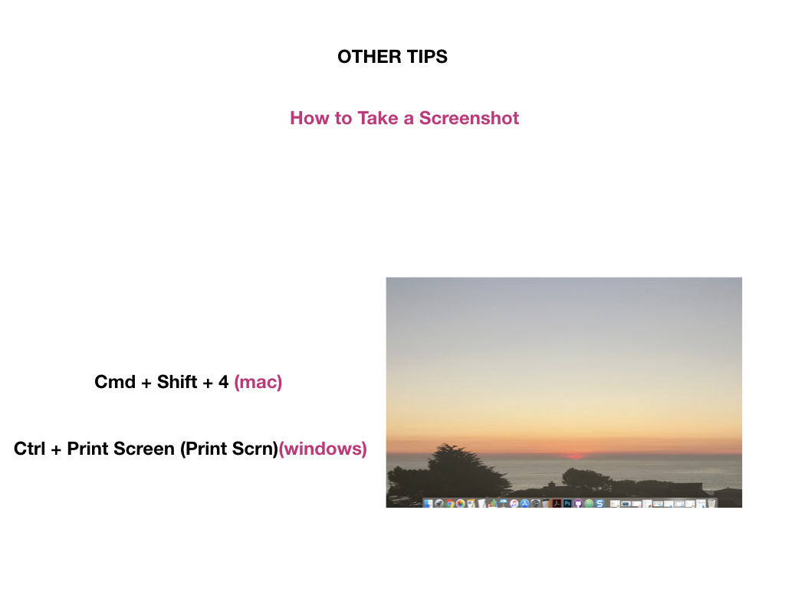
**Screenshots help you remember techniques and can come in handy when asking questions or turning in work.**

### **>Compressing (Zipping) Files<**
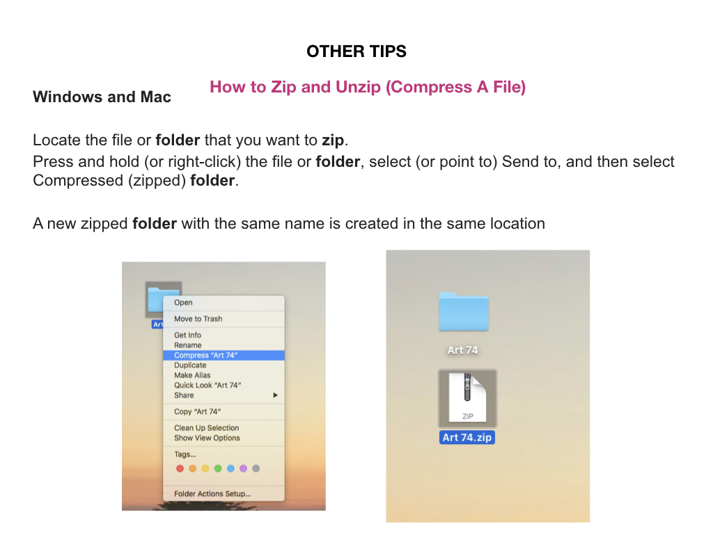
**Zipping your files will be required for certain assignments, and is useful for sending large files.**

### **>When in doubt, clean up and restart<**
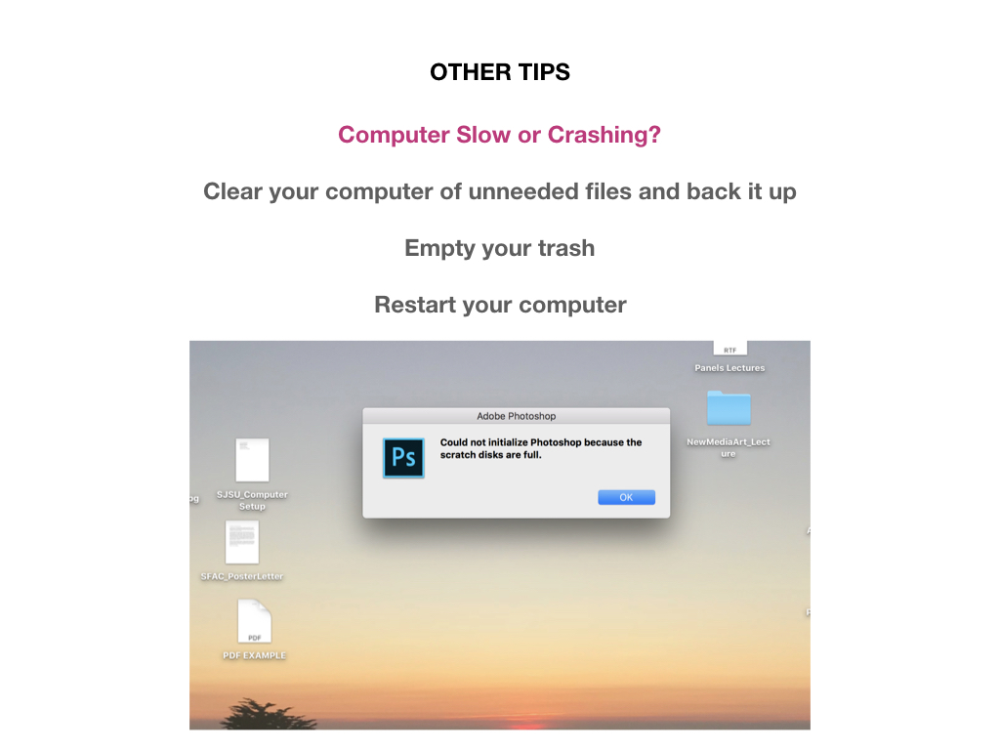
**Inevitably, your computer will slow down, crash, or act weird. When in doubt, clean it up and restart.**
