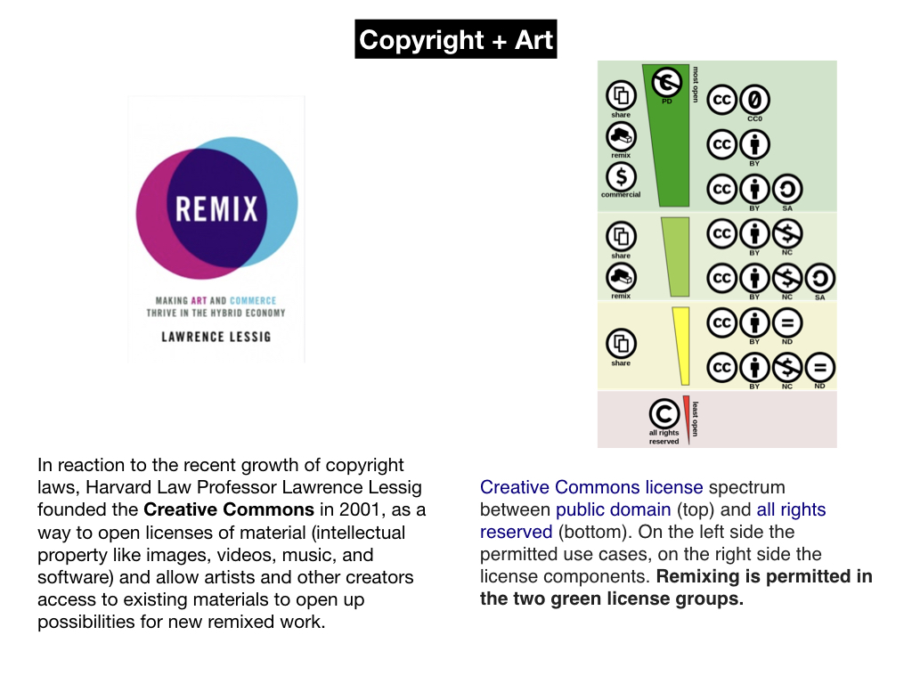
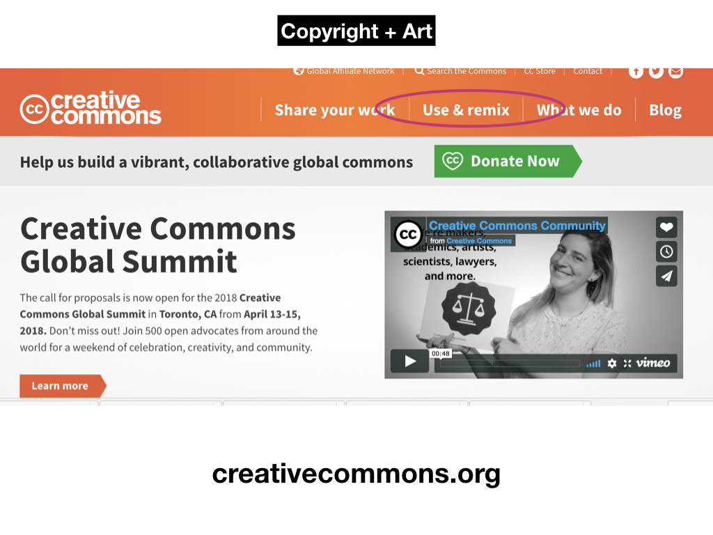
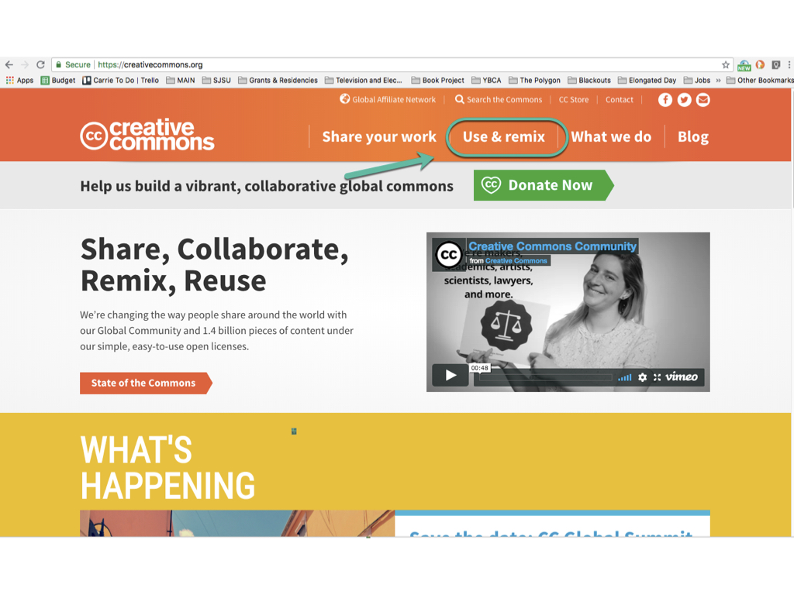
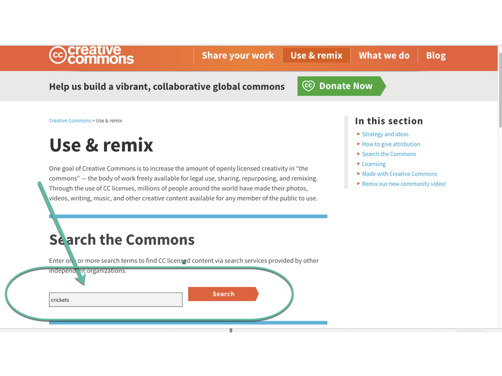
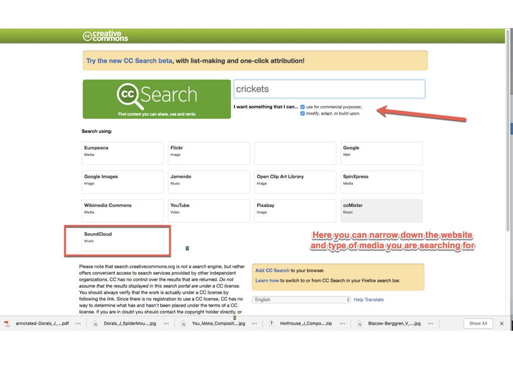
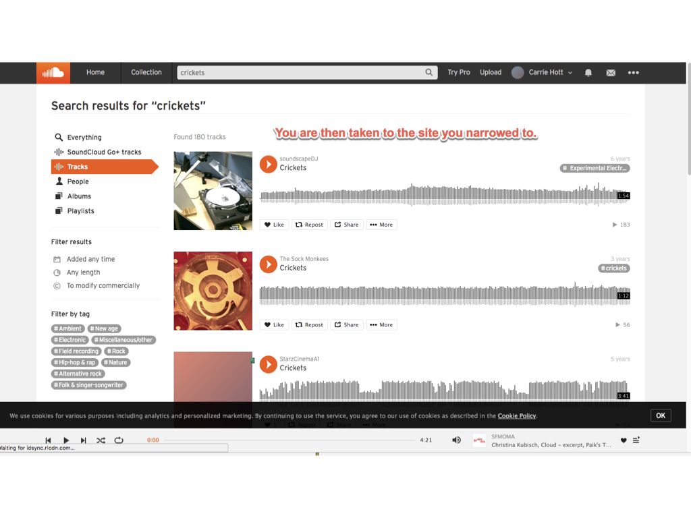
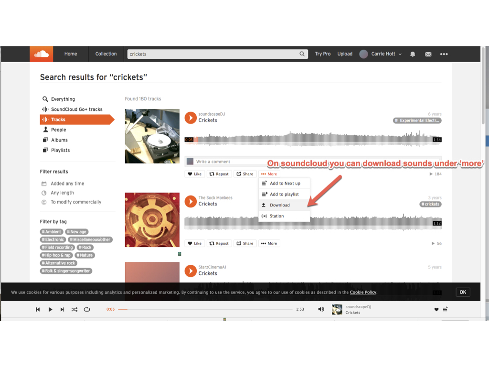

# **CREATIVE COMMONS**

### **++[SJSU Art 74 Spring 2019](https://carriehott.github.io/SJSU-Art74-Sp2019/)++**

[<Back to Tutorials](https://carriehott.github.io/SJSU-Art74-Sp2019/tutorials)

  

**Creative Commons for sourcing material online**

##### Usage rights

* [Creative Commons](http://creativecommons.org/)
  * Use it as search term or filter for google search (image/audio only), [filter for YouTube](http://www.smartcopying.edu.au/open-education/creative-commons/creative-commons-information-pack-for-teachers-and-students/how-to-find-creative-commons-material-using-youtube), Soundcloud, etc
*  [Public Domain](https://en.wikipedia.org/wiki/Public_domain)
  * [Pond5 Public Domain Project](https://www.pond5.com/free)
  * [Internet Archive](https://archive.org/about/)
    * Their [Prelinger Public Domain Archive](https://archive.org/details/prelinger) is all usable content
  * Media from [NASA](https://www.nasa.gov/) and other gov't agencies is all in the public domain
* Fair use
  * pdf on [Best Practices in Fair Use](online_best_practices_in_fair_use.pdf)
  * Center for Media and Social Impact's [Code of Best Practies in Fair Use for Online Video](http://cmsimpact.org/code/code-best-practices-fair-use-online-video/)

##### Downlading Audio & Sound FX

* Soundcloud: Filter for content in Creative Commons, download through [this site](http://9soundclouddownloader.com/download-sound-track).
* Websites:
  * [Free Music Archive](http://freemusicarchive.org/)
    - [field recordings](http://freemusicarchive.org/genre/Field_Recordings/)
  * [Free Sound](https://freesound.org/)
  * [Free SFX](http://www.freesfx.co.uk/)
  * [Sample Swap](http://sampleswap.org/)
  * [Sound Bible](http://soundbible.com/free-sound-effects-1.html)
  * [Free Sound Effects](http://99sounds.org/free-sound-effects/)
