# **GIF TUTORIAL**

### **++[SJSU Art 74 Fall 2019](https://carriehott.github.io/sjsu-art74/)++**

[<Back to Tutorials](https://carriehott.github.io/sjsu-art74/tutorials)

Elisabeth Nicula is an artist working with gifs in interesting ways and using them in her net art sites. You can check out her projects [here](https://elisabethnicula.com) and a website she made about geologic time [here](https://www.geologicaltime.net).

**How to make GIFs in Premiere Pro** 

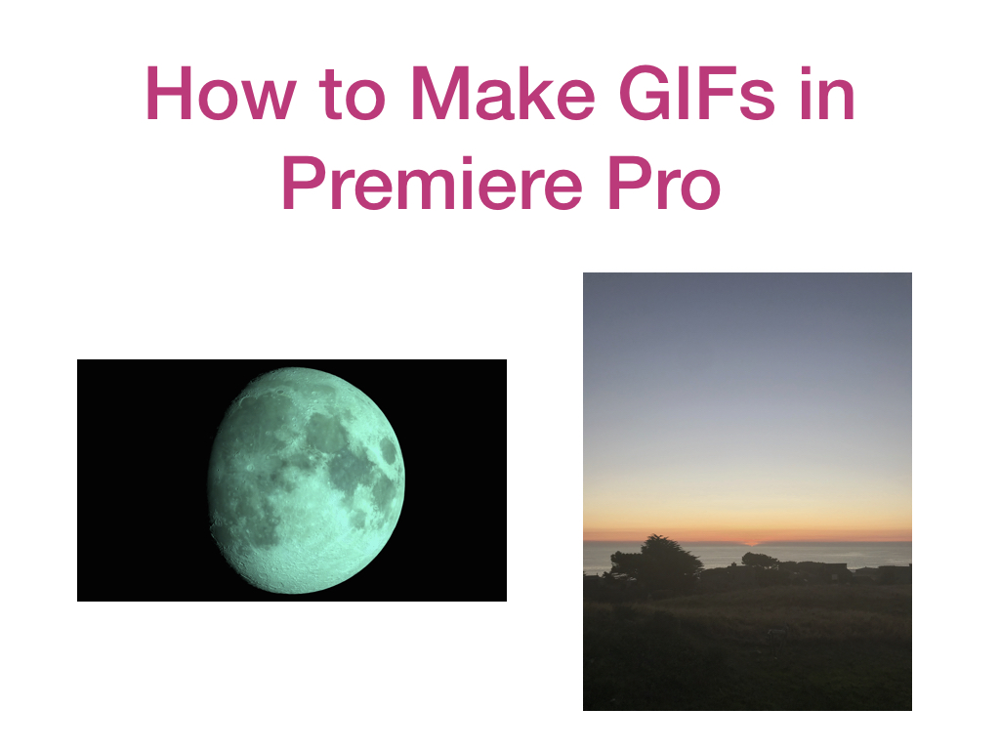

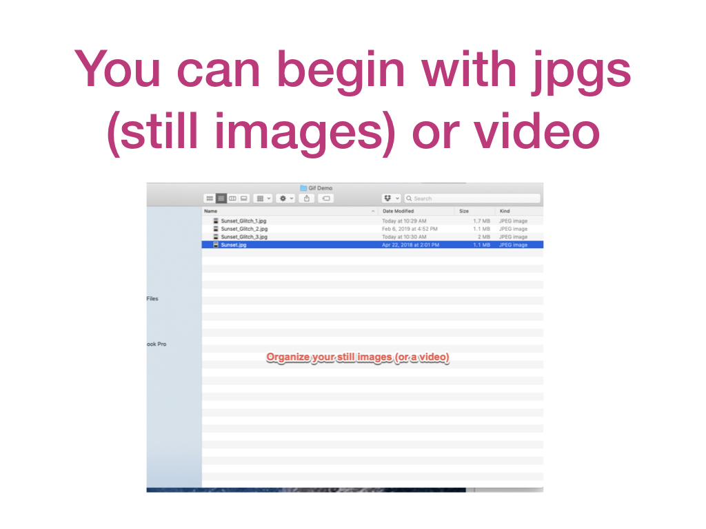

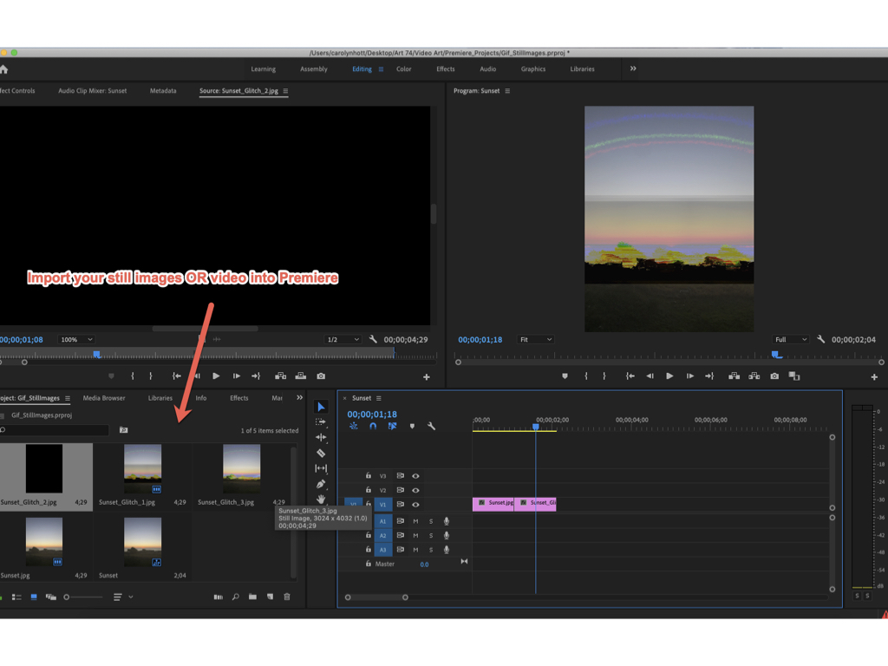

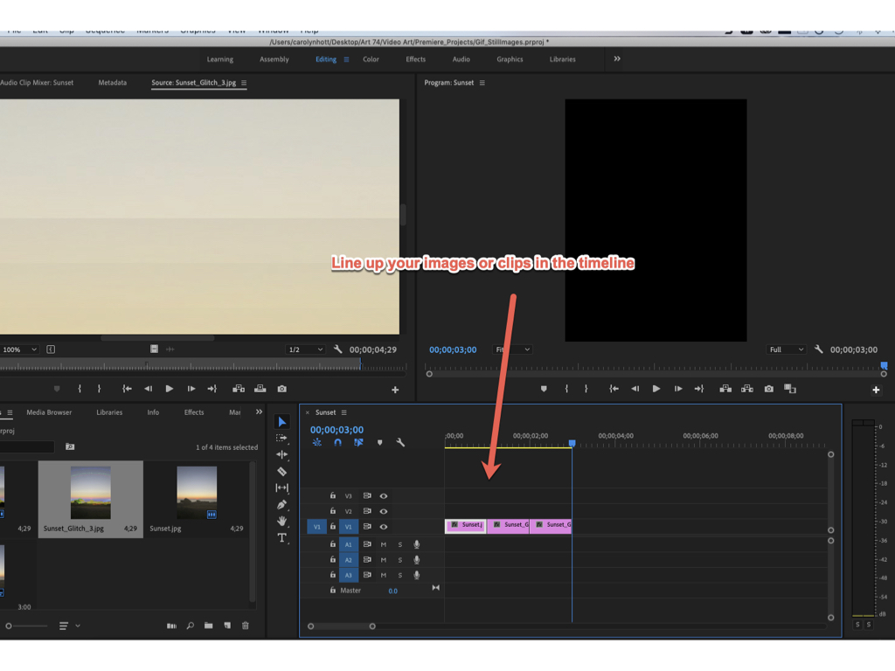

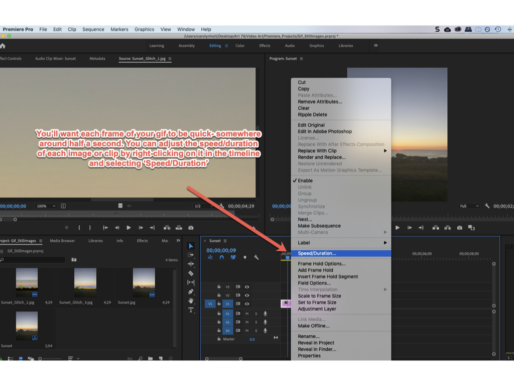

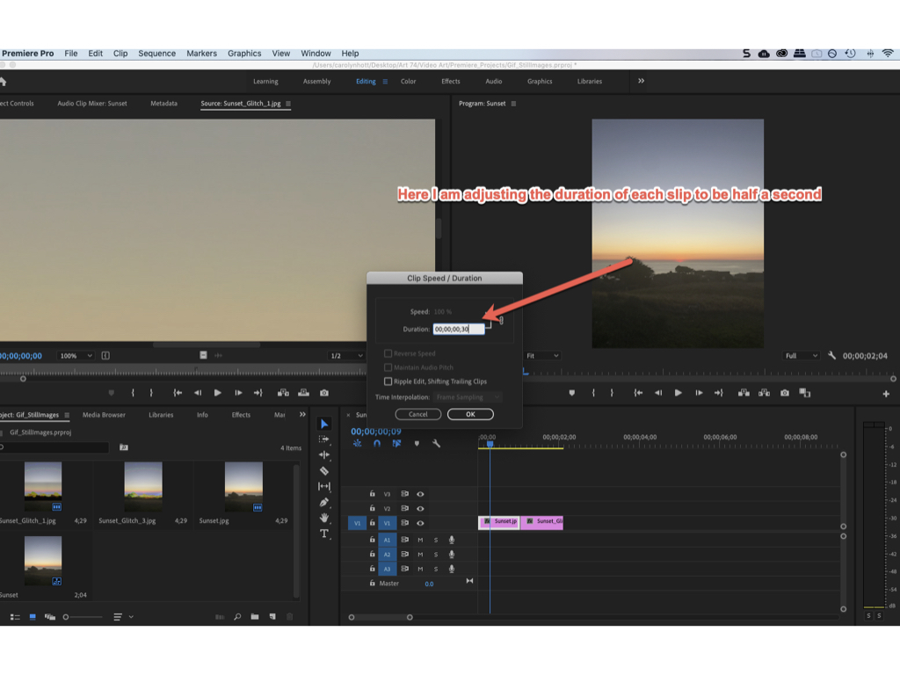

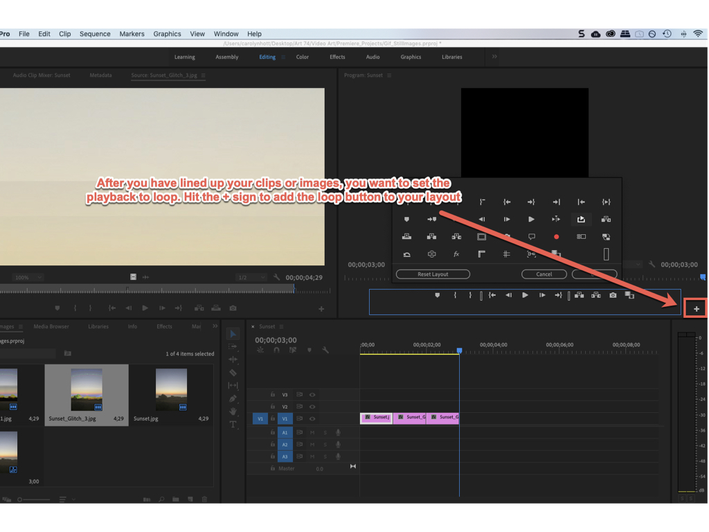

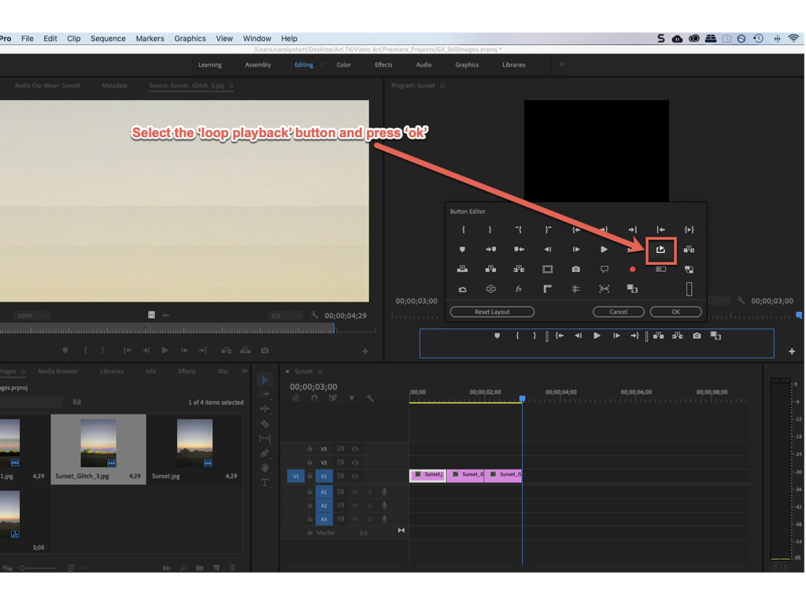

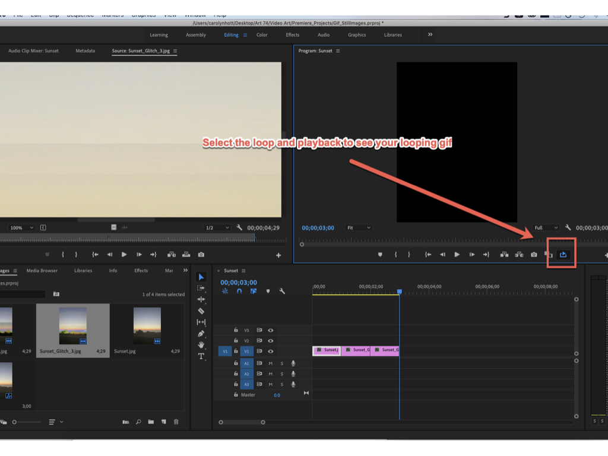

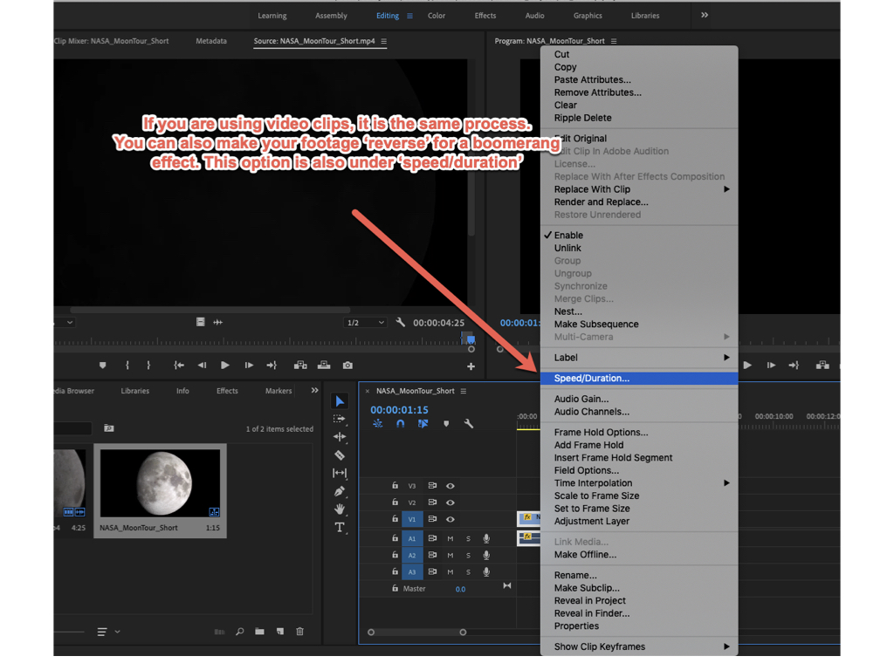

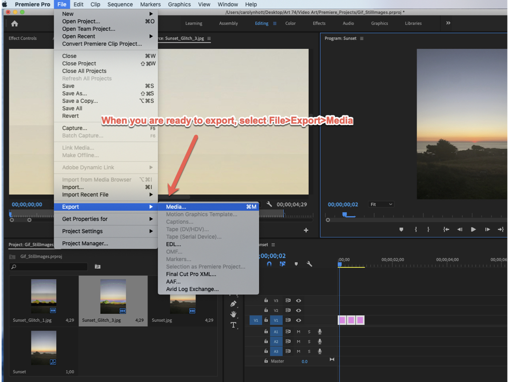

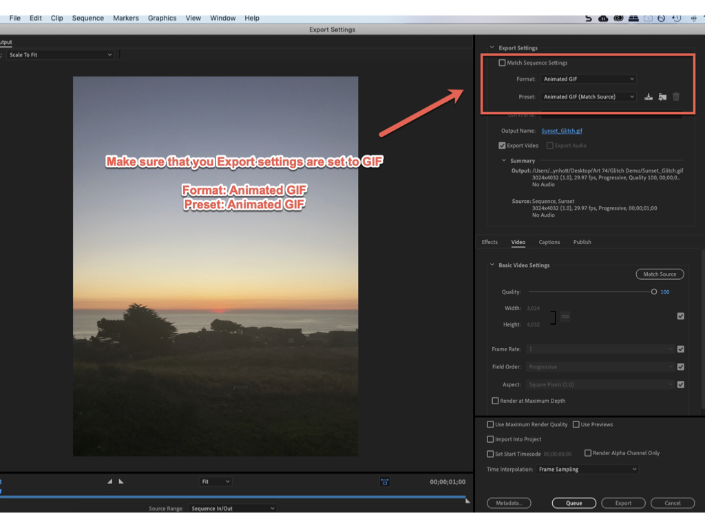

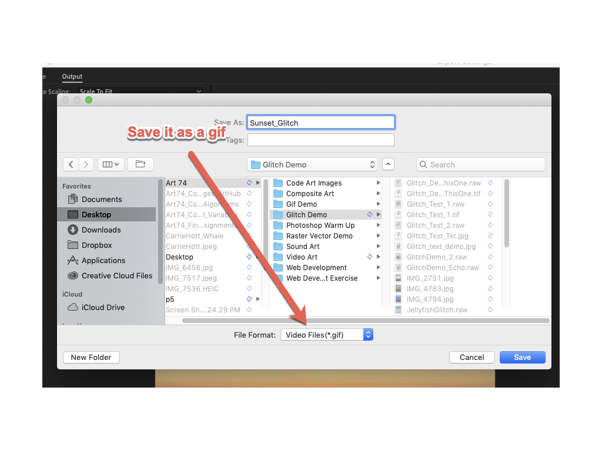

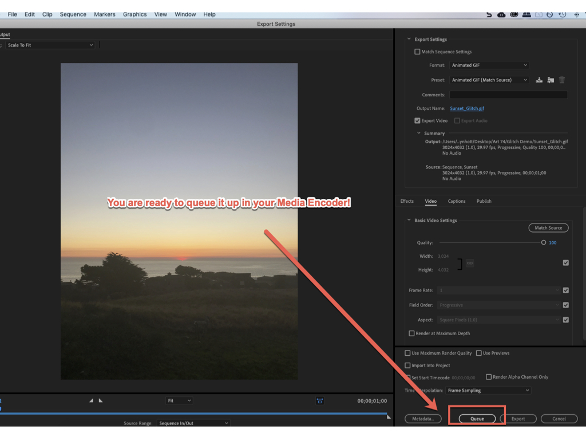
