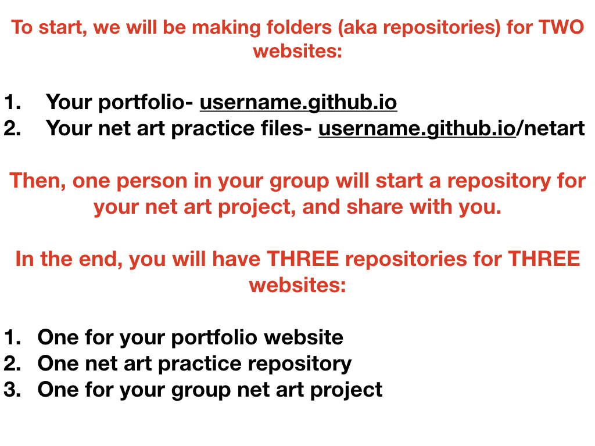
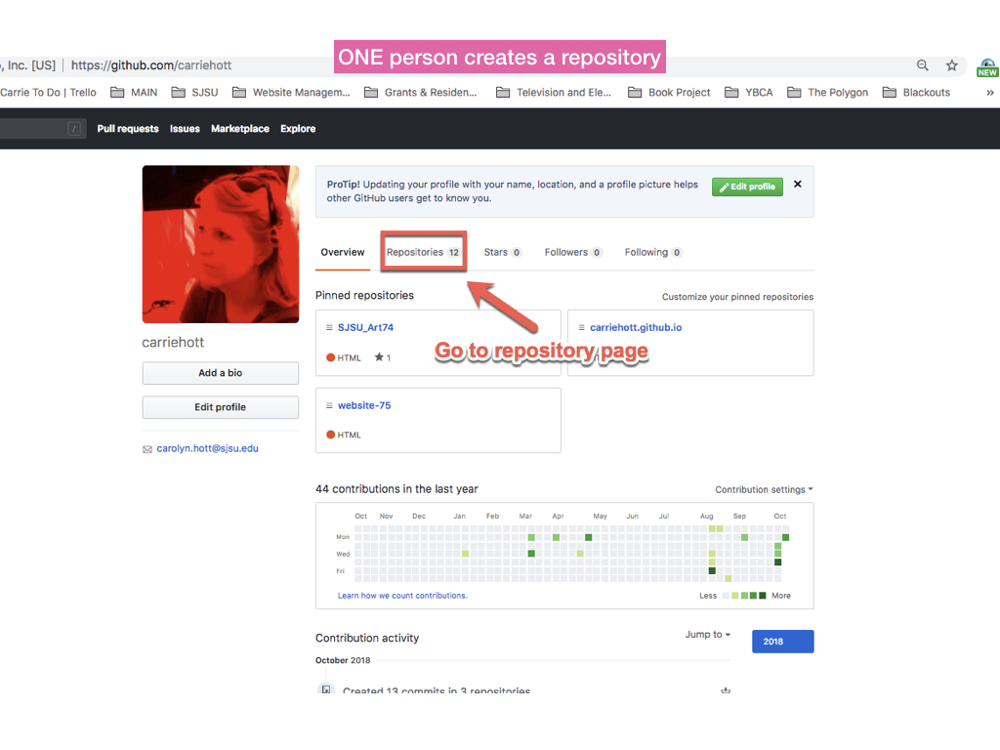
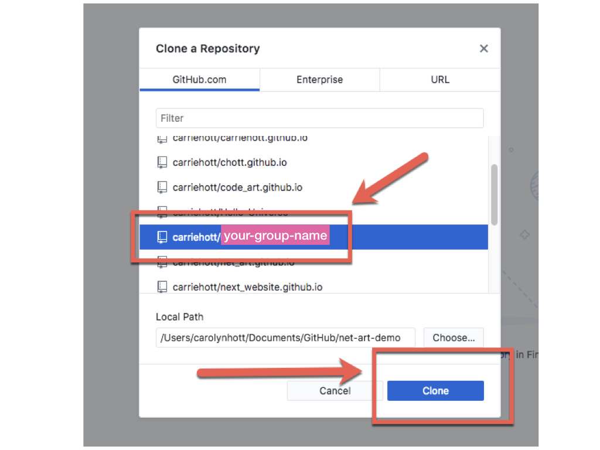
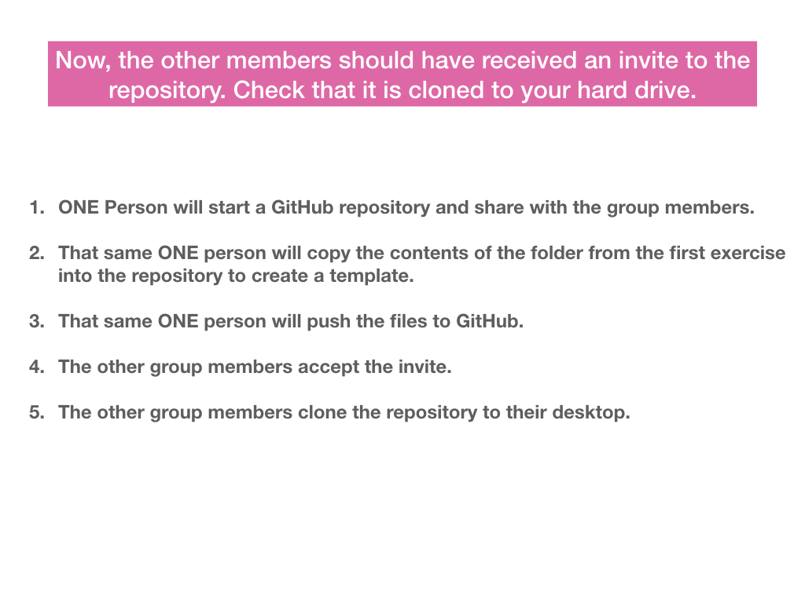

# **GITHUB & ATOM SETUP**

### **++[SJSU Art 74 Fall 2019](https://carriehott.github.io/sjsu-art74/)++**

[<Back to Tutorials](https://carriehott.github.io/sjsu-art74/tutorials)

# Setting Up and Using GitHub and Atom - for your portfolio website and net art!

 

### On this page:

### Atom
* [What is Atom?](#what-is-atom)
* [Install and set up Atom](#setup-atom)
* [Tour of Atom](#tour-atom)

### GitHub
* [What is GitHub?](#what-is-github)
* [Register for GitHub and Download GitHub Desktop](#register-and-download-github)
* [Step 1-Make a repository for your portfolio website](#step-one-portfolio-repository)
* [Step 2-Make a repository for your net art website](#step-two-net-art-repository)
* [Step 3-Add files to your Net Art repository](#add-files-to-your-net-art-repository)
* [Step-4 Editing in Atom and pushing to GitHub using Desktop](#editing-locally-in-atom-and-pushing-to-github-using-github-desktop)
* [Step-5 Create a Collaborative Repository (for your group project)](#create-a-collaborative-repository)
* [More Tutorials](#more-tutorials)

 

---

 

# What is Atom?
Atom is a text editor: a program where you edit your code. Download it at [atom.io](https://atom.io/).

Q: ? Do I need to use Atom? Can I use another text editor?

A: Yes! Atom does have some nice features for **integrating with GitHub** (so it might be worth it to try it out), but ultimately you should use the editor you like best, ie. Sublime Text, Brackets, Dreamweaver, etc.

# Setup Atom
Once you install Atom, you will want to modify it by adding “packages”, add-ons that will make Atom more powerful. Install atom-live-server, Atom-beautify, and Pigments.

Open Atom, from the Welcome Guide, choose ‘Install a Package.’ Or, go to Atom>Preferences>Packages> and then search. Or, go to Atom>Settings>Install and then search.

# Tour Atom

**If you want to preview your page as you edit it, go to the top menu: Packages>atom-live-server>start server. This will run a local server so that you can preview changes in the browser before making them live.**

# What is GitHub?

### What is Git & GitHub?

**Git** is a file control system, or a tool for developers to manage their code projects. **GitHub** is a hosting service for Git repositories (projects). So they are not the same thing: Git is the tool, GitHub is the service for projects that use Git.

 A lot of the code on GitHub is publicly available, so that developers (and you!) can easily check out what other people are doing, download their code, use it, and also post changes/improvements to the source.

Each project is contained in a **"repository."** **Think of a repository as an independent folder for each project.** For free Github accounts, all repositories are public. If you create a Github account with your SJSU email, you should AUTOMATICALLY be able to create unlimited private repositories.
 

 

# Register and Download GitHub

## If you have not yet, [open a GitHub account](https://github.com). Make sure you sign up with your sjsu.edu email address.

# Step One Portfolio Repository

Name repository username.github.io, where ***'username' is YOUR github username.***

#### REPEAT: The repository needs to be named EXACTLY the same as your account username, followed by github.io ----> for example: username.github.io

Click 'Initialize with a README' and create. You can make it private if you want, people will still be able to see the website live.

# Step Two Net Art Repository

# Add files to your Net Art repository

# Editing Locally in Atom and Pushing to GitHub Using GitHub Desktop

### After adding your files, open Atom, and open your Net Art project by going to File>Add Project Folder...

### Once you make changes to your repository, the changes will appear in GitHub Desktop and you can "commit" and "push" to sync it up to GitHub (the website).

# Create a Collaborative Repository
### For your group Net Art project, you need to make on repository in order to share the same files among your group.

 
 

# More Tutorials:

* **[HTML/CSS Overview](https://carriehott.github.io/sjsu-art74/tutorials/HTML_CSS_Overview/)**
* **[Portfolio Website Set Up](https://carriehott.github.io/sjsu-art74/tutorials/Portfolio_Setup/)**
* **[Portfolio Website Styling](https://carriehott.github.io/sjsu-art74/tutorials/Portfolio_Styling/)**
* **[Portfolio Website Content & Writing Guide](https://carriehott.github.io/sjsu-art74/tutorials/Portfolio_Content/)**
* **[Net Art Website Setup](https://carriehott.github.io/sjsu-art74/tutorials/Net_Art_Setup/)**
