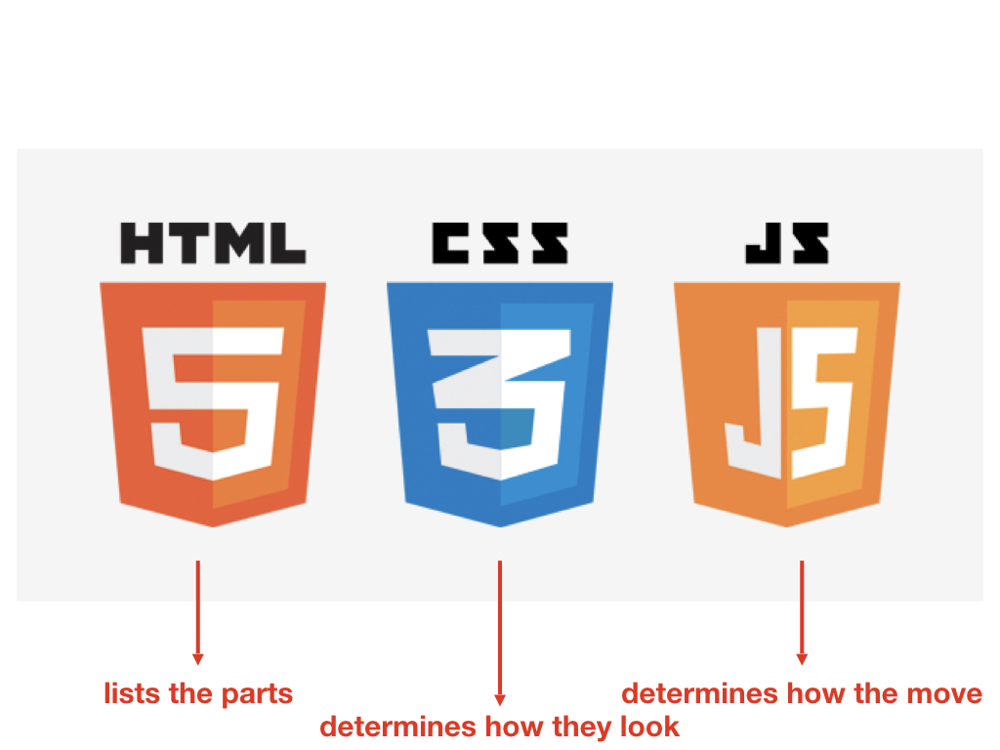

# **HTML CSS Overview**

### **++[SJSU Art 74 Fall 2019](https://carriehott.github.io/sjsu-art74/)++**

[<Back to Tutorials](https://carriehott.github.io/sjsu-art74/tutorials)

 

#### On this page:
1. [Things to Always Remember](#things-to-always-remember)
2. [Resources](#resources)
3. [What is HTML CSS JS?](#what-is-html-css-js?)
3. [HTML Basics](#html-basics)
  *  [Document Setup](#document-setup)
  *  [Tags](#tags)
  *  [Links](#links)
  *  [Images](#images)
  *  [Images as Links](#images-as-links)
  *  [Lists](#lists)
  *  [Comments](#comments)
4. [CSS Basics](#css-basics)
  *  [How to Add Style](#how-to-add-style)
  *  [Selectors](#selectors)
  *  [Divs](#divs)
  *  [Classes](#classes)
  *  [IDs](#ids)
5. [Tips and Tricks and Bells and Whistles](#tips-and-tricks-and-bells-and-whistles)
  *  [Layout Changes](layout-changes)
  *  [Background Image](#background-image)
  *  [Background Color](#background-color)
  *  [Marquee](#marquee)
  *  [Link Color and Hover](#link-color-and-hover)
  *  [Fonts](#fonts)
  *  [Dropdown Menus](#dropdown-menu)
  *  [Adding Sound](#adding-sound)
  *  [What Else?](#what-else)

#  Things to Always Remember

* **Website Folder Organization** 
  * Your Project folder should look something like this:

    * Project Folder
      * index.html
      * Other Html pages
      * Images folder (with images inside)
      * CSS folder (with stylesheet inside)
      * JS folder (javascript) (if you have it)

# Resources
**Technical Help:**
* [W3 Schools](https://www.w3schools.com/)- vast resource of code, exercises, and how-tos. Most everything you're wondering about can be answered here.
* [HTML Dog](http://www.htmldog.com/)- simple, direct explanations and tutorials of html, css, and javascript
* [Mozilla Developers Network](https://developer.mozilla.org/en-US/docs/Learn/HTML)- more direct and helpful tutorials for HTML, CSS, and Javascript
* [CSS Tricks](https://css-tricks.com/the-difference-between-id-and-class/)- Still having a hard time with IDs and classes? Look over this.
* [Web Design in 4 minutes](https://jgthms.com/web-design-in-4-minutes/)
* [Overview of HTML Tags](http://www.99lime.com/_bak/topics/you-only-need-10-tags/)
* [Kadenze Tutorials](https://www.kadenze.com): These courses are designed specifically for artists and art students. If you create a Kadenze account, you can audit courses for free. **Recommended: Session 1: Intro to the Web Landscape for familiarity with HTML/CSS**

**Colors and Fonts:**
* [Adobe Colors](https://color.adobe.com/)
* [Color Hex Codes](https://www.color-hex.com/)
* [Google Fonts](https://fonts.google.com/)
* [CSS Font Stack](https://www.cssfontstack.com/)

# What is HTML CSS JS?

### HTML= Hyper Text Markup Language
### CSS= Cascading Style Sheets
### JS= Javascript

  
  

# HTML basics
# Document Setup

 
 

# Tags

 
 

# Links

 
 

# Images

# Image as Link

 
 

# Lists

# Comments

# CSS basics
**See how CSS can change the same HTML document on [CSS Zen Garden](http://www.csszengarden.com/)**

# How To Add Style

# Selectors

# Divs

# Classes

# IDs

 
 

# Tips and Tricks and Bells and Whistles

# Layout Changes
### This is based on the template we created in class, which is now in your Net Art GitHub repository

# Background Image

### First, prepare an image, and save it in your images folder.

To create a full background image for your website on every page, copy the code below in your CSS (see the screenshot for instructions).

#### **Code to copy to your document below your first body selector:**

    body {
      background-image: url(/images/YourBackground.jpg);
      background-repeat: no-repeat;
      background-size: cover;
    }

### IF you want to have a different background image on every page of your site, then you need to add the code to your individual HTML pages.

**When you add CSS code to an individual HTML page, it goes in the <head></head> section, under the < title > and link to the stylesheet. YOU MUST add < style > style tags around the code </ style >.**

For more options, [see this page on W3Schools.](https://www.w3schools.com/cssref/pr_background-image.asp)

# Background Color
To create a full background color for your  website, try the code below in your CSS.

For more options, [see this page on W3Schools.](https://www.w3schools.com/cssref/pr_background-color.asp)

#### **Code to copy to your document below your first body selector:**

    body {
      background-color: coral;
    }

# Marquee
You can add a scrolling marquee to your website by using the <marquee> "<-marquee-> HTML tag".

It is technically obsolete because developers find it annoying, but if you have a conceptual use for it, and it works for you- try it. For more scrolling options- [check out this page.](https://www.w3docs.com/learn-html/html-marquee-tag.html) Note that it may not show up in every browser.

#### **HTML tag to use in your HTML documents:**

    <marquee>This is a marquee</marquee>

# Link Color and Hover
You can add more style to your links and change the color on hover and after they've been visited, by adding more link 'a' selectors to your stylesheet.  For more link styling options- [check out this page.](https://www.w3schools.com/css/css_link.asp)

#### **Code to copy to your CSS document below your first a selector:**

    /* visited link */
      a:visited {
          color: green;
        }

    /* mouse over link */
      a:hover {
          color: hotpink;
        }

      /* selected link */
        a:active {
          color: blue;
        }

# Fonts

# Dropdown Menu

Create a dropdown menu for different navigation options, or any other way you can use them!  For more link styling options- [check out this page.](https://www.w3schools.com/howto/howto_css_dropdown.asp)

#### **Code to copy to your HTML document:**

        

        <button class="dropbtn">Where Do We Go Now</button>
        

        <a href="link here">Option 1</a>
        <a href="link here">Option 2</a>
        <a href="link here">Option 3</a>
        

        

**The code above goes in your HTML document wherever you would like your dropdown menu to go. However, it won't work without some serious CSS:**

#### **Code to copy to your CSS document at the end of the page:**

        /* This is the style for the dropdown menu!*/

        /* This is the style for top title button: */
        .dropbtn {
            background-color: #4CAF50;
            color: white;
            padding: 25px;
            font-size: 45px;
            border: none;
          }

          /* This is the style for the dropdown menu position*/
            .dropdown {
              position: relative;
              display: inline-block;
            }

            /* This is the style for the dropdown menu content options*/
            .dropdown-content {
              display: none;
              position: absolute;
              background-color: #f1f1f1;
              min-width: 200px;
              z-index: 1;
            }

            /* This is the style for the dropdown menu content text*/
            .dropdown-content a {
              color: black;
              padding: 12px 16px;
              font-size: 45px;
              text-decoration: none;
              display: block;
            }

            /* This is the style for the dropdown menu hover colors*/
            .dropdown-content a:hover {background-color: #ddd;}

            .dropdown:hover .dropdown-content {display: block;}

            .dropdown:hover .dropbtn {background-color: #3e8e41;}

# Adding Sound
### You can add an mp3 to your website and set it to autoplay when the website loads. Reminder: you can only use your original sounds or non-melodic sounds (not recgnizable songs made by someone else)

### First! Make your MP3. Then make a media folder in your website folder (you already have css and images). Then add the MP3 to the media folder.

#### **Code to copy to your HTML document at the top of the page:**

          <audio autoplay loop>
          <source src="media/yourfile.mp3" type="audio/mpeg">
          </audio>

# What Else
# Lifetime Tip: Research! And learn to learn on your own.

# [Back To Top](https://carriehott.github.io/sjsu-art74/tutorials/HTML_CSS/)
