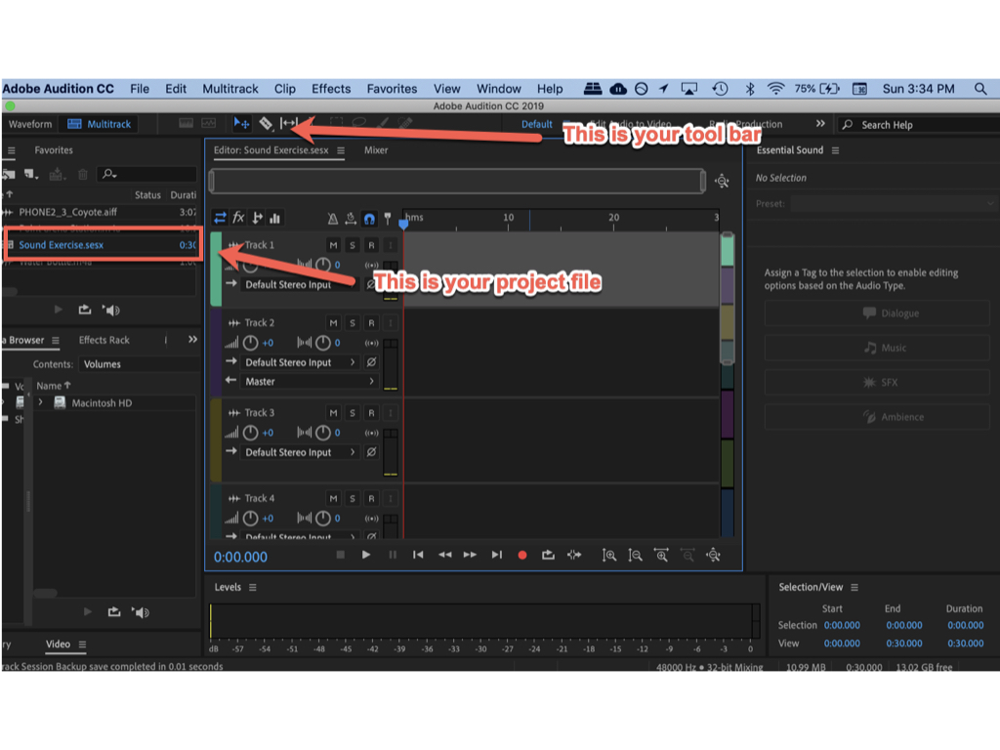
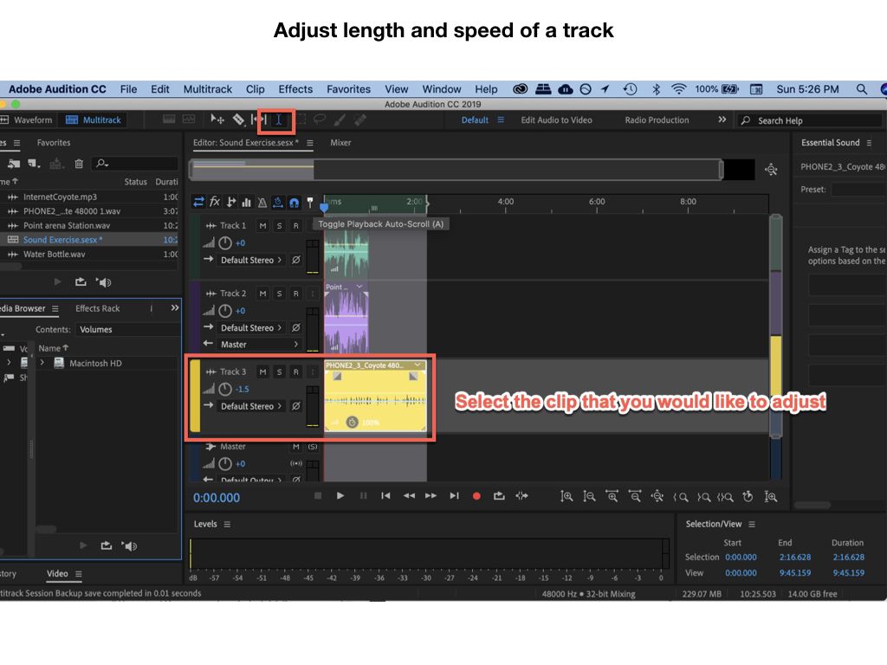
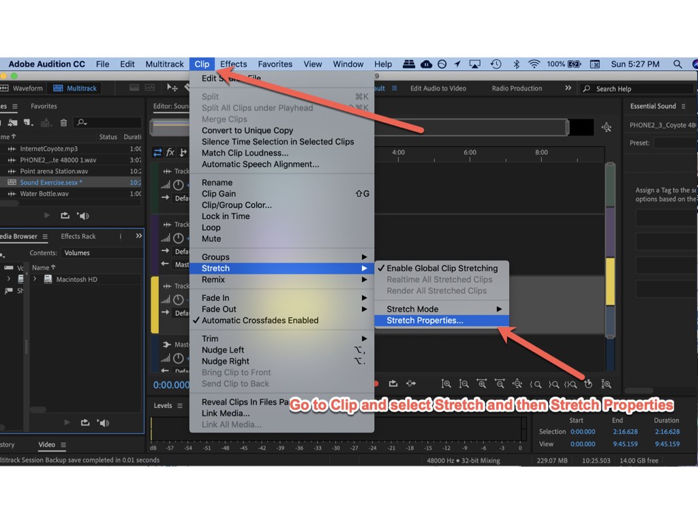

# **SOUND ART AUDITION TUTORIAL**

### **++[SJSU Art 74 Spring 2019](https://carriehott.github.io/SJSU-Art74-Sp2019/)++**

[<Back to Tutorials](https://carriehott.github.io/SJSU-Art74-Sp2019/tutorials)

**Intro to Audition** 
This tutorial reviews basics covered in class. For more Audition instruction, use your SJSU library card to access **[this Lynda.com tutorial](https://www.lynda.com/Audition-tutorials/Audition-CC-2019-Essential-Training/779764-2.html)**.

**On This Page**
* [Getting Started](#getting-started)
* [Importing Tracks](#importing-tracks)
* [Zoom in on Tracks](#Zoom In)
* [Adjusting Speed](#adjusting-speed)
* [Delete Part of Your Track](#delete-part-of-your-track)
* [Adjust Volume](#adjust-volume)
* [Combine and export](#combine-and-export)
* [Reopen to Edit](#reopen-to-edit)
* [Fade In Fade Out](#fade-in-fade-out)
* [Add Effects](#add-effects)
* [Final Export](#final-export)

# Getting Started

Make sure to organize your files ahead of time and keep them organized as you go.

Open Audition and review the workspace.

# Importing Tracks

The bigger the waveforms, the louder or more intense the sounds.

# Edit Multiple Tracks

# Zoom In

To zoom in on your sound you can use the magnifying tools. This is helpful if you are manipulating small increments in your sound.

# Adjusting Speed

To lengthen a track or shorten a track, you can either delete part of it, or adjust the speed.

# Delete Part of Your Track

The selection tool allows you to isolate parts of your clip. Click in the sound bar timeline, not above, to select parts of your sound.

# Adjust Volume

# Combine and export

Once you have aligned all of your tracks in Audition and you're ready to combine and then add effects to the new sound, export as a WAV file.

Save in your 'In Progress' folder

# Reopen to Edit

Reopen the WAV file you just exported to add more effects to the new sound.

# Add Effects

# Fade In Fade Out

# Final Export

When you are finished you are ready for the final export.

This time you will export as MP3 since it is going on the web. It will be more compressed than a WAV file.

Save this in your 'final' folder.

**Then- upload your sound to your [soundcloud](https://soundcloud.com/stream) account.**
