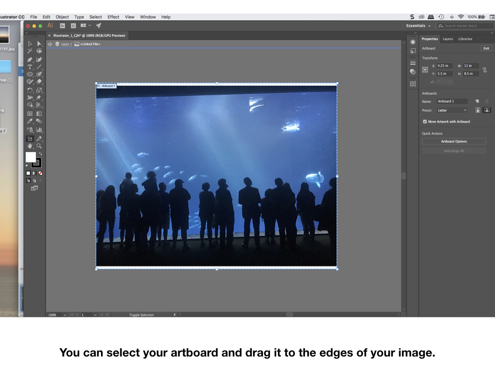
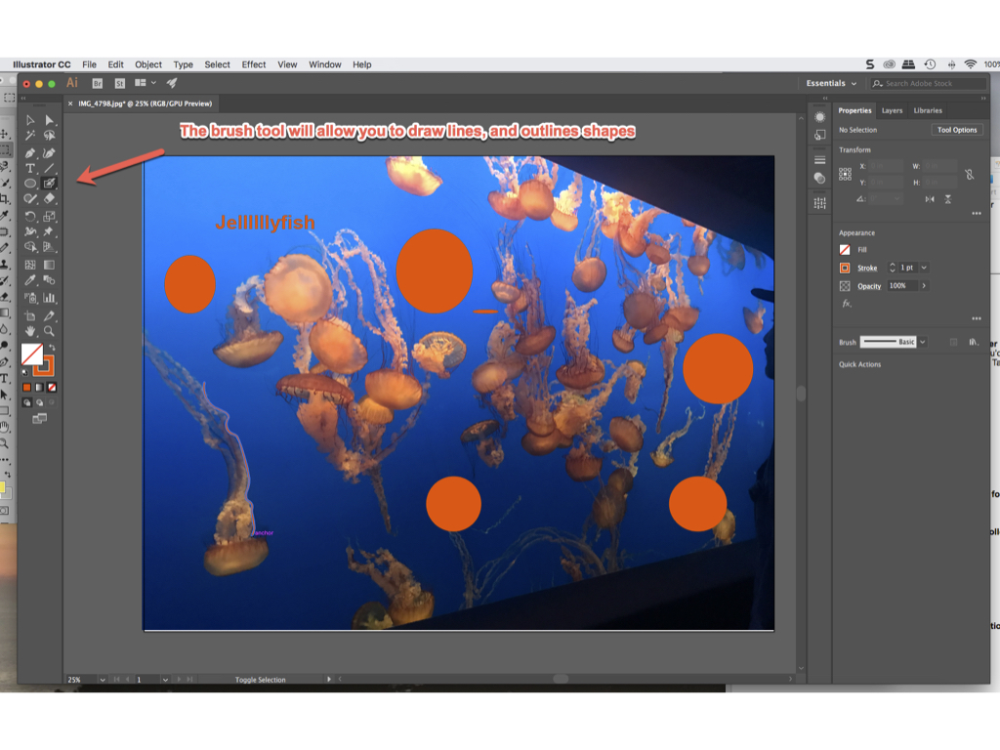

# **INRO TO ILLUSTRATOR**

### **++[SJSU Art 74 Spring 2019 Home Page](https://carriehott.github.io/SJSU-Art74-Sp2019/)++**

[<Back to Tutorials](https://carriehott.github.io/SJSU-Art74-Sp2019/tutorials)

**More Resources**  
[Lynda.com Photoshop Essentials Tutorial](https://www.lynda.com/Illustrator-tutorials/Illustrator-CC-2018-Essential-Training/628695-2.html?srchtrk=index%3a4%0alinktypeid%3a2%0aq%3aadobe+illustrator%0apage%3a1%0as%3arelevance%0asa%3atrue%0aproducttypeid%3a2 ) (use SJSU Library card for free access) 
[SJSU Adobe Software Workshops](http://www.sjsu.edu/ecampus/support/events/index.html)

You can crop in on an object to cut and paste by using the Quick Selection tool in Photoshop.

Back in Illustrator, you can place 'psd' files.

