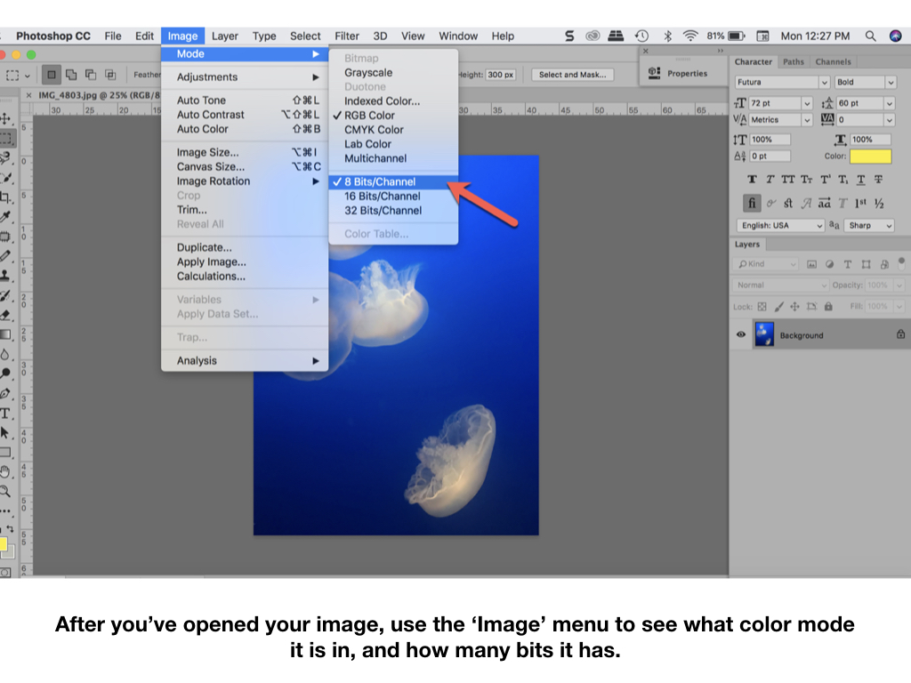
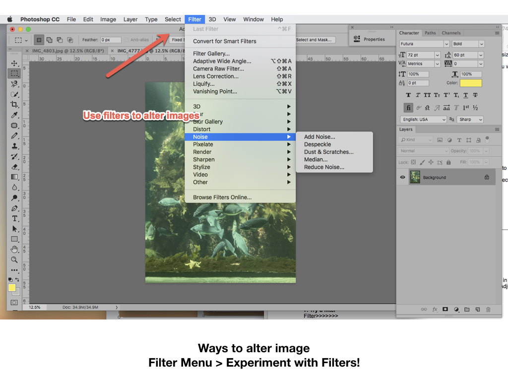
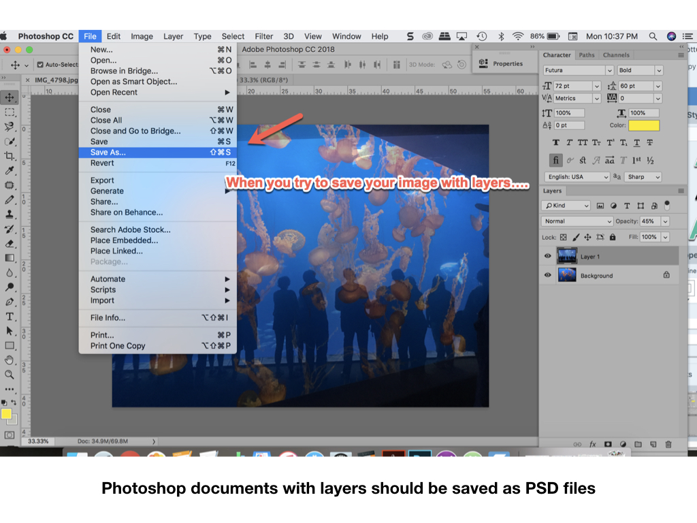

# **INRO TO PHOTOSHOP**

### **++[SJSU Art 74 Spring 2019 Home Page](https://carriehott.github.io/SJSU-Art74-Sp2019/)++**

[<Back to Tutorials](https://carriehott.github.io/SJSU-Art74-Sp2019/tutorials)

**On This Page**
* [Opening Images](#opening-images)
* [Creating a New Project](#creating-a-new-project)
* [Image Color Mode](#image-color-mode)
* [Image Size & Resolution](#image-size-and-resolution)
* [Undo What you Did](#undo-what-you-did)
* [Work on Multiple Images](#work-on-multiple-images)
* [Adjust Color](#adjust-color)
* [Add Effects](#add-effects)
* [Erase](#erase)
* [Layering Images and Transparency + Opacity](#layering-images-and-transparency-and-opacity)
* [Flattening Layered Images and PSD files](#flattening-layered-images-and-psd-files)
* [Saving JPGs](#saving-jpgs)

**More Resources**  
[Lynda.com Photoshop Essentials Tutorial](https://www.lynda.com/Photoshop-tutorials/Photoshop-CC-2017-Essential-Training-Basics/519289-2.html) (use SJSU Library card for free access) 
[SJSU Adobe Software Workshops](http://www.sjsu.edu/ecampus/support/events/index.html)

# Opening Images

# Creating a New Project

# Image Color Mode

# Image Size and Resolution

# Undo What you Did

# Work on Multiple Images

# Adjust Color

# Add Effects

# Erase

# Layering Images and Transparency and Opacity

# Flattening Layered Images and PSD files

# Saving JPGs

