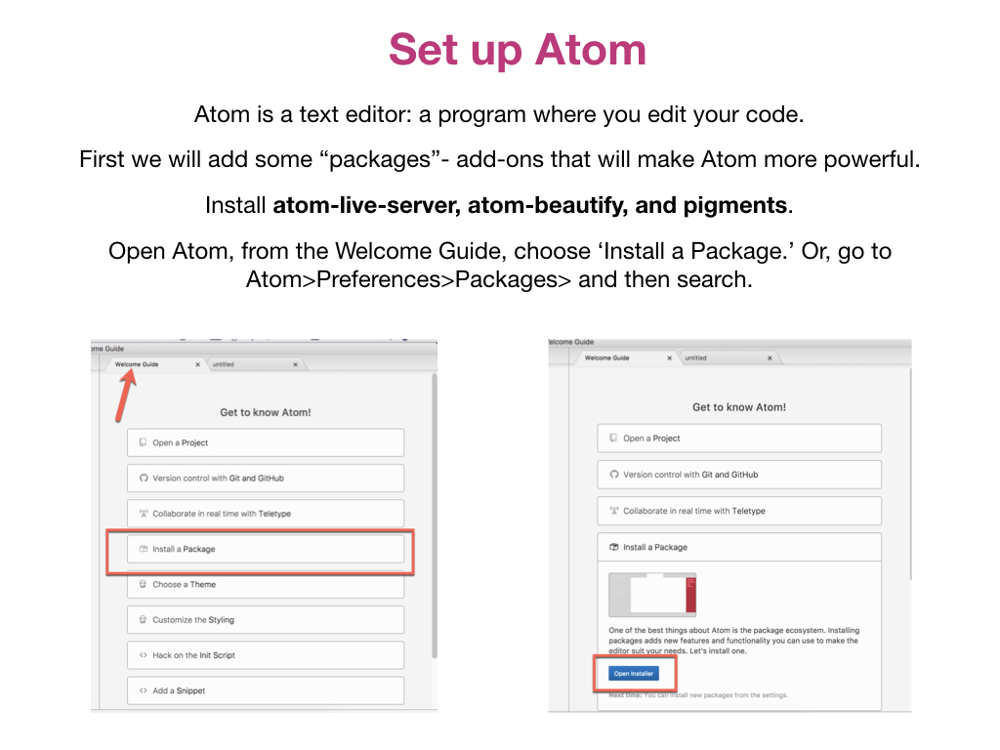
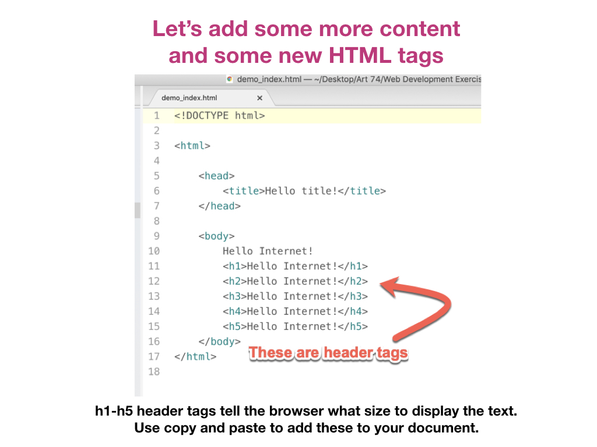
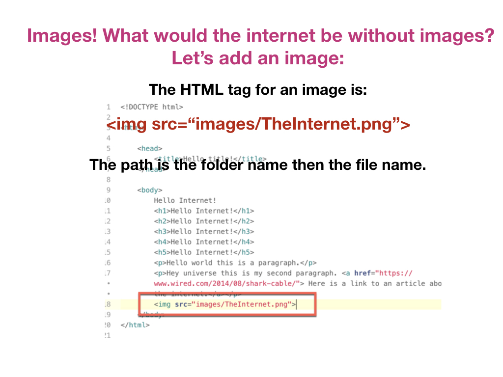
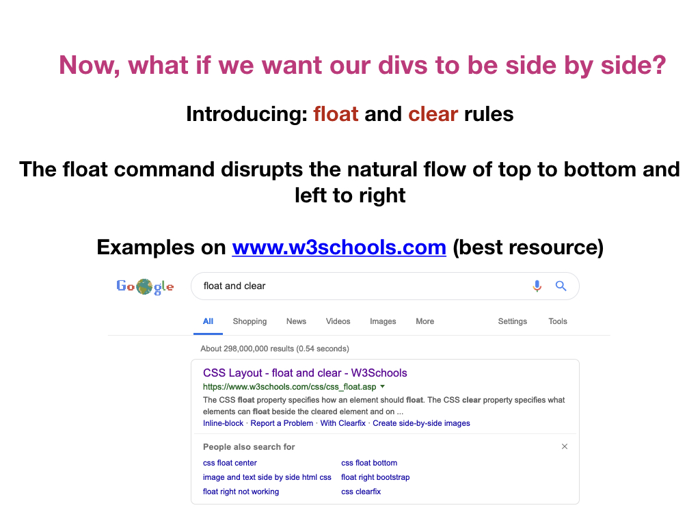
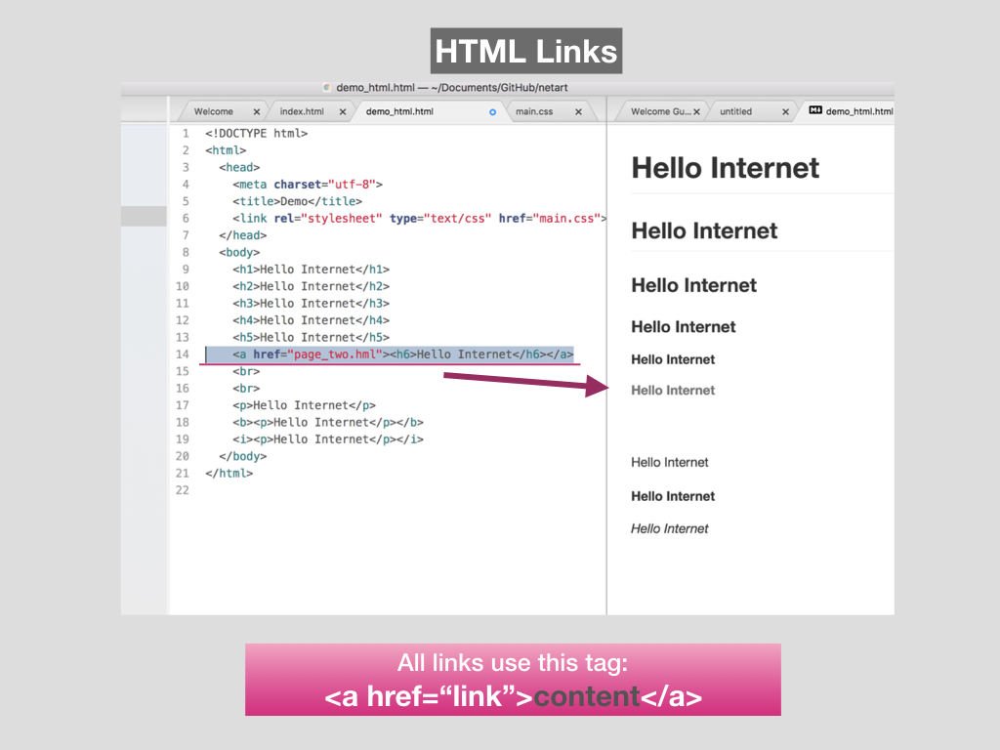

# **INTRO TO WEB DEVELOPMENT**

### **++[SJSU Art 74 Fall 2019](https://carriehott.github.io/sjsu-art74/)++**

[<Back to Tutorials](https://carriehott.github.io/sjsu-art74/tutorials)

 

### [In-Class Google Slides Presentation Here](https://docs.google.com/presentation/d/1AE3dLpKuHG1ekTRC80A5FcQCurYrXAXQwoLWQXufZkY/edit?usp=sharing)

#### Introduction to Web Development Parts 1 and 2
For a full overview of HTML & CSS see the [next tutorial](https://carriehott.github.io/sjsu-art74/tutorials/HTML_CSS/)

#### On this page:
1. [Part 1 HTML](#part-one-html)
  * [Setup Your Files and Atom](#setup-your-files-and-atom)
  * [What is HTML CSS JS?](#what-is-html-css-js?)
  * [Tour of an HTML Document](#tour-of-an-html-document)
  *  [Adding HTML Tags](#adding-html-tags)
  *  [Adding Links](#adding-links)
  *  [Adding Images](#adding-images)
  *  [Line Breaks](#line-breaks)
  *  [Comments](#comments)
2. [Part 2 CSS](#part-two-css)
  *  [What is CSS](#what-is-css)
  *  [Tour the CSS page](#tour-the-css-page)
  *  [Link your CSS to your HTML](#link-your-css-to-your-html)
  *  [Add and Change CSS Rules](#add-and-change-css-rules)
  *  [CSS IDs and Classes](#css-ids-and-classes)
  *  [Use Div tags with IDs and Classes](#use-div-tags-with-ids-and-classes)
  * [Using IDs with Divs to Create a Layout](#using-ids-with-divs-to-create-a-layout)
  * [Margins and Padding](#margins-and-padding)
  * [Float and Clear Rules](#float-and-clear-rules)
  * [Adding Pages To Your Website](#adding-pages-to-your-website)

# Part 1 HTML

# Setup Your Files and Atom

# What is HTML CSS JS?

# Tour of an HTML Document

# Adding HTML Tags

# Adding Links

# Adding Images

# Line Breaks

# Comments

# Part 2 CSS

# What is CSS

# Tour the CSS page

# Link your CSS to your HTML

# Add and Change CSS Rules

# CSS IDs and Classes

# Use Div tags with IDs and Classes

# Using IDs with Divs to Create a Layout

# Margins and Padding

# Float and Clear Rules

# Adding Pages To Your Website

# [Back to the Top](https://carriehott.github.io/sjsu-art74/tutorials/Intro_Web/)
