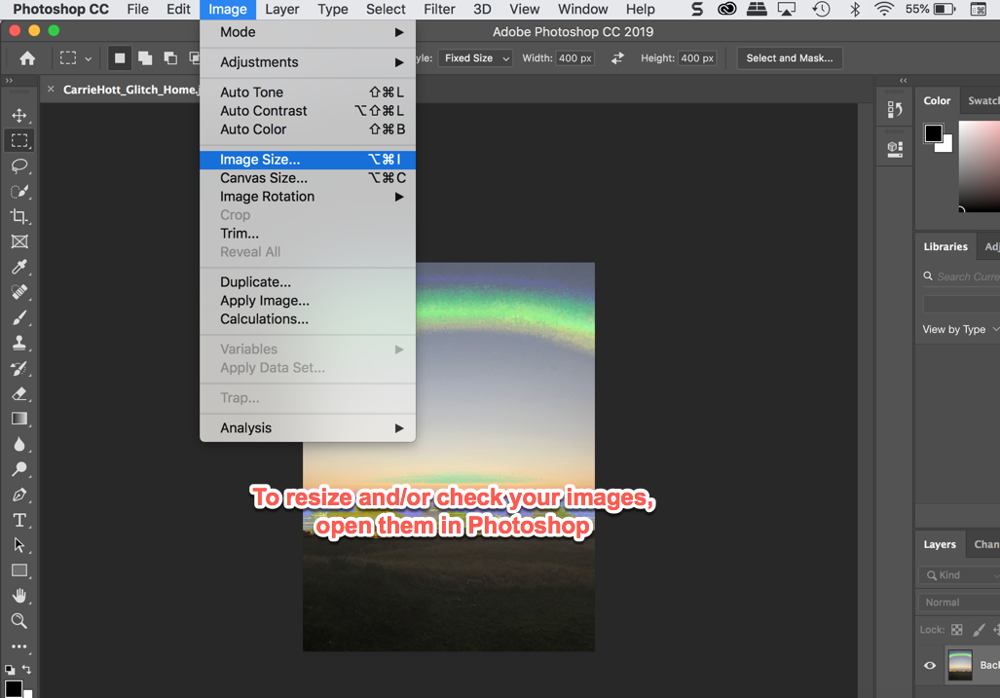
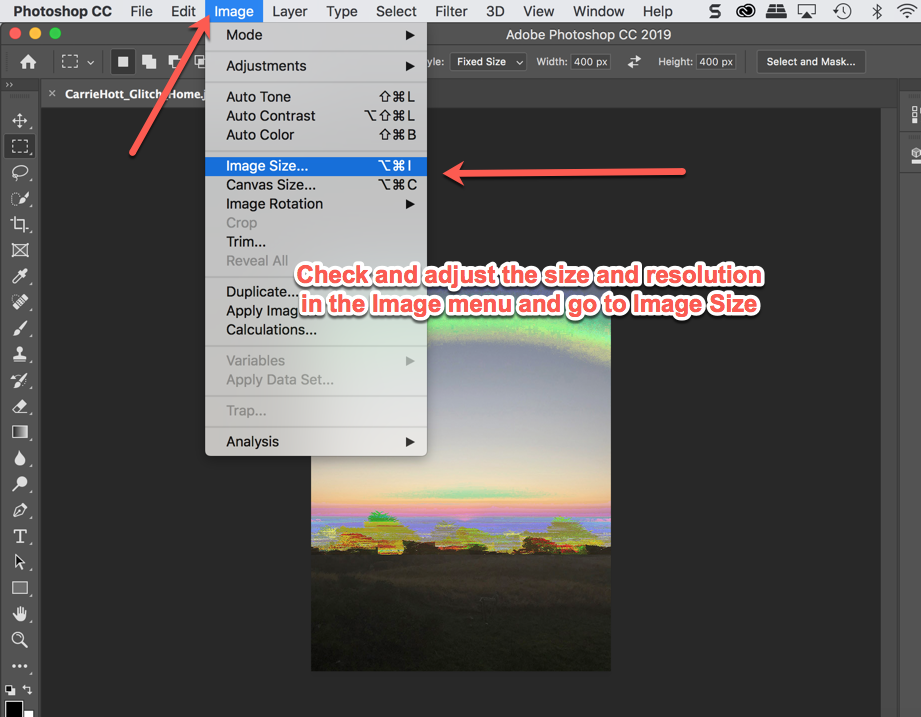
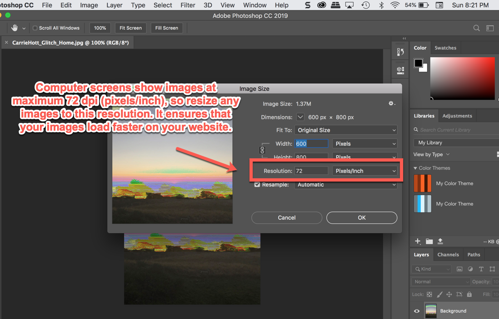
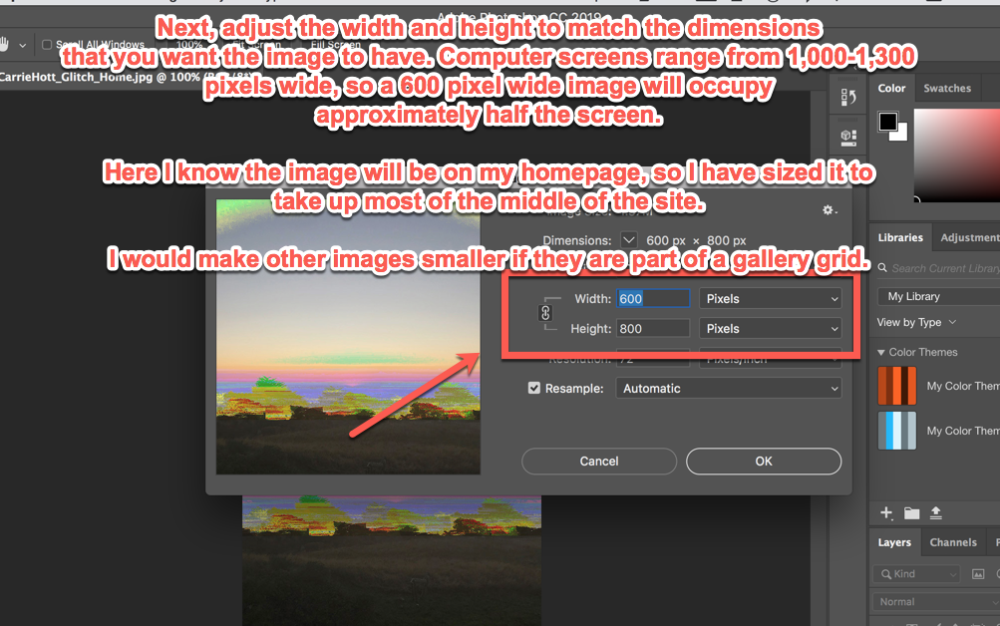
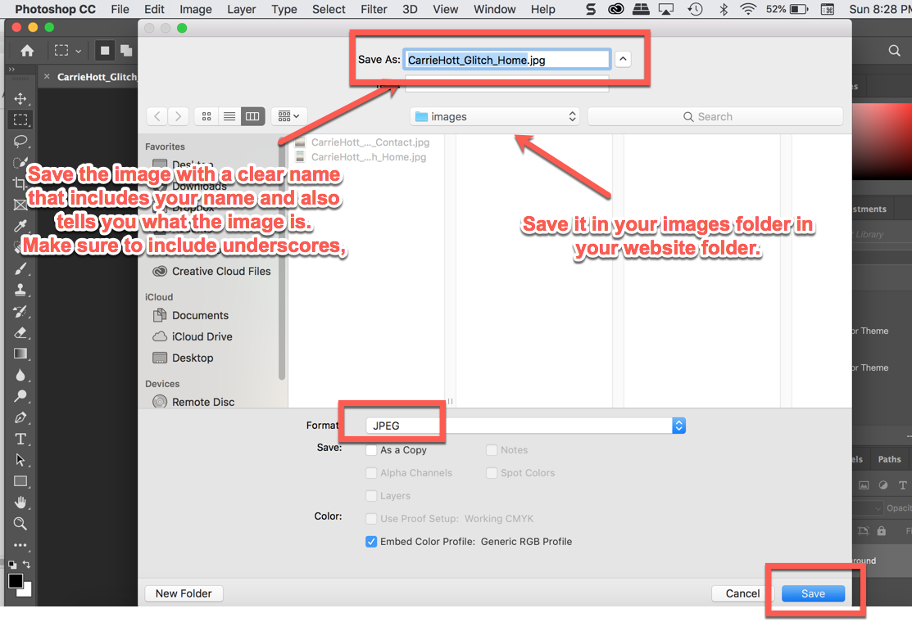
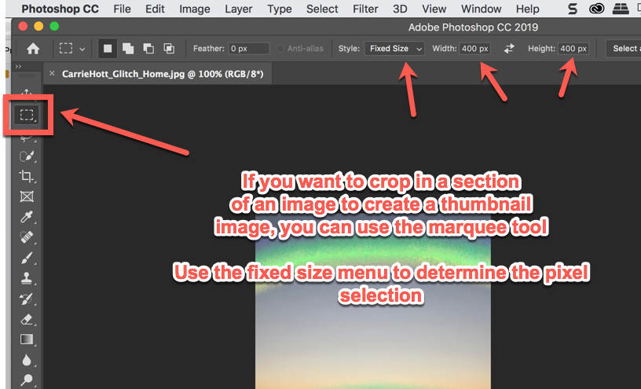
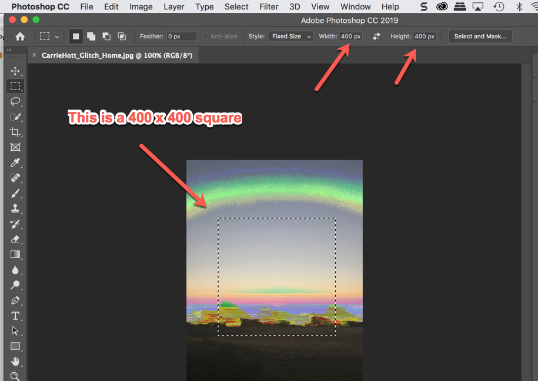
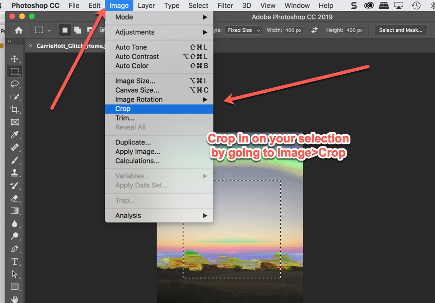
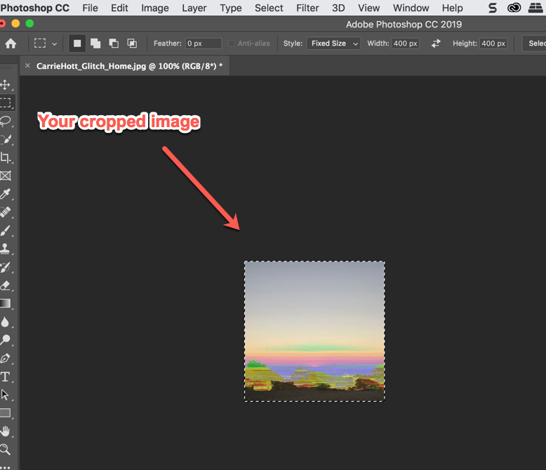
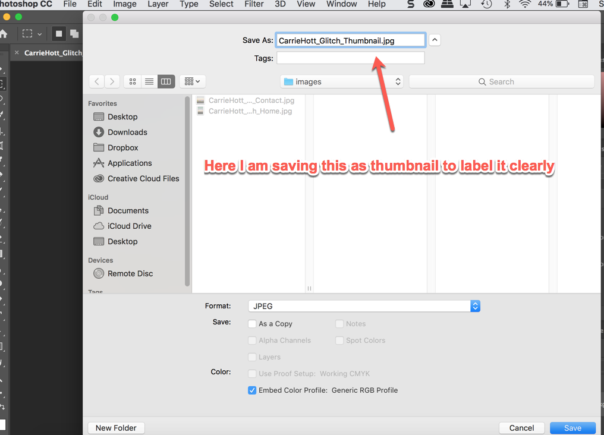

# **PORTFOLIO CONTENT PREP GUIDE**

### **++[SJSU Art 74 Fall 2019](https://carriehott.github.io/sjsu-art74/)++**

[<Back to Tutorials](https://carriehott.github.io/sjsu-art74/tutorials)

#### **Related Pages:**
* [HTML/CSS Overview ](https://carriehott.github.io/sjsu-art74/tutorials/HTML_CSS_Overview)
* [Portfolio Website Setup](https://carriehott.github.io/sjsu-art74/tutorials/Portfolio_Buildout)
* [Portfolio Website Styling](https://carriehott.github.io/sjsu-art74/tutorials/Portfolio_Styling)
 

#### **On this page:**
1. [What Is This Page For? ](#what-is-this-page-for)
2. [Resizing Images](#resizing-images)
3. [Embedding Videos and Sound](#embedding-videos-and-sound)
4. [Individual Artwork Descriptions](#individual-artwork-descriptions)
5. [Artist Statements](#artist-statements)

# What Is This Page For
Before building the structure of your portfolio website, you should organize and prep your images, descriptions of your work, and your artist statement. This page provides resources for these content pieces of your website.

**Remember:
Your portfolio should represent YOU and YOUR WORK.**

It will be hard to do this as a student, since you are still figuring out what kind of work you make. Getting you in the practice of writing and presenting your work in a web portfolio is the goal for now.

For the online portfolio for this class, I am looking for:
* Basic web design (filling out the portfolio we build together from [this tutorial](https://carriehott.github.io/SJSU-Art74-Sp2019/tutorials/Portfolio_Buildout/) and stopping there is just fine)
* Documentation of the projects you made for this class, with short descriptions about the CONCEPTS behind each piece.
* A two-paragraph artist statement.

# Resizing Images
**Why is it important to resize your images for the web?** When your images are sized to match the same dimensions and resolution as displayed on your website, they load faster. Computer screens generally have a max resolution of 72 dpi. If your image is larger, then the computer loading your site has to resize your images before displaying them. When you size your images correctly, the computer showing your website doesn't have to adjust the size from the original file size in your website folder to the display size on the screen, so they load faster.

### **Resizing for web:**

### **Creating Thumbnails:**

 
 
# Individual Artwork Descriptions
On your website, there are areas under your individual artworks for brief descriptions. These descriptions should be short (maximum 2-3 sentences) and clear descriptions of your concept and process.

Imagine these as a description on the wall of a gallery. What information do you want/need to convey to the viewer for them to understand the piece as you intended it?

Here are some examples of descriptions and format for title and medium:

**"Title (in quotations)", Digital Image, 6"x10", 2018**

This piece is an exploration of networked society and how compulsory sharing on social media is eroding our understanding of reality. I composited very large surveillance cameras in the place of eyes and digitally altered the color and resolution to further demonstrate the hyper-reality of this experience.

**"Title", Digital Video, 4 min, 2018**

In this video I recorded three televisions scavenged from the dumpster, which I then filled with cardboard as a metaphor for the changing, and disposable nature of digital information overload in the United States. I recorded news footage that I projected onto the cardboard, comparing the constant stream of information to consumable products and the intensity of American consumption.

# Artist Statements

Your artist statement should be approximately 250 words long.  Remember that the artist statement is a chance to tell the reader what you do and why you do it. **Start from where you are- speak directly and clearly and be honest. It's okay if you're just starting to make art and your statement is shorter. You're just getting started.**

250 words is usually two paragraphs:

**First Paragraph** 
Identify the medium or mediums you work in and what process you use. Identify your reason for making work and for using the materials that you use. Also address other
issues that are important (why do you do what you do? how does it connect to the outside world?) 
 
**Second Paragraph** 
Expand on the first paragraph and describes more of your process, or a specific project and how it is an example of your overall way of working. Make connections for your reader by connecting how you use your materials to why you are making work.

**HIGHLY RECOMMENDED Resources:**
* [How to Write An Artist Statement by Sarah Hotchkiss on The Creative Independent](https://thecreativeindependent.com/guides/how-to-write-an-artist-statement/)
* [Example Artist Statements on "Getting your Sh*t Together"](https://www.gyst-ink.com/sample-artist-statements/)
