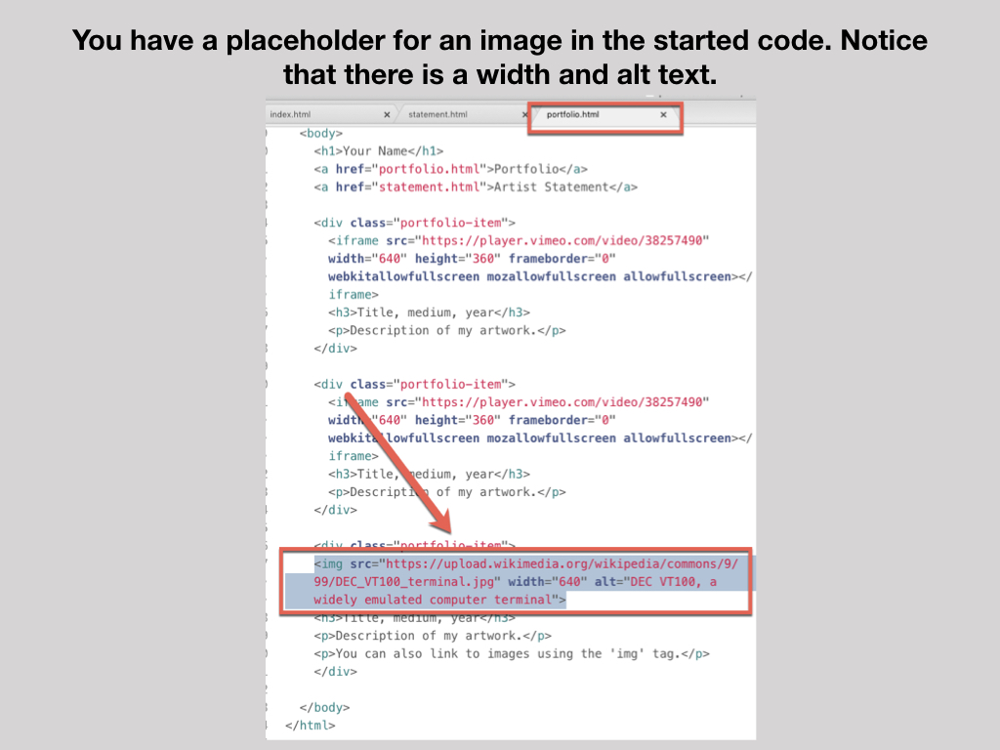

# **PORTFOLIO WEBSITE SETUP TUTORIAL**

### **++[SJSU Art 74 Spring 2019](https://carriehott.github.io/SJSU-Art74-Sp2019/)++**

[<Back to Tutorials](https://carriehott.github.io/SJSU-Art74-Sp2019/tutorials)

#### **Related Pages:**
* [GitHub and Atom Set Up
](https://carriehott.github.io/SJSU-Art74-Sp2019/tutorials/Github_Atom_Setup/)
* [HTML/CSS Overview ](https://carriehott.github.io/SJSU-Art74-Sp2019/tutorials/HTML_CSS/)
* [Portfolio Styling](https://carriehott.github.io/SJSU-Art74-Sp2019/tutorials/Portfolio_Styling)
* [Portfolio Website Content & Writing](https://carriehott.github.io/SJSU-Art74-Sp2019/tutorials/Portfolio_Content/)
 

 

#### On this page:

1. [Artist Websites](#artist-websites)
2. [Setup Your Folder](#setup-your-folder)
3. [Create Your Homepage INDEX.HTML](#create-your-homepage-index.html)
3. [Create Your CSS Page](#create-your-CSS-page)
4. [Create Your Artist Statement Page](#create-your-artist-statement-page)
5. [Link Your Artist Statement Page](#link-to-your-artist-statement-page)
6. [Setup The Portfolio Page](#setup-the-portfolio-page)
7. [Adding Portfolio Items](#adding-portfolio-items)
8. [Copy the Menu to Each Page](#copy-the-menu-to-each-page)
9. [Add Images and Media to the Portfolio Page](#add-images-and-media-to-the-portfolio-page)
10. [Developer Tools](#developer-tools)
11. [Pushing Live Reminder](#pushing-live-reminder)

# Artist Websites

**Note:** Your web portfolio can be as basic or as complex as you would like. You can stick to these basics, or build out your portfolio further using what you have learned, develop on your own. I DO RECOMMEND keeping it simple. As you have learned CSS can get sloppy _fast_ when copying and pasting from many sources, and it takes a long time to make a complex website. Stick with it and you will have this skill forever.

* [Sofia Cordova](https://www.sofiacordova.com/)
* [Cory Arcangel](http://www.coryarcangel.com/)
* [Jenny O'Dell](http://www.jennyodell.com/)
* [Lisa Rybovich Cralle](https://www.lisarcralle.com/)
* [Kate Rhoades](http://krhoades.com/)
* [Martha Colburn](http://marthacolburn.com/)
* [Rafael Lozano-Hemmer](http://www.lozano-hemmer.com/)

# Setup Your Folder

# Create Your Homepage INDEX.HTML

# Create Your CSS Page
Right now we just have the raw HTML. To change the way your website looks (color, font, spacing, etc), you will have to create another file, the CSS stylesheet. **Make sure to link each page in your site to the stylesheet.**

### But in order to see our css styles, we have to link the CSS file to the HTML file.

Cpoy the line below and place it inside the 'head' tag of your HTML. It tells the browser to look for a CSS stylesheet with the name of 'main.css' in the css folder.
 
 

    <link rel="stylesheet" type="text/css" href="css/main.css">

 
 

 
 

##### code to copy to your main.css:

    body {
      margin: 30px auto;
      max-width: 1000px;
      font-family: "Helvetica", "Arial", sans-serif;
      line-height: 1.5;
      padding: 30px 20px;
      text-align: center;
    }

    h1 {
      padding: 20px 0px 10px 0px;
    }

 
 

# Create Your Artist Statement Page
To create the artist statement page, we will create an HTML file for a second page, and then we will link to it to the homepage (index.html) file.

First, create a new file.

Name the file 'statement.html', use the autofill tool to setuo your html structure, and copy-paste the code below to start.

##### Code to copy below the Artist Statement:

(Notice the use of the 'em' and 'strong' tags — they make text italic or bold.)
 
 

    
Lorem ipsum dolor sit amet, <em>consectetur adipiscing elit</em>. Sed quis purus dolor. <strong>Maecenas sit amet</strong> turpis sodales, iaculis risus sed, venenatis massa. Nullam tempor vulputate porta. Sed ultricies turpis id justo condimentum, sit amet aliquam odio varius.

    
Ut suscipit nibh at magna tincidunt, et facilisis eros auctor. Integer cursus, eros sit amet ultricies eleifend, tortor massa tincidunt ante, quis ultricies mi nibh et enim. Nam quis risus elit. Morbi eget tortor molestie, rutrum nulla quis, mollis
    ligula. 

 

# Link To Your Artist Statement Page
Now we need to go back into the index.html file and create a link to the new page.

Note the anchor tag — 'a' — creates hyperlinks in your HTML. The href indicates where the link is going  (href="www.link.com") and the visible text is ***between*** the two 'a' brackets. It looks like this:
 

    <a href="statement.html">artist's statement</a>

 

# Setup The Portfolio Page

# Adding Portfolio Items
### Let's add divs to center images, using some new code:

 

#### First, start with this HTML to copy to your portfolio.html page, below the closing header tag, and above the closing body tag:

Portfolio items are placed in divs with class='portfolio-item'. Also, notice the height/edith specification for images and videos:

        

          <iframe src="https://player.vimeo.com/video/38257490" width="640" height="360" frameborder="0" webkitallowfullscreen mozallowfullscreen allowfullscreen></iframe>
          <h3>Title, medium, year</h3>
          
Description of my artwork.

        

        

        
        <h3>Title, medium, year</h3>
        
Description of my artwork.

        
You can also link to images using the 'img' tag.

        

 
 

Your portfolio.html page should look like this in Atom:

### Now here is some CSS to create divs (containers) for each portfolio item, and center images inside them.  

##### CSS to copy to main.css (after your 'a' rule):

In CSS, comments are contained within /\* forward slashes with asterisks facing in \*/

    /* Centers images */

    img {
    display: block;
    margin: 0px auto;
    }

    /* When you put a period in front of a CSS declaration, it indicates you are
    creating a new class. We can apply this to div elements to create different
    portfolio entries */

    .portfolio-item {
    margin-top: 60px;
    padding: 40px;
    background-color: #f7f7f7;
    }

Your main.css page should look like this in Atom:

# Copy the Menu To Each Page

# Add Images and Media to the Portfolio Page

# Developer Tools
**TIP:** Use Developer Tools in Your Browser! Right click on the browser and choose 'Inspect'. You can inspect the page to see what is going on in the back end as it corresponds to what you are seeing.

# Pushing Live Reminder
### Remember to save in Atom as you go whenever you are working on a web project. After you've completed an update, and you are ready for it to go LIVE online, go to GitHub desktop to push your updates.

When you open GitHub desktop, it should show the changes you made to your files in Atom:

Pushing updates live is a 3 step process:

### Last Step- go to your username.github.io and view your website live!

 

## Next Step- [Add Style](https://carriehott.github.io/SJSU-Art74-Sp2019/tutorials/Portfolio_Styling/) or [Add Content](https://carriehott.github.io/SJSU-Art74-Sp2019/tutorials/Portfolio_Content/)!

# [Back to Top](https://carriehott.github.io/SJSU-Art74-Sp2019/tutorials/Portfolio_Setup/)
